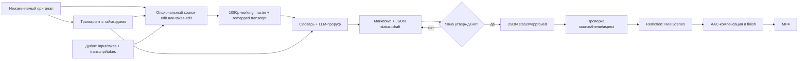
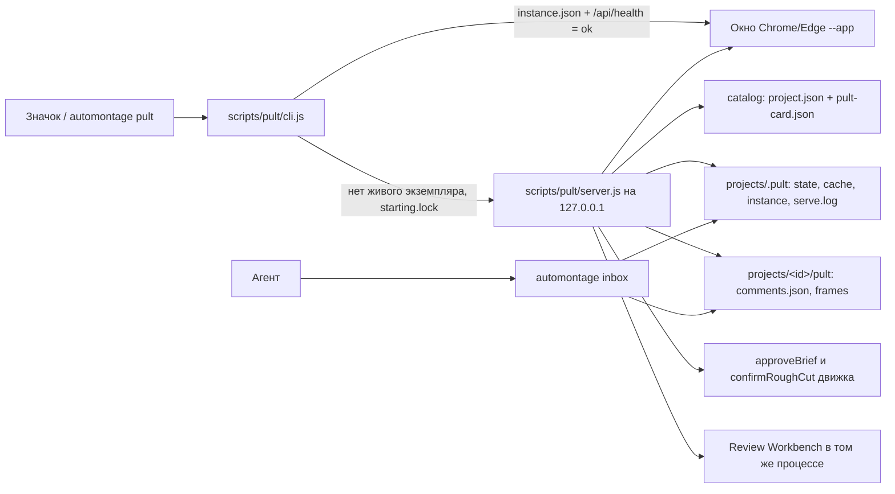
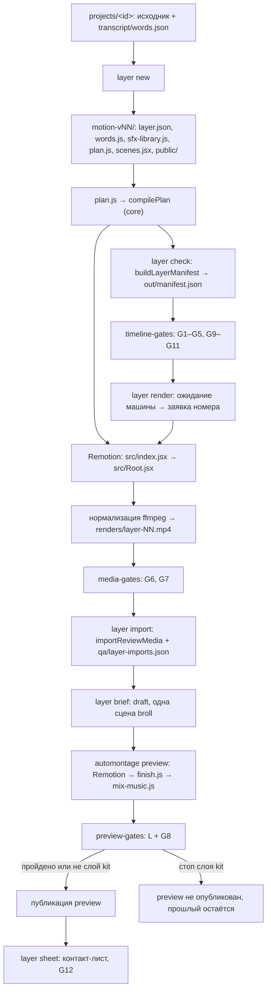

# Архитектура AutoMontage-Agent

Актуально на 2026-09-25. Документ описывает существующий код, а не будущую дорожную карту.

## 1. Назначение и границы

AutoMontage-Agent – локальный конвейер «видео или озвучка + монтажное решение → MP4». Он объединяет:

- Node.js-оркестратор и CLI;
- faster-whisper для локальной транскрибации;
- Remotion + React для программной графики;
- ffmpeg для подготовки исходника, музыки и финишной обработки;
- OpenCV/Python для анализа лица и перекадрирования;
- JSON-монтажные листы, отделяющие смысл и тайминг от визуальной темы.

Проект не является видеоредактором с GUI, облачным сервисом или хранилищем пользовательских
роликов. Исходники, музыка и результаты живут локально и не входят в репозиторий.

## 2. Главная модель: тема → композиция → монтажный лист

1. **Тема** (`src/theme/`) хранит цвета, шрифты, радиусы, тени и параметры движения.
2. **Композиция** (`src/`, `src/blocks/`, `src/scenes/`) знает, как рисовать и анимировать.
3. **Монтажный лист** (`props/*.json`, `schema/*.json`) определяет, что и когда показать.

Так один сценарий можно отрендерить в другой теме, не переписывая компоненты, а приватный
стиль можно подключить извне через `THEMES_EXT`.

Default зависит от композиции: lesson/ReelScenes использует встроенную
`lesson-neutral`, Dynamic использует `craft`. Оба значения задаются до построения props;
внешний theme id всегда передаётся явно.

## 3. Потоки данных

### 3.1 Dynamic – общий монтаж

```mermaid
flowchart LR
  A["Видео"] --> B["ffprobe: геометрия, FPS, длительность"]
  B --> C["ffmpeg: WAV 16 kHz mono"]
  C --> D["faster-whisper: transcript.json"]
  D --> E["Опционально: tighten / reframe / autopos"]
  E --> F["scenario JSON + captions.js"]
  F --> G["JSON Schema + quality gates"]
  G --> H["Remotion: Dynamic"]
  H --> I["ffmpeg finish / music"]
  I --> J["MP4 в projects/ или legacy out/"]
```

`scripts/build.js` является границей пользовательского ввода: пути сначала разрешаются
как host paths, затем ffprobe, ffmpeg, Python и Remotion получают их отдельными argv через
`scripts/process.js`. Числовые CLI-параметры проходят конечные диапазоны до первого spawn.
После исходного и каждого производного видео (reframe/tighten) build берёт геометрию, FPS и
длительность из соответствующего ffprobe. `scripts/source-timing.js` сохраняет точный numeric
FPS, включая NTSC `30000/1001` и `24000/1001`, вычисляет `durationInFrames` через `ceil` и
не даёт положительному целому `--frames` увеличить доступную длину.

Точка оркестрации – `scripts/build.js`. Без `--scenario` он создаёт черновой монтажный
лист; смысловую расстановку блоков агент затем правит и запускает повторно с готовым JSON.

В project-режиме `scripts/project/workspace.js` оборачивает render, finish, music и
публикацию в единый lifecycle. Ошибка переводит текущую версию из `started` в `failed`,
не меняя `latestRender`; новый canonical final сначала копируется во временный соседний
файл, синхронизируется и только затем атомарно заменяет предыдущий.

`project.json` – недоверенная граница между сохранёнными метаданными и файловой системой:
`project.json → schema/project.schema.json → resolveProjectPath() → filesystem`.
Перед чтением и записью старый manifest без `transcript` мигрируется к каноническим путям,
затем AJV-схема запрещает неизвестные поля, а resolver проверяет каждый project-путь.
Даже schema-valid manifest не получает доверия к путям: resolver принимает только канонический
относительный путь внутри workspace, отвергает
absolute/Windows/traversal-варианты, проверяет `lstat` каждого уже существующего компонента,
включая dangling symlink, и затем подтверждает containment через `realpath`. Slug ограничен
каноническим lowercase token. Legacy `--id` отдельно ограничен безопасным filename token,
а общий для lesson и Dynamic экспорт через `--outdir` проверяет `lstat` каждого существующего
компонента outdir и финала, включая dangling link, создаёт отсутствующие родители по одному,
подтверждает `realpath` containment и копирует в непредсказуемый exclusive/no-follow temp.
Атомарный `rename` публикует temp вместо прямой записи через статическую ссылку назначения.
Исключения – `source.originalPath` и `takes[].originalPath`: это provenance исходника и дублей,
а не workspace-пути.

`project.json` записывается через непредсказуемый соседний temp, открытый с exclusive и
no-follow flags там, где платформа их поддерживает. Temp-файл проверяется как regular file,
синхронизируется и атомарно переименовывается; cleanup удаляет его только при совпадении
file identity с созданным процессом.

Все изменяющие project-операции используют один межпроцессный lease из
`scripts/project/workspace.js`: Save, approval, регистрация brief и lifecycle render не могут
одновременно менять один workspace, но чтения остаются доступными. Полный owner record
публикуется атомарно; live owner и owner с другого host сохраняются. Lease умершего PID на том
же host можно забрать через identity-проверенный recovery claim. Под lease manifest заново
читается с диска, stale in-memory snapshot получает `PROJECT_MANIFEST_CONFLICT`, а замена
`project.json` выполняется только после повторной проверки persisted file snapshot. Для
существующего manifest даже низкоуровневый writer обязан передать expected snapshot; успешный
`rename` является однозначной commit point и после него transaction не запускает fallible probe,
который мог бы ошибочно откатить уже опубликованную историю.

Containment защищает от вредоносного manifest и symlink, существующих на момент проверки.
Соперничающий локальный процесс с правом записи в workspace или внешний `--outdir` может заменить предка между
проверкой и файловой операцией; portable Node API не даёт для этого кроссплатформенный
descriptor-relative `openat`-аналог. Такая конкурентная подмена вне границы модели угроз:
не предоставляйте untrusted локальным процессам запись в папку проекта или каталог экспорта;
проверки и операции в коде расположены настолько близко друг к другу, насколько позволяет API.

### 3.2 Lesson – ТЗ до рендера

`scripts/lesson/workflow.js` определяет режим `plan` или `render`.
`scripts/gen-brief.js` выбирает только официальные сцены и создаёт draft.
`scripts/lesson/brief.js` валидирует данные и превращает approved brief в props.
`schema/lesson-brief.schema.json` фиксирует контракт.

Approval под project lease заново читает и полностью валидирует текущий persisted draft и
manifest. Markdown и JSON публикуются первыми атомарными no-replace hard links, поэтому уже
существующая историческая ревизия никогда не заменяется. `project.json` публикуется CAS-последним:
reader либо видит прежний currentBrief, либо новый указатель на уже существующий JSON. Сбой до
manifest удаляет только собственные опубликованные файлы; hard exit может оставить безопасный
orphan, и следующая draft-ревизия пропускает занятое имя. При рендере точный legacy
`faceSrc: "source.mp4"` внутри сцены переводится на
текущий source lease вместе с top-level `faceSrc` и `audioSrc`. Другой approved
`scene.faceSrc` разрешён только как canonical `assets/...` project video или web-relative
repository-public video. Props обязаны сохранить точный исходный reference и scene type до
bundle boundary; после проверки cloned scene получает отдельный `.automontage/...` snapshot,
а top-level `audioSrc` не меняется.
Канонический builder отдельно передаёт trusted source alias (`source.mp4`): top-level
`faceSrc`/`audioSrc` обязаны совпасть с ним, поэтому forged props не превращают custom reference
в alias главного видео. Same-inode dedup хранит полную source identity и SHA-256; ctime-only
повтор требует стабильного полного rehash, любое другое расхождение отклоняется.

Первичный lesson/scenario draft тоже использует этот contract: build context не резервирует
номер заранее, генератор сначала создаёт временную no-replace пару, а `publishBriefRevision()`
под lease выбирает свободную ревизию, публикует исторические файлы no-replace и обновляет
manifest последним. Поэтому параллельный build или foreign destination не перезаписывается.

Brief замораживает исходник, тему, аспект, размеры, FPS, длительность, сцены и проверенное
кадрирование лица. Это защищает от ситуации, когда утверждали один монтаж, а рендерится другой.

Сокращение исходника - отдельная data-boundary до draft. `scripts/project/build-master.js`
валидирует `edit/vNN-source.json` относительно активной source revision и FPS, собирает диапазоны
через существующий trim pipeline: `scripts/working-quality.js` выбирает размер от
отображаемого кадра (с учётом поворота), а `scale=W:H:flags=lanczos,setsar=1` после concat
уменьшает короткую сторону до 1080 внутри того же кодирования. `--quality source` сохраняет
родной размер; маленькие кадры не увеличиваются, нечётные стороны округляются вниз.
Master полностью декодирует результат и атомарно публикует новую пару
`input/source-vNN.mp4` + `transcript/words-vNN.json`. Слова вне оставленных диапазонов удаляются,
пересекающие разрез клипуются, а последующие таймкоды сдвигаются без повторного Whisper.
Оригинал и история immutable; manifest переключается последним и очищает только устаревший
`currentPreview`. Draft не переписывается автоматически: новая режиссура должна явно зафиксировать
новую source revision.

Черновая нарезка – проверка сокращения до motion-слоя. Её данные живут в необязательном поле
`project.json.roughCut` (`null` или запись по `schema/project.schema.json`): список кусков
`edit/roughcut-vNN.json` (обычный source-edit, NN – 2–3 цифры), копия `previews/roughcut-vNN.mp4` с тем
же NN, их SHA-256, размер, длительность, `sourceDuration`, `status` (`review` – ждёт автора,
`confirmed` – подтверждена) и у `confirmed` ещё `confirmedAt` и `confirmedBy` (`pult` | `chat`).
Этап активен, пока `roughCut.sourceRevision` равна `source.revision`: первый же master поднимает
ревизию, и запись становится историей. `validateProjectManifest` проверяет согласованность
`status` с `confirmedAt`/`confirmedBy`, пару `editPath`↔`filePath` (до проверки путей, поэтому и без
каталога проекта) и containment обоих путей; отсутствие файла копии паспорт не ломает.
Чистая модель `scripts/project/rough-cut-model.js` (без чтения диска и без `workspace.js`, чтобы не
было цикла require) переводит секунды нарезки в секунды исходника (`roughCutTimeToSource`),
перечисляет вырезы с причинами из `note` (`removedRanges`), считает размер копии `roughCutSize`
(короткая сторона 720, без увеличения, чётные стороны) и определяет охрану
`assertRoughCutSettled` для `master` и `layer new` (ошибка с `code === 'ROUGH_CUT_PENDING'`; другое
имя действия – обычная ошибка, чтобы опечатка не снимала охрану). Охрана подключена: `buildMaster`
вызывает её сразу после чтения паспорта, до слота очереди, а `layer new` – сразу после `projectFrom`,
до папки слоя. Пока нарезка ждёт автора, отказывают обе команды; после подтверждения master
разрешён, а `layer new` ждёт, пока master не поднимет ревизию исходника.

`automontage roughcut` (`scripts/project/rough-cut-cli.js` → `buildRoughCut` в
`scripts/project/rough-cut.js`) собирает копию нарезки, не создавая ревизии исходника. До слота
очереди: имя `edit/roughcut-vNN.json` (абсолютный `--edit` внутри проекта сначала переводится в
относительный), та же `validateSourceEdit`, что у master, FPS исходника и отказ, если
`previews/roughcut-vNN.mp4` уже есть (нужен `edit/roughcut-v(NN+1).json`). Размер копии –
`roughCutSize(workingSize(displayDimensions + orientedSampleAspectRatio, '1080p'))`, то есть повёрнутая
телефонная запись даёт портретную копию. Затем слот общей очереди `roughcut <папка>` (до project
mutation lease, отпускается в `finally`) и под lease, по образцу `publishSourceRevision`: сверка
активных `source.revision`/`localPath` и SHA-256 байтов списка, `runTrim()` тем же графом
`buildConcatFilter` (`audioFadeSec: 0.04`, `precision: 6`, `scale`) в
`previews/.roughcut-vNN-<token>.tmp.mp4`, но с `encoder: 'proxy'` (`-preset ultrafast -crf 26
-pix_fmt yuv420p`, `aac -b:a 128k`, `-movflags +faststart`; по умолчанию `encoder: 'master'` с
прежними аргументами); если у стадии остался флаг поворота (FFmpeg 7.1.0/7.1.1 поворачивает кадры,
но оставляет флаг), одна перепаковка без перекодирования `-display_rotation 0 -i <стадия> -map 0
-c copy -movflags +faststart` во вторую стадию `.roughcut-vNN-<token>.upright.tmp.mp4` и удаление
первой; затем полное декодирование `ffmpeg -f null`, сверка длительности
(`max(0.08, 1/fps)`), FPS, размера копии и размера показа (`displayDimensions` при повороте 0),
повторная сверка байтов списка, `linkSync` в итоговое имя
и последней – запись `roughCut` со `status: review` (`purpose: 'rough-cut-manifest'`). Ошибка на любом
шаге убирает обе стадии и не меняет паспорт. `confirmRoughCut(workspace, { expectedSha256, by })` под
lease ставит `confirmed` с `confirmedAt`/`confirmedBy` только для активной записи в `review`
(иначе `code: 'ROUGH_CUT_MISSING'`) и только если байты копии равны `sha256`, байты списка –
`editSha256`, а заданный `expectedSha256` – `sha256` (иначе `code: 'ROUGH_CUT_CHANGED'`).
`automontage roughcut confirm` вызывает её с `by: 'chat'`, маршрут пульта
`POST /api/roughcut/confirm` – с `by: 'pult'` (раздел 3.4).

`scripts/project/clean.js` (`automontage clean`) чистит диск у готовых роликов. Планировщик
`planProjectCleanup` берёт только проекты, которые пульт считает готовыми (`deriveVariantStatus`
из `scripts/pult/status.js` и новые правки из `scripts/pult/comments.js`), без lock и старше
`--min-age-days`, и по правилам уровня (`renders` или `archive`) перечисляет их файлы; симлинки не
проходятся. На `archive` ссылки текущего и отрендеренного ТЗ и всех `layer.json` держат ревизии
исходника и наборы b-roll. Без `--yes` команда только печатает отчёт. С `--yes` `applyCleanup`
заново строит план каждого проекта, удаляет только файлы из обоих планов, обычные и внутри
проекта, и собирает ошибки отдельных файлов в отчёт вместо остановки.

Монтаж из нескольких дублей использует ту же границу. `scripts/project/takes.js` импортирует
дубли в `input/takes/`, расшифровывает каждый в `transcript/takes/take-NN.json` и регистрирует их в
`project.json.takes`; первым дублем становится исходный файл проекта. `scripts/project/takes-pack.js`
печатает фразы всех дублей для выбора. `edit/vNN-takes.json` (`schema/takes-edit.schema.json`)
перечисляет куски в порядке смысла. `scripts/project/build-takes-master.js` проверяет, что дубли
совпадают по FPS, размеру кадра с учётом поворота и соотношению сторон пикселя и имеют звук,
выравнивает границы по кадрам, собирает куски одним FFmpeg filter graph через `runSegmentsTrim()`
и публикует результат тем же `publishSourceRevision()` из `scripts/project/source-revision.js`,
что и обычный source-edit.
`scripts/trim-media.js` выбирает `-/filter_complex` для FFmpeg 7+ и `-filter_complex_script` для 6.x.
Видео каждого куска проходит `fps` до и после `trim`, поэтому дубли с плавающей частотой кадров
дают целое число кадров, а FFmpeg 7 записывает длительность пакетов. Кусок не начинается раньше,
чем начались оба потока дубля: `probeMediaPath()` читает `start_time` по пути файла, а не через
`pipe:0`, иначе фрагментированный MP4 и MPEG-TS теряют длительность. Дубль, взятый назад во
времени, открывается отдельным входом FFmpeg, чтобы общий декодер не держал кадры в памяти.
Звук для Whisper извлекается с первой звуковой дорожки через
`aresample=async=1:min_hard_comp=0:first_pts=0`, а видео остаётся во втором пустом выводе: тишина в
начале восстанавливается, короткие разрывы внутри звука заполняются, а MPEG-TS не пересчитывает
начало по звуку, поэтому слова дубля стоят на той же оси, что и `trim`. При пересчёте слов слово,
попавшее в кусок меньше чем на кадр, отбрасывается, если его середина вне куска, а слово с `e <= s`
после округления удаляется. `takes-pack.js` режет фразы по концу предложения или по паузе, потому
что Whisper прячет паузы внутрь слов.
`scripts/project/take-pauses.js` читает уровень звука каждого дубля окнами по 10 мс на той же оси,
что и `trim` (первая звуковая дорожка, видео остаётся в пустом выводе, иначе у MPEG-TS FFmpeg
пересчитывает начало по звуку), и до кадрового выравнивания ставит каждую границу куска в паузу,
найденную не дальше 0.25 с от неё, не переходя через другое слово: граница в звуке уходит в паузу с
запасом около 0.1 с тишины у края куска, граница уже в паузе остаётся в этой паузе, разрез, если
пауза позволяет, не ближе 0.04 с к речи, в короткой паузе отдаёт отступ речи, которая остаётся в
куске, а стык соседних кусков одного дубля режется в одной точке. Середину слова Whisper разрез тоже
не пересекает: границу склеенных без паузы слов уровни не видят. Слова целиком вне запрошенного
диапазона и слова, чья часть внутри куска лежит в тишине на его краю, в транскрипт не переносятся.
Пошаговая работа пользователя описана в [docs/TAKES.md](docs/TAKES.md).

Draft имеет отдельную непередаваемую в final возможность: `scripts/preview.js` принимает только
текущий зарегистрированный draft, выбирает `ReelScenes` или `MotionReel` по `briefs[].kind`
через `scripts/project/brief-contract.js` и готовит props через закрытую preview-boundary,
материализует медиа в том же изолированном bundle и выполняет Remotion → `finish.js` →
`mix-music.js`. Отличия только технические: `--scale=min(1,1920/max(width,height))`, CRF 28 и детерминированная отметка
«ЧЕРНОВИК». После полного decode immutable revision и `previews/current-preview.mp4` публикуются
атомарно, а manifest обновляет только `currentPreview`; `renders`, `latestRender` и `final`
недоступны этой границе. Approved builder по-прежнему отклоняет draft. Проверка просмотра перед approval использует
тот же масштаб через `previewScale`, а хеши и подтверждение просмотра остаются обязательными.
Перед decode и публикацией lesson-preview проходит барьер `scripts/qa/preview-gates.js`
(гейт L и G8, раздел 3.5): стоп строг только для слоя kit из реестра `qa/layer-imports.json`.

Preview не имеет отдельного HTML- или FFmpeg-дизайна: такие имитации могли бы показать не тот
монтаж, который затем соберёт final. И preview, и final используют одну соответствующую kind композицию,
одни scene props, тему, шрифты, media bundle и аудиопорядок; разрешённые различия preview
ограничены scale, CRF и watermark.

#### Reel from donor workflow

`reel-from-donor` — верхний редакторский слой над существующими монтажными маршрутами. Он не
скачивает и не хранит учётные данные соцсетей: исследование донорского ролика выполняется через
уже авторизованную Reels Platform или по материалам пользователя. Канонический навык лежит в
`skills/reel-from-donor/`, а тонкие adapters в `.agents/skills/`, `.claude/skills/` и
`.codex/skills/` направляют все среды к одной инструкции.

До любой графики слой фиксирует CTA, дизайн, формат и длину, создаёт карту «донорский фрагмент
→ полезная механика → первоисточник → статус факта» и показывает текст карточек на утверждение.
Карточечный формат «тихое фоновое видео + анимированные элементы» живёт в изолированном
локальном Remotion-проекте внутри `projects/<id>/`; он не меняет публичные сцены и темы
движка. Talking-head передаётся `reel-turnkey`, audio-only с озвучкой — `motion-reel`.

#### Motion workflow

Публичный путь: тема → script в текущей агентной сессии → выбор готового аудио или платного
provider → canonical words → timed motion draft → полный preview → явное approval → final → QA.
Канон инструкции – `skills/motion-reel/SKILL.md` с reference; `.agents` и `.codex` хранят
byte-identical копии. `reel-turnkey` маршрутизирует запросы без камеры до применения lesson-правил.

`automontage demo --motion` использует `scripts/project/cli-options.js` и отдельный
`scripts/motion/demo.js`: из `generate-neutral-fixtures.js` получает детерминированные WAV-тоны,
PNG-геометрию, иллюстративный transcript/script и все семь сцен. Публикуется только draft
audio-only workspace, стандартно `projects/motion-demo/`, без Whisper, провайдера и скрытого
approval/render. Любая существующая папка назначения отклоняется. Tracked
`examples/motion-brief-demo.json` равен генератору; бинарные данные остаются локальными.
Демо длится 27 секунд: steps/list получают 5/7 секунд и минимум 0,75 секунды полной видимости
последнего элемента. WAV и иллюстративные таймкоды выводятся из тех же границ сцен. Следующая
preview-команда печатается с POSIX single-quote escaping как подсказка; исполнение остаётся argv-only.
Scheduling и автопубликация – будущая отдельная orchestration-система, не часть этого pipeline.

`scripts/motion/build.js` владеет отдельным CLI-маршрутом. Первый вызов `motion <audio> --project`
использует `createMotionProject`, dedicated audio probe и локальную транскрипцию; scaffold
публикуется через `publishBriefRevision`. Новый проект по умолчанию живёт внутри `projects/`
текущей папки; явный `--project-dir` выбирает другое место. Проба открытого аудио использует seekable
`cache:pipe:0` с `read_ahead_limit=-1`, чтобы определять длительность обычных WAV/MP3 больше
64 KiB; timeout ограничен 30 секундами.

Общий `scripts/project/private-workspace.js` защищает все motion workspaces: локальный звук,
демо, TTS и возобновляемый preview/final. До первой записи source/manifest сохраняются новая
цепочка каталогов и локальный `.gitignore` с последним правилом `*`; существующие bytes правил
сохраняются. Проверка Git отклоняет корень репозитория и tracked-содержимое; no-follow/identity
guards отклоняют symlinks и подмену каталогов/ignore. Source staging, canonical words и draft
повторяют guard; неудачная начальная запись удаляет принадлежащие ей частичные файлы.

Опциональная async-ветка `motion --script --voice elevenlabs --accept-provider-cost` использует
`scripts/voice/elevenlabs.js`: официальный POST `/v1/text-to-speech/:voice_id/with-timestamps`,
ограничение ответа 32 MiB и общий deadline 60 секунд включая тело. Fetch и filesystem заменяемы
в тестах; redirects и автоматические retries запрещены. `alignment.js` собирает слова из
character entries с кириллицей/Unicode в канонический transcript, поэтому Whisper не вызывается.
SHA-256 кэш включает текст, ID голоса, модель, voice settings и output format. Workspace имеет
локальный `.gitignore` с `*`; tracked-папки и symlinks отклоняются. Exclusive `attempt.json`
резервирует запрос до отправки, сохраняется при неоднозначном отказе и предотвращает дубликаты.
До fetch сохраняются файл `.gitignore`, каждая новая папка цепочки и её запись в родителе;
directory fsync следует общей платформенной политике `filesystem-capabilities` (POSIX).
Общий `writeFilesNoReplace` принимает optional parent guard и after-commit проверку: guard
повторяется сразу после temp open до записи bytes, rollback ownership сохраняется до
последнего fsync каталога и workspace-check. При отказе удаляются только собственные output-файлы.
Готовый receipt связывает hashes MP3/words; повреждение кэша не вызывает новый платный запрос.
После probe/copy actual `input/narration.*` сверяется с digest receipt; открытый snapshot
удерживается и проверяется до публикации canonical words и draft.
Конфигурация читается в локальный объект из `.env`/environment без записи в `process.env`, manifest
или props. Кэш и canonical transcript переходят в прежний motion draft/approval pipeline.

`prepareMotionPreview`/`prepareMotionRender` связывают brief с `manifest.source.localPath`,
не создают `faceSrc`, проверяют тему `motion-neutral` и сохраняют глобальный таймкод озвучки.
Общий `render-media-bundle` различает роли audio/image/video: narration, scene media и музыка
копируются с no-follow в изолированный каталог. Motion media и music имеют обязательные hashes;
все ссылки относительны workspace. Music использует существующий finish/ducking pipeline.
Перед копированием motion video ffprobe читает тот же закреплённый дескриптор, который затем
хешируется. Каждый scene, включая повторное использование файла, проверяет наличие пригодного
аудиопотока для `mix`/`replace` и конец обрезки по FPS проекта. Порог совпадает с lesson:
округлённый trim + длительность сцены не превышают округлённое число кадров видео, а для
`replace` – также аудио. Silent video разрешён в `mute`; image media сохраняет прежний путь.
Отсутствующие `audioMode`/`trimStartSec` проверяются как `mute`/`0`, как в схеме и renderer.
Значения нормализуются только в локальной копии preflight; approved JSON и его SHA не меняются.
Ошибка preflight не вызывает Remotion и не публикует preview, поэтому preview QA не получает
нового непригодного пакета. Тот же media gate действует при approval и final bundle.
Для motion preview digest фактически скопированной narration должен совпасть с digest исходника,
полученным до snapshot; именно он записывается в `currentPreview.sourceSha256`. Подмена аудио
на время копирования с последующим возвратом прежних bytes отклоняется до Remotion.

Motion approval всегда требует просмотренного полного current preview. Поле `approval` содержит
`draftSha256`, `previewSha256`, `sourceSha256`, `confirmedAt`; draft не может содержать receipt.
Approved entry сохраняет SHA-256 точных JSON bytes. Final принимает только текущую зарегистрированную
approved-копию, сверяет её с исходным draft и receipt, держит дескрипторы и повторяет проверки
после рендера. Все долгие digest-проверки завершаются общим быстрым контролем identities
approved/draft/preview/narration. Motion включает этот guard после staging/fsync MP4,
до и после его атомарной замены, а также после staging/fsync manifest перед его commit.
Прежний final сохраняется до успешного commit manifest и восстанавливается при поздней правке
входных файлов; failed-сборка не меняет `latestRender`. Занятая папка версии не перезаписывается.

Motion Review работает в режиме просмотра: browser state включает названия/текст сцен и тип
источника `audio`, но не содержит source paths, media hashes, approval/provider data или
lesson-edit capabilities. Изменившаяся озвучка помечает preview устаревшим.

#### 3.2.1 Пакет Reels и hook-family

Пакетный монтаж является оркестрацией нескольких независимых lesson-workspace, а не новой
render capability. Локальный игнорируемый batch index связывает `itemId`, fingerprint исходника,
`hookFamily`, состояние approval/QA и относительные пути preview/final. Канонические данные
каждого результата остаются в его собственном `projects/<id>/project.json`.

Для hook-family агент один раз фиксирует общую основу после точки стыка и проверяет её identity
во всех вариантах: речь, сцены, графика, субтитры и музыка должны совпасть. Отдельный вариант
можно вернуть в draft независимо; изменение общей основы инвалидирует approval и QA всей семьи.

Подготовка транскриптов, brief и активов может идти параллельно. Полные Remotion-рендеры в одном
checkout выполняются последовательно из-за общих legacy `tmp/`; параллельные render workers
требуют отдельных clone/worktree. Публичный контракт процесса описан в
[docs/BATCH-REELS-WORKFLOW.md](docs/BATCH-REELS-WORKFLOW.md).

### 3.3 Review Workbench — локальная проверка до рендера

Эта секция описывает внутренние границы безопасности. Пошаговая работа пользователя с окном
описана отдельно в [docs/REVIEW-WORKBENCH.md](docs/REVIEW-WORKBENCH.md).

Путь нового b-roll проходит через несколько границ; браузер никогда не получает project path
или SHA-256:

```mermaid
flowchart LR
  A["Файл в браузере"] --> B["POST /api/assets/import"]
  B --> C["owned quarantine 0700"]
  C --> D["ffprobe + полный decode + лимиты"]
  D --> E["WebP или H.264/AAC master + WebM proxy"]
  E --> F["immutable UUID bundle + asset.json"]
  F --> G["opaque asset-N в Review"]
  G --> H["allowlist command + /api/validate"]
  H --> I["Save: brollMedia + SHA-256 в новом draft"]
  I --> J["approve: повторный probe/hash/identity"]
  J --> K["одноразовый render media bundle"]
  K --> L["Remotion Img / OffthreadVideo"]
```

`scripts/review/server.js` поднимает loopback-сервер с непредсказуемым session token и отдаёт
browser-safe модель: исходник, отдельный смонтированный preview, сцены, слова, разрешённые медиа
и аудит таймингов. Реальные пути
остаются на сервере; `/api/*` и `/media/*` требуют токен, а файловые ответы привязаны к snapshot
regular-файла и закрываются при его подмене после старта. `/media/current-preview` дополнительно
перечитывает manifest и сверяет SHA-256 открытого immutable revision и канонического preview на
каждом запросе; браузер не получает ни путь, ни hash.

`GET /api/state` каждый раз заново читает текущие manifest, brief и transcript с диска. Opaque
asset id сохраняется, пока совпадают server-side reference, device и inode; замена исходника или
зарегистрированного медиа завершает старую сессию с `409`, а не привязывает прежний handle к
новым байтам. Тот же identity gate действует перед validate/save. Для выбранного подменённого
asset preview даёт `404`, а validate/save — `422`.

По умолчанию сессия read-only и не имеет POST-маршрутов или edit controls. Флаг `--edit`
открывает `POST /api/validate`, `POST /api/save` и отдельный потоковый
`POST /api/assets/import`. Для protected edit-запроса token и Origin
своей loopback-сессии проверяются до чтения body. Сам body сервер вычитывает с жёстким лимитом;
лишь затем сверяет method, route, edit permission и точный content type. Только допущенный body
разбирается как JSON. Validate заново читает
зарегистрированный текущий brief и manifest, сверяет их hashes, воспроизводит allowlist-команды
и возвращает browser-safe diff. Save повторяет эту проверку на свежем snapshot и через project
workspace создаёт новую draft Markdown/JSON-ревизию и ровно одну manifest entry. Исходный draft,
approved-файлы и render history не перезаписываются. Search, import и Save не вызывают approval
или final render. Отдельные явные действия пользователя запускают настоящий draft-preview и
утверждение просмотренной сохранённой ревизии.
Перед повторным чтением CAS и выделением номера workspace берёт общий project mutation lease.
Живой или foreign-host owner даёт прежний `409`, а lease завершившегося PID восстанавливается
без удаления чужих байтов. Review публикует Markdown и канонический JSON через atomic
no-replace, повторно сверяет старый manifest и лишь после этого атомарно публикует новый
manifest. Поэтому `/api/state` продолжает видеть старую согласованную ревизию, пока оба файла
новой пары не стали видимы. Orphan после hard exit не перезаписывается: allocator выбирает
следующий свободный номер ревизии.

Редактор принимает только `move-boundary`, `replace-broll`, `set-broll-fit`,
`set-broll-video-start`, `set-broll-audio-mode`, `set-broll-query` и `allow-broll-text`.
Выбор медиа использует непрозрачный `asset-N` из текущего allowlist.
Первая команда меняет только `left.end` и `right.start`: это adjacent edit, а не global ripple.
Остальные выбирают image/video, `contain|cover`, покадрово округлённый старт и
`mute|mix|replace`; video default равен `contain`, frame 0, `mute`, image default — `cover`.
Видео без аудиопотока допускает только `mute`. Все времена brief остаются абсолютными временами
исходника; поздние сцены не сдвигаются. Undo/redo хранит команды только в памяти браузера;
серверный validate заново строит registry, пробует/хэширует тот же открытый descriptor и остаётся
источником геометрии, diff и timing audit. Текст, scene type, effects, keyframes, masks и прочие
поля fail closed как unsupported diff. `set-broll-query` меняет только два поисковых запроса
в существующем intent, а `allow-broll-text` - разрешение на встроенный текст выбранного файла.
`brollMedia.overlay` Review только переносит: projection, `replace-broll`, validate и Save
сохраняют значение, отсутствие поля остаётся отсутствием, а любое изменение overlay в diff
считается unsupported – команды для него нет.

#### Поиск B-roll и границы доверия

В draft сцена может содержать `brollIntent` без файла: цель кадра, фразу из транскрипта,
исходный и английский запросы. Генератор сохраняет такую сцену, а Remotion показывает штатную
`[ B-ROLL ]` заглушку. Английский запрос пишет текущий агент или человек; отдельного LLM API нет.
Approved не содержит intent: незаполненный блокирует утверждение, заполненный удаляется из
approved-копии с сохранением происхождения материала.

`scripts/broll/pexels.js` реализует provider-интерфейс для официального поиска фото и видео.
`config.js` читает необязательный локальный ключ; браузер его не получает. `candidates.js`
создаёт отдельный allowlist на Review-сессию: случайные candidate/search ID привязаны к сцене,
запросу и сроку жизни. Повторный поиск заменяет поколение кандидатов. Карточки содержат автора,
публичную страницу Pexels, лицензию и характеристики; изображения и короткие видео идут через
аутентифицированный локальный proxy. Read-only сессия не получает доступ к поиску или proxy.

Remotion по умолчанию переносит все поля корневого `.env` в браузер рендера. Поэтому центральный
resolver находит установленный `@remotion/cli` через Node package lookup (включая hoisted npm
installation), проверяет имя пакета и containment entrypoint, затем явно задаёт `config/remotion-public.env` без значений. Эта граница действует
для preview, final, chunks и still; разрешённые `REMOTION_*` настройки сохраняются. Ключи
провайдеров также исключены из наследуемого окружения preview-job. Из stderr preview-job в браузер
уходит только русская причина остановки барьером проверок («preview не опубликован: …», код
`PREVIEW_BLOCKED`, поле `reason` без абсолютных путей проекта и движка); любой другой сбой остаётся
голым `PREVIEW_FAILED`. Каждое чтение состояния Review (`/api/state`, опрос `preview-job`)
попутно убирает брошенные stage импорта под project mutation lease, но пока preview-job идёт,
эта уборка пропускается: публикация preview берёт тот же lease без ожидания, и опрос статуса не
должен его перехватывать. `resolveProjectPath` проверяет путь несколькими обращениями к диску;
если запись исчезла посреди проверки (`ENOENT`/`ENOTDIR`, например чужой процесс отпустил lease),
проверка повторяется целиком, до трёх повторов, каждый раз с отказом symlink и выхода за проект.
Остаточный `ENOENT` при поиске lease-файла превращается в `PROJECT_MANIFEST_CONFLICT`, пока папка
проекта существует: занятый или только что освобождённый lease – это конфликт, а не сбой. Если
пропала сама папка проекта, наружу уходит исходная ошибка, а не «повторите». Реальный ключ не входит
в браузерную модель или код сцены; regression проверяет поведение установленного Remotion
с синтетическим ключом во временном fixture-проекте.
Префикс `REMOTION_*` предназначен только для публичных значений. Настройки с этим префиксом из
корневого `.env` сохраняются; значения из `.env.local` нужно явно экспортировать в запускающий
процесс. `remotion.config.js` сохраняет штатные Webpack-правила Remotion, исключая из
`node_modules`-фильтра только реальный `src/` установленного AutoMontage-пакета: JSX публичного
renderer бандлится и из npm tarball, а сторонние зависимости сохраняют штатные исключения.
Самостоятельный запуск сырого `npx remotion` обходит resolver движка.

`scripts/broll/remote.js` разрешает только HTTPS на точных доменах провайдера. Каждый redirect
заново проходит проверку адреса и публичного DNS; соединение использует проверенный IP с исходным
TLS hostname. Ограничены redirect, время, заголовки и фактически прочитанные байты, включая поток
без достоверного Content-Length. Сжатые ответы, private/loopback IP, произвольные URL, ошибочный
MIME и оборванные ответы отклоняются. Ошибки фиксированные, без ответа провайдера или ключа.

`scripts/review/broll-discovery.js` связывает поиск с существующим импортом. Только явное
«Выбрать» скачивает полный файл; затем работают прежние quarantine, probe, полный decode,
нормализация и SHA-256. CDN URL не становится `brollSrc`. Завершение асинхронной операции
повторно проверяет snapshot проекта и поколение поиска. Выбранный импортированный asset
назначается обычной командой `replace-broll`; Save остаётся immutable draft-публикацией.

Для discovery `asset.json` версии 3 расширяет v2 полями `provenance` и `textScan`.
Provenance содержит provider ID, источник, автора, лицензию, запросы, время получения и rendition;
геометрия, длительности, наличие аудио и hashes берутся из нормализованных байтов. v1/v2
сохраняют прежние правила. `text-scan.js` локально вызывает Tesseract для изображения или трёх
кадров видео; pipe, время и вывод ограничены. Распознанный текст даёт `needs-review`, отсутствие
инструмента или ошибка - `unavailable`. OCR не доказывает отсутствие логотипа или текста.

Машинный результат не меняется после импорта. Разрешение пользователя хранится в сцене как
`brollReview={assetSha256,scanSha256,allowEmbeddedText:true}`. Браузер посылает только boolean;
сервер подставляет hashes проверенного asset. Замена очищает разрешение. Approval проверяет
его по открытым metadata/media descriptors и повторяет identity/hash barrier перед публикацией.
Без совпадающего разрешения `needs-review` и `unavailable` блокируют approval.

Discovery устанавливает `brollReviewPolicy: "preview-required"`; approval также определяет
необходимость гейта по проверенной metadata v3, даже если поле policy пропущено вручную.
Публикация preview сохраняет
`briefSha256` точных байтов прочитанного draft и `sourceSha256` исходника. Полный preview должен
соответствовать текущим байтам draft, исходнику, формату и полному диапазону. Фрагмент или старый
preview не открывает approval. После явного подтверждения просмотра approved получает
`brollApproval={draftSha256,previewSha256,confirmedAt}`. Повторная draft-правка удаляет receipt
и делает старый preview неактуальным. Старые approved-проекты с metadata v1/v2 сохраняют
совместимость. Final render запускается отдельно и использует только approved локальные
проверенные assets; для v3 он также требует policy и receipt.

Позиция маленького video preview — локальное UI-состояние по паре scene/opaque asset: rerender
после validate, настройки, Undo или Redo восстанавливает playhead, но не отправляет его в brief.
Показанный used interval берёт подтверждённый `trimStartSec` и прибавляет текущую длительность
сцены из server diff; отдельного end-handle нет. Во время validate workbench имеет
`aria-busy=true`, сообщает о проверке и блокирует все мутации. Timing error подсвечивает только
границы рядом с указанным сервером `sceneIndex`; обычная media/HTTP ошибка границы не красит.
Ответ `201` фиксирует import независимо от следующего `GET /api/state`: если refresh падает,
браузер честно сообщает, что файл уже добавлен и требуется reload, сохраняя команды и diff.
Единственная доступная точка открытия file chooser — именованная кнопка «Добавить медиа»:
скрытый native file input исключён из Tab-порядка и accessibility tree, но остаётся программной
границей выбора файла. Enter/Space на кнопке вызывают тот же input и не обходят mutation lock.

`POST /api/assets/import` доступен только в edit-сессии и принимает один raw body за раз.
Заявленный размер, MIME и безопасное имя проверяются до обработки; поток пишется в отдельный
owner-only quarantine с точным `Content-Length`, abort signal и фиксированным запасом диска.
До создания quarantine импорт берёт тот же project mutation lease, что Save, approval и render,
но чтения Review остаются доступными. Quarantine `0700` до upload публикует append-only `0600`
owner journal с hard-link anchor; master/proxy inode создаются и фиксируются до запуска encoder.
После hard exit следующий владелец lease удаляет только записи умершего local PID с совпавшими
inode и ожидаемым набором детей. UUID, имя и возраст не доказывают ownership; malformed/foreign,
symlink, replacement и неожиданный child сохраняются. Publication claim так же удаляет только
identity-записанные stage/final paths, а валидный bundle с marker-last `asset.json` неизменяем.
Если setup quarantine падает до появления durable owner journal, каждый уже созданный файл и
каталог удаляется в обратном порядке только по сразу записанным identity и точным bytes. Корень
удаляется только обычным non-recursive `rmdir`, когда он всё ещё тот же и пуст; неожиданный или
заменённый child сохраняет и себя, и quarantine для диагностики.
Preview stage, claim и canonical final получают private inode и owner-journal запись до первой
записи bytes; identity final-каталога журналируется сразу после `mkdir`. Удаление сначала атомарно
перемещает pathname в случайный `0700` tombstone, проверяет перенесённый inode/размер/mtime и лишь
затем удаляет его; малые immutable owner/claim/temp-файлы дополнительно сверяются побайтово.
Подмена исходного pathname, попавшая в claim-rename, сохраняется внутри tombstone. Node 20 не даёт
unlink по descriptor или rename no-replace, поэтому это намеренная strongest-available граница,
а не обещание абсолютной атомарности против процесса с тем же UID и открытым private pathname.
Затем ffprobe и полный decode подтверждают реальный контейнер, codec, геометрию, длительность и
аудио. Общий probe не выводит media duration из `format.duration`: canonical `durationSec`
равен только длительности visual video stream, а `audioDurationSec` хранит отдельную длительность
audio stream. Stream timing берётся из stream duration, `duration_ts × time_base` или stream
`DURATION` tag; отсутствие проверяемой video/audio длительности закрывает импорт.
Для video FPS сначала используется положительный `avg_frame_rate`; отсутствующее, `0/0` или
другое невалидное среднее значение переключается на положительный `r_frame_rate`, а две
невалидные величины сохраняют прежний fail-closed FPS error.

Legacy project/public изображения используют тот же V1-предел 25 MiB, что browser upload.
Размер проверяется до хеширования, SHA-256 читается из no-follow descriptor порциями не больше
64 KiB, а полные path/descriptor identity до и после чтения закрывают mutation fail closed.

Изображение нормализуется в WebP; видео – в H.264/yuv420p master с AAC 48 kHz stereo при
наличии звука и отдельный VP8/Opus WebM proxy для браузера. После autorotate нечётные стороны
дополняются до чётных максимум на один пиксель, поэтому encoder не требует crop и не искажает
aspect ratio. Оба видео ограничены visual duration: длинный audio trim-ится, короткий остаётся
коротким. Metadata удаляется. Публикация
атомарно переносит один immutable UUID bundle в `assets/broll/images|video/` и proxy в
`previews/broll/`; `asset.json` содержит параметры и hashes без путей, а фиксированные
относительные ссылки сервер выводит из UUID и типа медиа. Metadata v2 требует
`audioDurationSec`; legacy v1 image безопасно читается, legacy v1 video отклоняется для
переимпорта, а не получает догадку из старого `durationSec`.

После начального admission `4 × input + 512 MiB` импорт вычисляет BigInt output budgets из
проверенных bytes/geometry/visual duration/FPS/audio. Hard caps равны 128 MiB для WebP,
2 GiB для master и 512 MiB для proxy; `ffmpeg -fs`, bounded writer/copy и post-close size gate
не позволяют encoder или publication превысить budget. `statfs` повторяется перед encode,
master, proxy и каждой publication copy с учётом peak live copies, 4 MiB overhead и 512 MiB
reserve. Любая граница возвращает стабильный `507`, а существующий owned cleanup/retry contract
удаляет только доказанные partial paths.
Импорт не отправляет `replace-broll`: после refresh новая карточка появляется в media lane, но
пользователь обязан отдельно назначить её сцене.
Browser upload нормализует общий MIME `.m4v` (`video/mp4`) в контрактный `video/x-m4v`, не задаёт
`Content-Length` вручную и сохраняет XHR progress. Большая media lane прокручивается внутри
панели и не создаёт горизонтальный overflow всей страницы.

Project lesson planning использует уникальную JSON/Markdown temp-пару только как handoff от
генератора к transactional publisher. После успеха и ошибки удаляются лишь заранее снятые inode;
подмена сохраняется в private tombstone и завершает planning fail closed.

SIGINT/SIGTERM Review сначала abort-ит активный import и начинает закрытие HTTP server, но процесс
завершает только после всех tracked import-finalizers: quarantine cleanup, controller release и
bounded retry shared lease release. Media child получает `SIGTERM`, а после ограниченного grace
period — `SIGKILL`. Persistent release error остаётся явным и прикрепляется к исходной ошибке
операции, не маскируя её. Публичный `automontage review` запускает Review неблокирующим child,
пересылает каждый shutdown signal ровно один раз и принимает его exit code лишь после cleanup.

Save не доверяет browser descriptor. Он повторно сканирует immutable bundle, открывает master
без следования symlink и передаёт тот же read-only descriptor в bounded ffprobe через `pipe:0`.
Общий `scripts/media-probe.js` задаёт один argv/timeout/buffer/error contract для Save и approval;
живой host pathname в probe не передаётся (исключение: `probeMediaPath()` для дублей и master,
см. D-031). Затем Save хэширует те же открытые байты и только
после повторной identity-проверки материализует канонический `brollMedia` в новый draft.
Approval повторяет containment, probe, metadata/proxy/hash и clip-duration проверки, удерживает
descriptors до commit boundary и публикует approved только если все identities сохранились.
Один и тот же UUID можно использовать в нескольких сценах с разными start/fit/audio; удалить
или заменить опубликованный asset на месте в V1 нельзя.

Registry, Review state, Save/restart и approval переносят обе длительности без вычисления одной
из другой. Для `mute` и `mix` trim обязан помещаться в visual duration. Для `replace` он обязан
помещаться одновременно в visual и audio duration; короткий audio поэтому нельзя молча
дополнить тишиной или растянуть до картинки.

Filesystem capability сосредоточен в `scripts/filesystem-capabilities.js` и независимо описывает
`noFollow`, `posixPermissions` и `directoryFsync`. POSIX сохраняет `O_NOFOLLOW`, точные private
`0600/0700` и fsync каталога после изменения directory entries. На Windows Node не поддерживает
используемую пару open-directory + `fsyncSync`, поэтому пропускается только этот directory-entry
durability flush; это не следствие отсутствия POSIX mode bits. Regular-file fsync, containment,
opened-handle/path identity, timestamps, size и SHA-256 barriers остаются обязательными. Поэтому
replacement, append, overwrite и same-size byte change fail closed на всех трёх платформах.

Внешний `409` синхронно переводит браузер в отдельное конфликтное состояние ещё до асинхронной
перезагрузки: active/redo stacks очищаются, проверенный diff сбрасывается, а timeline, b-roll,
undo/redo и Save блокируются. Ошибка `GET /api/state` сохраняет quarantine и не разрешает discard.
Только успешно загруженный канонический state выставляет отдельный fresh-ready gate; после него
явное удаление устаревших правок снимает блокировку. Никакого silent rebase нет, и следующая
команда валидируется отдельно от свежей базы, поэтому дорефрешные команды не могут попасть в
новый replay. Тот же порядок действует для `409` от validate и save.

Asset registry публикует только browser-safe descriptors и capabilities. Изображения и
нормализованные видео можно назначать b-roll; audio-only остаётся только preview-активом и не
проходит командный/approval/render contract. Канонические ссылки, UUID, hashes и абсолютные пути
остаются server-side. Drag может притянуть границу к слову; ArrowLeft/Down и ArrowRight/Up идут
на соседний кадр, а Home/End — на первый/последний допустимый кадр внутри пары сцен. Slider ARIA
публикует именно эти достижимые frame-inset min/max и пересчитывает их из server diff после
validate/Undo/Redo. Timing audit использует нормализованные word timestamps и объясняет
`reason: frame|word`.

Token обычно передаётся только существующему browser-launch process. Для `--no-open` или ошибки
launch сервер вместо URL в stdout создаёт в системной temp-папке exclusive regular URL-файл
mode `0600`; stdout содержит лишь путь. Owned файл удаляется при закрытии сервера либо через
10 минут, а collision, symlink или ошибка записи закрывают старт сервера. CLI обрабатывает
обычные `SIGINT` и `SIGTERM`: close-listener удаляет owned handoff, а import-finalizer освобождает
lease/quarantine до завершения прямого CLI или публичной wrapper-команды. Для не перехватываемого
`SIGKILL` cleanup намеренно не обещается.

`scripts/review/waveform.js` best-effort создаёт через argv-only ffmpeg изображение
`previews/review-waveform-<fingerprint>.png`. Fingerprint включает workspace-relative identity,
размер и временные метаданные исходника. Генерация идёт в непредсказуемый соседний temp,
проверяет regular file и публикует его атомарным rename; symlink и dangling symlink отклоняются.
Identity каталога `previews/` фиксируется до запуска ffmpeg и повторно сверяется через resolver,
realpath, device и inode после процесса и непосредственно перед rename. Если parent подменён,
публикация закрывается, а cleanup не следует по новому внешнему пути.
Ошибка или отсутствие ffmpeg дают `waveform: null` и не меняют manifest, brief или render state.
При успехе браузер видит только `{ url: "/media/waveform" }`, а timeline добавляет PNG внутрь
существующей дорожки исходника без отдельной пустой панели.

Workbench изолирован от OpenCut runtime/project format и Remotion Studio. Он не экспортирует
видео в браузере, не меняет текст, не делает global ripple и не реализует effects registry,
keyframes или masks. Канонический путь остаётся прежним: draft -> внешнее approval -> approved
brief -> `scripts/build.js --brief` -> Remotion. Перед вызовом Remotion lesson build копирует
source, approved custom scene face videos и все локальные legacy/structured b-roll в один
immutable одноразовый owner-only `public` под системным temp, переписывает только clone props на
безопасные `.automontage/...` basenames и передаёт каталог Remotion отдельным `--public-dir` argv.
Repository `public` целиком не копируется; lesson fonts уже встроены в bundle, а remote legacy
images остаются HTTPS. File Provider `ctime` может быть ограниченно re-pin-нут только до начала
render callback после полного стабильного SHA-256 при неизменных
`dev/ino/size/mtime/mode/nlink`. Baseline фиксируется до единственного Remotion render; после
всего callback identity/hash сверяются строго без ctime re-pin, поэтому mutation + byte/mtime
restore всё равно закрывает build. Owned temp-root удаляется после success/error. Approved JSON
не меняется и не содержит host path.

### 3.4 Пульт роликов – все ролики в одном окне

Пошаговая работа пользователя описана в [docs/PULT.md](docs/PULT.md).

- Статус вычисляет чистая функция `scripts/pult/status.js` из `project.json`. «Готов» – только
  при существующем final и complete-рендере текущего approved brief (у проекта без brief –
  при complete-рендере). «Ждёт меня» – при полном
  preview текущего draft с совпадающим `briefSha256` и без новых правок; новые правки
  возвращают вариант в «В работе». Если движок заведомо не примет утверждение, каталог передаёт
  `approvalBlocker`: lesson draft со сценой `broll`, у которой есть `brollIntent`, но нет
  `brollMedia`/`brollSrc` (то же условие, что проверяет `approveBrief`). Вариант остаётся в
  «Ждёт меня» с шагом «Выберите B-roll в проверке монтажа», но `approvable: false` и билета нет.
  Пока approved brief ждёт финала (`needsFinal`), вариант показывает утверждённый preview, даже
  если на диске лежит final прежней версии: новые правки цепляются к утверждённой версии.
  Legacy-папки получают статус из `pult-card.json`; вариант, чьё видео не найдено на диске,
  уходит в «В работе» с шагом «Видео не найдено – проверьте pult-card.json».
- Имена папок проверяет одно правило `scripts/pult/names.js` (`SAFE_NAME`, `isSafeName`):
  запрещено только опасное в пути (`/`, `\`, управляющие символы, имя, начинающееся с точки, больше 255
  символов), без списка разрешённых символов, иначе реальные имена (NFD `й`/`ё` macOS, скобки,
  плюс) были бы неадресуемы. Из него же строятся ключ варианта `ENTRY_KEY` (`папка` или
  `папка#N`), id карточки `CARD_ID`, проверка папки для «Показать в папке» и
  `inbox --accept`. Папка с `#` попадает в «Не читается»: символ конфликтует с разделителем
  варианта. Симлинки на папки не читаются, `scanFolder` сверяет точное имя из `readdir`, а не
  совпадение на регистронезависимой файловой системе.
- `scanProjects` читает список папок один раз и сканирует каждую папку отдельно: ошибка одной
  папки переводит её в «Не читается», а не роняет весь список. Маршруты медиа и действий ищут
  вариант точечно, `scanFolder(projectsDir, folderFromKey(key))`, без полного скана каталога на
  каждую обложку.
- Браузер не получает путей и хешей. Видео адресуются ключом варианта; в URL видео и обложки
  есть метка версии `&v=`: HMAC отдельного секрета сессии от ключа, относительного пути и
  SHA-256 из паспорта (у final и legacy-видео без хеша – размер и время изменения). Метка
  меняется вместе с файлом, поэтому открытая страница замечает новый preview и перерисовывает
  плеер, но сама ничего не раскрывает; файл по-прежнему выбирается только ключом. Видео в
  формате, который пульт не отдаёт браузеру (legacy `.mkv`, `.avi`), помечается
  `videoUnsupported`: его нельзя ни проиграть, ни утвердить, но обложка строится.
- Утверждение проходит три шага. HMAC-билет `approvalTicket` от ключа, пути brief и SHA-256
  preview сверяется с текущим состоянием (иначе `409 PREVIEW_CHANGED`). Затем пульт хеширует
  байты отдаваемого preview и сравнивает их с паспортом (иначе `409 PREVIEW_DAMAGED`): движок
  сверяет `expectedPreviewSha256` только там, где preview обязателен (motion, discovery b-roll).
  Последний шаг – `approveBrief(..., { confirmPreviewViewed: true, expectedPreviewSha256 })`.
  Отказ движка при всё ещё актуальном билете даёт `422 APPROVAL_BLOCKED`, занятый
  `project.json` (`PROJECT_MANIFEST_CONFLICT`) – `409 PROJECT_BUSY`, изменившийся за это время
  ролик – снова `409 PREVIEW_CHANGED`. Успешное утверждение затем вызывает
  `setArchived(..., false)` по `cardIdFor(entry)`: карточка возвращается из архива, потому что
  само нажатие «Утверждаю» и есть просьба пользователя собрать финал (DECISIONS.md D-030).
  Порядок фиксирован – approve, затем un-archive: отказ утверждения оставляет карточку в
  архиве, а отказ самого un-archive (I/O) не портит уже случившееся утверждение – только лог,
  как и другие внутренние сбои маршрута. Если карточку убрали в архив уже ПОСЛЕ утверждения
  (обратный порядок действий) или approveBrief вызвали не через эту кнопку (Review Workbench,
  CLI в чате), `buildCards` (`scripts/pult/cards.js`) ставит на копии варианта флаг
  `archivedNeedsFinal = archived && needsFinal` – то же условие, по которому
  `automontage inbox` метит такое утверждение «в архиве» (`scripts/pult/inbox.js`), без оглядки
  на новые правки. Флаг переключает подпись плеера в `pult/app.js` на честную
  `Утверждённый preview – в архиве, агент соберёт финал по вашей просьбе` независимо от правок,
  а nextStep карточки заменяется на `Утверждено, в архиве – агент соберёт финал по вашей
  просьбе` только без невыполненных правок – иначе он остаётся обычным `Ждёт агента: …`, не
  трогая сами entries каталога.
- Черновая нарезка (раздел 3.2) – отдельный вид видео `roughcut`. Пока этап активен и копия
  лежит на диске, статус берётся из `roughCut.status` (новые правки по-прежнему первыми):
  `review` – «Ждёт меня», «Черновая нарезка – посмотрите и отметьте оговорки»; `confirmed` –
  «В работе», «Нарезка подтверждена – агент собирает слой». На экране – копия нарезки, и
  `approvable` ложно: утвердить можно только preview, билета утверждения у нарезки нет. Вариант
  получает `roughCutConfirmable` (нарезка в `review` и видео играет), `roughCutConfirmedAt`
  (ISO-время подтверждения из `roughCut.confirmedAt`, пока нарезка `confirmed`, иначе `null`;
  по нему `roughCutBlock` в `pult/app.js` вместо кнопки рисует отметку «✅ Нарезка подтверждена
  в HH:MM» по местному времени браузера, а фоновое обновление заменяет блок при смене билета или
  этого времени), `roughCutCuts` (время выреза в нарезке, сколько секунд убрано, причина из
  `note` не длиннее 500 знаков) и `roughCutTicket` – HMAC того же секрета сессии от `key\0roughcut\0editPath\0sha256`: новая
  нарезка делает старый билет недействительным, а слово `roughcut` не даёт выдать билет нарезки
  за билет утверждения и наоборот. `POST /api/roughcut/confirm` принимает ровно
  `{key, ticket, confirmViewed}` (`confirmViewed` не `true` – `400 CONFIRMATION_REQUIRED`) и
  проходит те же три шага, что и утверждение: билет (иначе `409 ROUGHCUT_CHANGED`), байты
  отдаваемой копии против `roughCut.sha256` (иначе `409 ROUGHCUT_DAMAGED`) и
  `confirmRoughCut(workspace, { expectedSha256, by: 'pult' })`. Отказ движка сначала сверяется с
  билетом текущей записи: нарезка сменилась или `ROUGH_CUT_MISSING` (гонка с master) –
  `409 ROUGHCUT_CHANGED`; `ROUGH_CUT_CHANGED` при актуальном билете (байты копии или списка
  кусков, который правили после сборки) – `409 ROUGHCUT_DAMAGED`, обновление страницы тут не
  поможет; `PROJECT_MANIFEST_CONFLICT` – `409 PROJECT_BUSY`; остальное – `500 INTERNAL`, в лог
  – только класс ошибки. Подтверждает нарезку только человек этой кнопкой или словами в чате
  (`automontage roughcut confirm`); агент маршрут не вызывает.
- Сервер слушает только `127.0.0.1`, требует `Bearer`-токен для API (для медиа – `?token=`,
  потому что `<video>` и `` не шлют заголовки), проверяет `Host` на всех маршрутах и
  `Origin` на изменяющих. Тело запроса – JSON до 64 KiB ровно с ожидаемыми полями. Файлы
  открываются по путям из манифестов через `resolveProjectPath` и `O_NOFOLLOW`; отдаются только
  известные видео и картинки, с Range, через `pipeline`, чтобы отменённый Range-запрос закрывал
  дескриптор. Ошибки уходят странице кодом и русской фразой, в лог – только имя класса ошибки.
  Во время закрытия API и медиа отвечают `503`.
- Страница пульта (`pult/index.html`, `app.js`, `styles.css`) и единственный файл шрифта
  `/fonts/Onest.ttf` из `public/fonts/` отдаёт `serveStatic` по жёсткому белому списку путей, без
  токена: каждый каталог от корня движка до файла и сам файл проверяются через `lstat` –
  симлинк, не-каталог или не-файл дают `404`. Шрифт того же источника, поэтому `default-src
  'self'` в CSP уже разрешает его загрузку без отдельного `font-src`.
- Пульт ничего не удаляет и не перемещает в папках роликов. Он пишет только `projects/.pult/`
  (`state.json` архива, `cache/`, `instance.json`, `starting.lock`, `serve.log`) и
  `projects/<id>/pult/` (`comments.json`, `frames/`); утверждённый brief и подтверждение
  черновой нарезки в `project.json` записывает движок.
  Симлинк вместо `.pult` или `pult/` отклоняется до записи и до чтения кэша, служебные JSON
  читаются без следования симлинку.
- Живой экземпляр описывает `instance.json` (права `0600`: pid, порт, токен). `checkHealth`
  различает `ok` (ответил именно пульт), `busy` (соединение принято, но ответа нет вовремя, или
  `503` закрытия) и `absent` (отказ в соединении, чужой статус или тело). Занятый пульт ждут до
  20 с. Мёртвый pid или `absent` снимают регистрацию, но только ту, что проверяли: запись,
  которую за это время перезаписал другой запуск, остаётся. Два клика подряд
  разводит замок `starting.lock` (создание `wx`, брошенный старше 30 с снимается): сервер
  запускает только владелец замка, остальные ждут его регистрацию. Вывод фонового сервера идёт
  в `projects/.pult/serve.log` (`0600`, без следования симлинку), на него ссылается ошибка
  «не запустился за 15 секунд». Если окно не открылось, команда печатает полный адрес.
- Обложки, метаданные и кадры правок делают `ffprobe`/`ffmpeg` через `scripts/process.js` с
  `timeout: 15000`: необязательная опция `invoke()` завершает зависший процесс через `SIGKILL`,
  вызовы без неё ведут себя как прежде. Кэш лежит в `projects/.pult/cache/` с ключом от пути,
  размера и времени изменения; обложка пишется во временный файл и переименовывается, файл
  нулевого размера считается промахом.
- Review Workbench открывается внутри процесса пульта (`startReviewServer`, `editable: true`,
  `open: false`), один на проект даже при двойном нажатии, и закрывается вместе с пультом так
  же, как его CLI по Ctrl+C: отмена импорта, `close` и `closeAllConnections`, ожидание уборки.
  Авторизованные запросы к Review (его `Host` и токен) считаются активностью пульта. Страница
  опрашивает `/api/cards` каждые 20 с; пульт сам завершается через 30 минут без авторизованных
  запросов страницы или Review.
- `automontage inbox` (`scripts/pult/inbox.js`) читает тот же каталог: новые правки с секундой,
  кадром и пометкой «к прежней версии видео», утверждённые варианты без final (`needsFinal`),
  повреждённый `comments.json` и правки в папках с нечитаемым паспортом или без него. Для
  каждого утверждённого без final варианта строится `cardIdFor` (`scripts/pult/cards.js`) и
  сверяется с `projects/.pult/state.json` (`readPultState`, тот же архив, что и у карточек
  пульта, узел `K` на схеме выше): утверждение архивной карточки остаётся во входящих, но
  строка получает пометку «в архиве – не начинай без просьбы пользователя» и заканчивается
  «По просьбе пользователя – собери финал и проведи полный QA.» вместо обычного «Собери финал
  и проведи полный QA.». Новая правка того же ролика печатается как обычно, без пометки.
  Битый `state.json` `readPultState` гасит пустым архивом, поэтому inbox не падает и просто не
  находит архивных id. `--accept <папка> <id>` отмечает правку принятой. Управляющие символы
  вырезаются из каждого значения, которое попадает в терминал: текста правки, названия, путей
  папки, brief, видео и кадра, id. `comments.json`, где путь видео содержит управляющие символы,
  начинается с `/` или `\` или содержит сегмент `..`, считается повреждённым.
  Правка с видом `roughcut` печатается как «к черновой нарезке» и получает секунду исходника:
  `buildInbox` берёт список кусков именно этой копии (`editPathForRoughCutVideo` от пути видео
  из самой правки, не текущая нарезка), читает его через `resolveProjectPath` (`mustExist`,
  файл, без симлинков) и переводит секунду через `roughCutTimeToSource`. Результат – поля
  `sourceTimeSec` и `sourceRevision` (из списка), строка получает «(в исходнике ревизии N:
  M:SS.СС)» (`formatSourceTime`); старая правка, помеченная «к прежней версии видео», всё равно
  считается по своему списку. Список не читается (нет файла, битый JSON, пустой или
  пересекающийся список, нет ревизии, симлинк) – поля `null` и строка без секунды исходника.
  Подтверждённая нарезка без master (`entry.roughCut.status === 'confirmed'`, этап активен) даёт
  элементу `roughCutConfirmed` (путь списка) и строку «Нарезка подтверждена: …»: она не зависит
  ни от `needsFinal`, ни от архива (кнопка «Нарезка готова» – явное решение автора, как и
  правки), а после master, когда ревизия исходника выросла, исчезает. Нарезка в `review`
  строки не даёт – ход за автором, и папка без правок во входящих не появляется.

### 3.5 Motion-kit слой и гейты

Пошаговая работа, контракт `plan.js`, пороги всех гейтов и разбор сообщений – в
[docs/MOTION-KIT.md](docs/MOTION-KIT.md). Здесь – модули, поток данных и границы доверия.
Почему устроено так – D-034…D-040 в [DECISIONS.md](DECISIONS.md).

- **Kit.** `src/motion-kit/` – ESM. `core.js` реэкспортирует только чистые модули (`time`,
  `words`, `safe`, `camera`, `motion`, `inserts`, `sfx`, `captions`, `compile`, `manifest`,
  `screen`), `index.js` добавляет React-компоненты: `SpeakerLayer`, `KitBox`, `FullscreenReveal` и
  `StockInsert` (модуль `Inserts.jsx`), `BrowserFrame`, `ScrollShot` и `ShutterFlash` (модуль
  `Screen.jsx`), `SfxTrack`, `Subtitles`, `FontLoader`. Слой подключает kit по имени
  `@automontage/motion-kit`: Remotion – через webpack alias `withMotionKitAlias`
  (`scripts/remotion-webpack.js`; каталог kit `remotion.config.js` считает от текущей папки,
  поэтому рендер идёт из корня движка), Node – через alias esbuild в `scripts/motion-kit-node.js`.
  Из остального движка kit берёт только `src/scenes/safezone.js`, и safe-зона у kit и lesson-сцен
  одна.
- **Одна сборка на две стороны.** `compilePlan(buildPlan, ctx)` превращает план в дорожки по
  кадрам: камера, элементы, вставки, звуковые события, субтитры, исключения (`KIT_VERSION` из
  `compile.js`). Её вызывают и `src/Root.jsx` слоя (что рендерится), и `buildLayerManifest`
  (что проверяется), поэтому гейт судит ровно тот таймлайн, который потом рендерится.
  `buildLayerManifest` синхронно собирает `plan.js` через esbuild `buildSync` с metafile,
  проверяет границу импортов `findPlanViolation` (только `@automontage/motion-kit/core` и файлы
  слоя, `process.env` пуст) и отдаёт `buildManifest` из kit. Граница – ограждение от случайностей,
  а не песочница: `layer check` выполняет `plan.js`. `loadKitCore` так же собирает `core` для
  слов и написания из транскрипта (`layer words`, `layer new`) и проверки `sfxMasterDb` в
  `layer.json`.
- **`layer new`** (`scripts/layer/new.js`) нерекурсивно занимает следующую `motion-vNN` (номера не
  переиспользуются), копирует `templates/motion-layer/` (`src/index.jsx`, `src/Root.jsx`,
  `src/plan.js`, `src/scenes.jsx`, `README.md`), исходник в `public/speaker.mp4`, шрифты, звуки
  библиотеки (`scripts/layer/sfx-library.js`, только в пустую папку) и заглушки стока и скриншота,
  пишет `src/words.js`, `src/sfx-library.js` и `layer.json` с `source` (путь, sha256, размер,
  mtime, ревизия исходника). Прерванная команда убирает недостроенную папку.
- **Привязка к исходнику.** `assertLayerSource` (`scripts/layer/common.js`) сравнивает
  `layer.json.source` с текущим исходником проекта (путь и ревизия, при другом размере или mtime –
  sha256); `layer words`, `layer check` и `layer render` на другом исходнике отказываются.
- **`layer check`** (`scripts/layer/check.js`) удаляет прошлый манифест, пишет новый
  `out/manifest.json` и прогоняет `runTimelineGates` (`scripts/qa/timeline-gates.js`: G1–G5,
  G9–G11, исключения через `applyWaivers`), дополнительно меряя ffprobe клипы stock-вставок для
  G10. Любой отказ сборки или формы манифеста – отчёт с `error`, код 2.
- **Машинная очередь** (`scripts/heavy-queue.js`, D-044) общая для `layer render`,
  `layer import`, `preview`, final render (lesson и Dynamic), `master` и `roughcut`. Атомарные
  project mutation leases папок `slot-0` … `slot-(N-1)` исключают одновременное занятие слота,
  recovery использует тот же identity-проверенный протокол, но смерти оркестратора недостаточно.
  `heavy-execution.js` пишет intent в `.execution-<lease-token>/` до запуска;
  `heavy-worker.js` становится POSIX group leader и подтверждает PGID до запуска инструмента.
  Общие sync `process.js` и async `review/media-process.js` используют этот supervisor.
  Через наследуемый Node preload `heavy-child-preload.js` регистрирует дополнительные
  `spawn`/`spawnSync` с `detached: true`, включая реальный запуск Chromium в Remotion.
  Аргументы, stdio и окружение этих внутренних запусков сохраняются; добавляются только
  внутренний execution context и preload. Никакого поиска процессов по командной строке нет.
  Recovery и `queue` требуют ESRCH для всех записанных групп и неизменившегося списка tickets;
  pending/повреждённые записи, ошибки доступа и повторно использованный PGID блокируют слот.
  Lease берётся до lease проекта. `finally` прекращает регистрацию новых запусков; если работа
  ещё жива, token-scoped `released` разрешает reclaim лишь после её окончания, даже когда
  оркестратор остался жив. Без потомков обычный dead-owner recovery сохраняется.
  Supervisor пересылает SIGTERM/SIGINT/SIGHUP своей группе; после grace период заканчивается
  принудительным завершением этой группы. Async launcher посылает escalation группе конкретного
  живого supervisor, а на Windows управляет реальным direct child через отдельный IPC-канал.
  Записи других запусков с тем же token не обходятся для отправки сигналов. Captured stdout/stderr
  проходят через supervisor с backpressure и без изменения binary bytes; sync deadline/maxBuffer
  проверяются внутри него, пока он ещё может завершить реальную работу. Native spawnSync сохраняет
  hard-kill fallback на timeout + 1000 мс для зависшего supervisor; ETIMEDOUT/ENOBUFS сохраняют
  stage исходного инструмента. После async timeout/abort/output overflow parent закрывает свои
  pipes и завершает ошибку не позднее grace + 250 мс (при работающем event loop), даже если
  отделённый потомок держит унаследованный дескриптор. Это ошибка, не доказательство завершения:
  отдельные detached-группы не убиваются по историческим PGID и продолжают удерживать слот
  через tickets до доказанного окончания. Соседний invocation остаётся жив.
  Surviving descendants и аварийное завершение supervisor всё равно защищены tickets.
  На Windows успешный запуск может убрать свои tickets только в живом исходном оркестраторе;
  ошибка или его смерть оставляет fail-closed блокировку до ручной проверки. Job Objects нет:
  намеренно отделённый потомок после формально успешной Windows-команды не покрывается.
  Нативная самостоятельная daemonization и удаление preload из Node env также вне контракта.
  Ожидание очереди не держит проект заблокированным.
  `AUTOMONTAGE_HEAVY_DIR` задаёт общий каталог (по умолчанию `os.tmpdir()/automontage-heavy`),
  `AUTOMONTAGE_HEAVY_SLOTS` – целое 1–8 (по умолчанию 1), `AUTOMONTAGE_HEAVY_WAIT_MS` –
  целое ≥ 0 (по умолчанию 10800000 мс, 3 ч); проверка слота каждые 5000 мс.
  `acquireHeavySlot` и `acquireHeavySlotSync` обслуживают async/sync команды,
  `tryAcquireHeavySlot` пробует занять слот, `listHeavySlots` читает состояние для
  `automontage queue`: label, PID, время начала и каталог. Label содержит только
  `<задача> <имя папки проекта>[/<слой>]` (basename), без личного пути. Таймаут или нулевое
  ожидание при занятости дают `HEAVY_QUEUE_BUSY` с текстом «машина занята: …».
  Это ограничение параллельности, а не обещание FIFO; команды вне этого протокола не учитываются.
- **`layer render`** (`scripts/layer/render.js`): сначала тот же `layer check`; затем слот
  общей машинной очереди (`scripts/heavy-queue.js`), после ожидания – повторный `layer check`.
  `--no-wait` отказывает при занятой очереди, а не обходит её. Слот берётся до project mutation
  lease и освобождается в `finally`. Манифест читается в память сразу после проверки. Номер
  рендера занимает заявка `renders/layer-NN.raw.mp4`, созданная с `wx`; в неё же Remotion пишет
  сырой рендер. Номер с готовым файлом или отчётом не переиспользуется. Remotion запускается
  командой `remotionLayerRenderCommand` (`scripts/build-commands.js`) поверх
  `resolveRemotionCommand` (`scripts/env.js`): пустой защищённый `--env-file`, `--public-dir`
  слоя, без `--props`, `cwd` – корень движка. Только `layer render` передаёт
  `AUTOMONTAGE_LAYER_LIMITED_RANGE=1` вместе с остальным окружением: override
  `scripts/remotion-ffmpeg-override.js` добавляет limited range/yuv420p в кодирование libx264
  самого Remotion. Затем ffprobe проверяет `pix_fmt=yuv420p` и `color_range=tv`: ffmpeg копирует
  соответствующее видео и нормализует только звук в AAC 48 кГц ровно на длину кадров слоя.
  Если Remotion отдал другой формат/range, остаётся fallback с перекодированием видео.
  `scripts/qa/media-gates.js`: G6 сравнивает
  длину **видеопотока**, размер и FPS с исходником, G7 – звук слоя с голосом исходника по окнам
  `cues.kept` манифеста. Заявка снимается только после записи отчёта.
- **`layer import`** (`scripts/layer/import.js`) принимает только сам рендер: файл внутри
  проекта, чей путь и sha256 стоят во входе `role: 'layer'` самого свежего отчёта `layer render`
  (`findRenderReport`, `renderReportProblem` в `scripts/layer/registry.js`: целый отчёт с G6 и G7,
  итог совпадает с гейтами, не «стоп»), а `assertReportSource` сверяет вход `source` отчёта с
  текущим исходником. `importReviewMedia` получает внутреннюю стратегию
  `masterStrategy: remux-if-conforming`: соответствующий H.264/yuv420p слой переупаковывается
  без повторного кодирования master в `assets/broll/video/<id>/media.mp4`, иначе применяется
  прежнее кодирование. WebM-прокси кодируется в четыре потока (`cpu-used=4`). HTTP-импорт Review
  сохраняет стратегию `encode` и прежние параметры. Ограниченное по времени и выводу полное
  декодирование master и прокси, квоты, lease и атомарная публикация остаются обязательными.
  В реестр `qa/layer-imports.json` пишется связь
  `renderSha256` → `canonicalSha256` целого ассета вместе с профилем, слоем и путём отчёта.
  Реестр – единственный признак слоя kit: sha256 рендера и целого ассета проверяются отдельно,
  даже когда видеопоток master скопирован без перекодирования.
- **`layer stock`** (`scripts/layer/stock.js`) ищет клип клиентом Pexels из B-roll discovery,
  режет его без звука под размер, FPS и длину вставки (`--sec`, иначе длина `--insert` из
  `buildLayerManifest`, иначе 2,5 с) в `public/stock/` и дописывает в `public/SOURCE.md` строку из
  четырёх ячеек: файл, лицензия и автор, страница с запросом и отрезком, SHA-256. `plan.js` не правит.
- **`layer brief`** (`scripts/layer/brief.js`) публикует draft lesson brief прежнего формата:
  одна сцена `broll` с `overlay: 'none'` на весь хронометраж, звук слоя `audioMode: 'mix'`, голос из
  исходника по глобальному таймкоду, музыка по желанию. Ассет должен быть в реестре, цел и собран
  для текущего исходника.
- **Барьер preview** (`scripts/qa/preview-gates.js`, вызывается из `scripts/preview.js` после
  `finish.js` и `mix-music.js`, пока lease жив, до полного decode и публикации). Гейт L сверяет
  каждое видео сцен brief (`brollMedia`) с реестром и проверяет отчёт `layer render` записи, как
  `layer import`; видео вне реестра с именем рендера слоя (`label` в `asset.json`) даёт только
  предупреждение L. G8 меряет разрыв «голос – музыка» в LU по настоящим дорожкам: голос после
  `finish.js`, музыка через `mix-music.js` в режиме `stem: 'music'` (тот же sidechain), окна речи
  из `transcript/words.json` проекта (`scripts/qa/mix-gates.js`). Обе дорожки замера – ровно
  длительность preview × 48000 кадров, выровненные по сэмплам (`apad,atrim=end_sample`, после конца
  голоса тишина, как в миксе), поэтому длина и выравнивание не зависят от версии ffmpeg, а сам разрыв на
  ffmpeg 6, 7 и 9 совпадает до сотых LU (декодеры и передискретизация версий чуть различаются). Окна речи после
  конца голоса дают G8 «голос не звучит», а не пропуск: тишина прибавляет 0 к обеим суммам, разрыв
  звучащих окон не меняет и двигает только число блоков и LUFS. Строгий режим – только если видео
  сцены найдено в реестре или реестр не читается: стоп L или G8 не даёт опубликовать preview,
  и если отчёт не записался, preview тоже не публикуется. Для остальных роликов публикация не
  блокируется, G8 – справка со статусом `skipped` без совета по громкости, preview длиннее 180 с
  не меряется (справочный замер – два полных декодирования во float внутри lease, а у задачи
  preview в Review тайм-аут 10 минут). Отчёт `qa/preview-<UTC-дата-время>-NN.json|txt` пишется для каждого lesson-preview;
  номер занимается файлом с `wx`, ошибка записи не выдаёт абсолютных путей. Входы отчёта: `source`
  и `brief` по sha256, которые preview уже посчитал, и `layer` – `reference` и `canonicalSha256`
  каждой записи реестра, проверенной гейтом L; пути относительно проекта. `findRenderReport`
  такие входы не видит: он читает только `layer-*-render-NN.json`. Brief `motion-reel`
  барьер не проходит: gates для него не запускаются, а `videoScenes` читает только `brollMedia`.
- **`layer sheet`** (`scripts/layer/sheet.js`) работает с текущим preview проекта: контакт-лист
  4×4 с рамкой safe-зоны, полоски по 5 кадров вокруг новых правок пульта и G12
  (`scripts/qa/empty-frame-gate.js`: доля пикселей с перепадом яркости больше 24 на кадре,
  уменьшенном до 135 px; кадр, для которого долю не удалось посчитать, считается пустым). Если
  ffmpeg не отдал сам кадр контакт-листа, команда останавливается с ошибкой; иначе она только
  предупреждает: qa-отчёт не пишет, код 0.
- **Отчёты и коды.** `scripts/qa/report.js` строит отчёт (`buildReport`, статус `error` при
  любой ошибке), печатает его (`formatReport`) и пишет атомарно (`writeReport`). `layer check` и
  `layer render` возвращают 0 (пройдено или предупреждения), 1 (стоп) или 2 (оценить нельзя);
  пороги профилей `avatar`/`live` – `scripts/qa/profiles.js`, safe-зона для CommonJS –
  `scripts/qa/safe-rect.js`.

## 4. Remotion-слой

`src/index.js` регистрирует композиции через `src/Root.jsx`.

- `Dynamic` – блоки из scenario: карточки, счётчики, b-roll, CTA и субтитры.
- `ReelScenes` – официальная библиотека lesson-сцен через `SceneDirector`.
- `MotionReel` – независимый camera-free `MotionDirector`: `kinetic-title`, `card`, `steps`,
  `list`, `counter`, `media`, `cta`; props строятся из проверенного motion brief.
- `LessonSeq` и связанные lesson-композиции – ранний слайдовый путь, сохранённый в коде.
- Демо-композиции используют готовые данные из `src/scenario-*.js` и `examples/`.

`MotionReel` по умолчанию имеет 1080×1920/30 FPS; `calculateMetadata` берёт геометрию, FPS
и полную длительность narration из props, включая хвост после последней сцены. Единственный
`Audio` narration находится на корне с кадра 0. Каждая `Sequence` использует глобальные
округлённые start/end, а входы текста, карточек, шагов и счётчика считают локальные кадры.
Шаги раскрываются node → connector → node; счётчик интерполирует к точному утверждённому
значению, включая знак и дробь, и сохраняет число на одной строке.

`src/motion/motion-theme.js` содержит оригинальные публичные токены `motion-neutral` и
длительности анимации в секундах. Другие имена тем отклоняются. Общие локальные шрифты и
сейф-зона переиспользуются без lesson-декора: Onest, текстовая область x=70…950/y=250…1500
на базовом 1080×1920 холсте, масштабируемом целиком при другой геометрии. Текст подгоняется
по фактической браузерной раскладке после загрузки шрифта; кадр ждёт окончания подгонки.
Слова не обрезаются и не заменяются многоточием. Обычной полосы субтитров по умолчанию нет;
только явное `caption` выделяет место для подписи. Draft имеет отдельный watermark.

Motion `media` использует `Img`/`OffthreadVideo` с утверждёнными `fit` и `trimStartSec`.
`contain` сохраняет края исходного изображения, `cover` допускает небольшой плавный zoom.
Видео по умолчанию muted; `mix`/`replace` переиспользуют общие аудио-envelope, включая
приглушение единственного narration в глобальном интервале `replace`-сцены.

`SceneDirector.jsx` раскладывает сцены по глобальным таймкодам. Видео внутри каждой сцены
получает `trimBefore`, равный глобальному стартовому кадру; единая аудиодорожка не сбрасывается.
Сцены соединяются непрозрачным hard cut: fade-in без перекрытия запрещён, потому что он создавал
пустой кадр на каждом стыке.

`src/scenes/BrollMedia.jsx` сохраняет legacy image через `Img`, а structured video выводит через
Remotion `OffthreadVideo`. `trimBefore = round(trimStartSec × fps)`, а длину ограничивает
родительская scene `Sequence`. `mute` выключает только клип; `mix` оставляет исходный голос и
подаёт клип с постоянным коэффициентом −18 dB; `replace` плавно меняет source/clip gain на
границах сцены. Музыка остаётся отдельной root-level дорожкой. Отдельный loudness pass для
каждого b-roll asset в V1 намеренно не выполняется.

Оформление поверх b-roll решает чистая функция `brollOverlayPresentation(brollMedia)` из того же
файла. Без поля `overlay` и при `"default"` она возвращает прежний набор: `brightness(0.85)` на
медиа, нижний градиент, чип, блок заголовка с `sub` и окно спикера – вывод совпадает с прежним
побайтно. `"none"` выключает всё это, и `SceneBroll` показывает только медиа. Схема и
`validateLessonBrief` принимают `overlay` у image и video, другие значения отклоняются; props
передают поле в Remotion без изменений.

Официальные lesson-сцены находятся в `src/scenes/scenes.jsx`:

| JSON-ключ | Назначение |
|---|---|
| `fullscreen` | спикер на весь экран, короткая подпись; `side-overlay` использует свободную половину горизонтального кадра для текста и лёгкой схемы |
| `split` | спикер + заголовок и тезисы |
| `bottom-diagram` | последовательность шагов |
| `blur-overlay` | сильный числовой или смысловой акцент |
| `text-only` | крупная цитата без спикера |
| `stat` | реально произнесённая метрика |
| `broll` | визуальный пример из локального файла; draft допускает `brollIntent` с заглушкой до выбора; `showSpeakerPip: false` убирает окно спикера и оставляет медиа полноэкранным; `brollMedia.overlay: "none"` убирает всё оформление движка для слоя со своим текстом |

`chart` реализован как эксперимент, но запрещён в автоматическом lesson-brief.
Сторона `fullscreen/side-overlay` вычисляется по `facePos`: графика всегда занимает отрицательное
пространство напротив спикера. В вертикальном формате вариант безопасно возвращается к обычной
нижней подписи. Необязательный массив `stepStartsSec` хранит относительный таймкод входа каждого
пункта и позволяет синхронизировать последовательность с конкретными смыслами транскрипта.
Финальный `fullscreen/side-overlay` может включить `centerOnFade`: в последнюю секунду сцены
заголовок плавно перемещается в центр, а вертикальный акцент исчезает.
У `broll` необязательный `showSpeakerPip` управляет окном спикера: по умолчанию оно сохраняется,
а `false` даёт чистый полноэкранный скринкаст без второго видеослоя.

## 5. Скрипты и ответственность

| Область | Основные файлы |
|---|---|
| Пользовательский CLI | `scripts/cli.js`, `scripts/doctor.js` |
| Оркестрация и процессы | `scripts/build.js`, `scripts/env.js`, `scripts/process.js`, `scripts/media-probe.js`, `scripts/source-timing.js` |
| Папки и версии роликов | `scripts/project/workspace.js`, `scripts/project/build-context.js` |
| Source revisions и дубли | `scripts/project/build-master.js`, `scripts/project/source-revision.js`, `scripts/project/takes.js`, `scripts/project/takes-pack.js`, `scripts/project/takes-cli.js`, `scripts/project/takes-edit.js`, `scripts/project/build-takes-master.js`, `scripts/project/take-pauses.js`, `scripts/project/rough-cut-model.js`, `scripts/project/rough-cut.js`, `scripts/project/rough-cut-cli.js`, `scripts/trim-media.js` |
| Транскрипция и субтитры | `scripts/transcribe.py`, `scripts/build-captions.js` |
| Lesson brief | `scripts/gen-brief.js`, `scripts/lesson/*` |
| Локальная проверка | `scripts/review/*`, `review/*` |
| Пульт роликов | `scripts/pult/*`, `pult/*`, `schema/pult-card.schema.json` |
| Валидация и качество | `scripts/validate.js`, `scripts/quality-gate.js`, `scripts/dynamic-gate.js` |
| Монтаж аудио/видео | `scripts/finish.js`, `scripts/finish-audio.js`, `scripts/mix-music.js`, `scripts/pack-tg.js` |
| Длинные рендеры | `scripts/render-chunks.js` |
| Паузы и кадрирование | `scripts/tighten.js`, `scripts/cut-pauses.js`, `scripts/reframe.py`, `scripts/face-center.py` |
| Внешние темы | `scripts/load-ext-theme.js` |
| Release gates | `scripts/check-release.js`, `scripts/smoke-release.js` |
| Motion-kit (детали слоя) | `src/motion-kit/*` (чистые `core.js` и React `index.js`), `templates/motion-layer/` (стартовые файлы слоя), `scripts/remotion-webpack.js` (alias `@automontage/motion-kit`) |
| Kit в Node | `scripts/motion-kit-node.js`: `loadKitCore`, `buildLayerManifest`, граница `plan.js` `findPlanViolation` (esbuild `buildSync` + metafile) |
| Команды слоя | `scripts/layer/cli.js` и `new`, `words`, `check`, `render`, `import`, `brief`, `stock`, `sheet`; общие части `common.js`, `registry.js`, `sfx-library.js`; машинная очередь `scripts/heavy-queue.js`; `remotionLayerRenderCommand` в `scripts/build-commands.js` |
| QA-гейты | `scripts/qa/profiles.js`, `report.js`, `safe-rect.js`, `timeline-gates.js` (G1–G5, G9–G11), `audio.js`, `media-gates.js` (G6, G7), `mix-gates.js` (G8), `preview-gates.js` (барьер L + G8), `empty-frame-gate.js` (G12) |

Длинный рендер хранит части в `out/.chunks/<job-sha256>/`. Cache descriptor v2 включает
composition, канонизированные props, identities source/audio, диапазоны и Remotion options,
а также identity реализации рендера: всего `src/`, `package.json` и `package-lock.json`. Для каждого реально
упомянутого в props файла из `public/` сохраняются JSON pointer, размер и SHA-256; остальные
ресурсы `public/` на key не влияют. Канонические props убирают volatile path только у generated
`.automontage/<lease>/source.<ext>`, поэтому новый lease с теми же байтами продолжает resume.
Обычные asset paths и произвольные видимые строки сохраняются: два разных b-roll path с
одинаковыми байтами дают разные keys. Также сохраняется исходный порядок ключей props, наблюдаемый
Remotion. Общий resolver public media отклоняет symlink на любом
сегменте и любой realpath escape. Обход `src/` сортирует POSIX-relative paths и не следует
symlink; symlink прерывает построение cache key.

## 6. Данные и артефакты

- `projects/YYYY.MM.DD_<slug>/` – основной локальный workspace одного ролика. В нём лежат
  `project.json`, один исходник, транскрипт, ревизии brief, активы, превью, версии рендера и финал.
- `projects/.pult/` – служебная папка «Пульта роликов»: архив карточек `state.json`, кэш
  обложек и ffprobe `cache/`, `instance.json` живого экземпляра, `starting.lock` и `serve.log`.
  `projects/<id>/pult/` хранит правки `comments.json` и их кадры `frames/`. Необязательная
  `projects/<id>/pult-card.json` задаёт группу, подпись варианта или legacy-варианты
  (`schema/pult-card.schema.json`). Больше пульт в проекте ничего не пишет; утверждённый brief
  создаёт движок через `approveBrief`.
- Локальный batch index – игнорируемый сводный указатель на независимые project workspace; он не
  заменяет их manifest, не является release asset и не попадает в Git.
- `project.json` – журнал относительных project-путей, статусов brief и рендеров, а также записи
  черновой нарезки `roughCut` (раздел 3.2). Только `source.originalPath` и `takes[].originalPath`
  хранят исторические абсолютные пути исходника и дублей.
- `input/takes/take-NN.<ext>` (начиная с take-02; take-01 ссылается на оригинальный исходник
  проекта) и `transcript/takes/take-NN.json` (для всех дублей) – неизменяемые копии дублей и их
  локальные транскрипты; `edit/vNN-source.json` и `edit/vNN-takes.json` – входы `automontage
  master`, а `input/source-vNN.mp4` и `transcript/words-vNN.json` – опубликованные source revisions.
- `assets/broll/images|video/<uuid>/` – immutable normalized master и bounded `asset.json`;
  `previews/broll/<uuid>.webm` – браузерный video proxy. Review показывает их только через
  token-protected opaque routes.
- `out/<id>.transcript.json` и `out/<id>.captions.js` – generated data legacy-режима;
  отслеживаемые `src/data/` остаются только историческими fixtures и не перезаписываются.
- `props/` – входные props и сценарии для воспроизводимых рендеров.
- `public/` – tracked/локальные статические ресурсы checkout, доступные legacy/Dynamic Remotion.
  Личные `public/source*.mp4`, музыка и `public/efir/` игнорируются. Approved lesson ничего сюда
  не пишет: source и утверждённые local scene media копируются в owner-only системный temp
  `os.tmpdir()/automontage-render-*/public/.automontage/<safe-namespace>-<uuid>/media-N.<ext>`, а абсолютный
  temp `public` передаётся Remotion отдельным `--public-dir` argv и не попадает в props.
- `projects/<id>/motion-vNN/` – слой motion-kit (игнорируется Git вместе с `projects/`):
  `layer.json`, `spelling.json`, `src/`, `public/` (`speaker.mp4`, шрифты, `sfx/`, `stock/`,
  `shots/`, `SOURCE.md` с лицензиями и SHA-256), `out/manifest.json` (манифест гейтов, пишет
  `layer check`) и `renders/layer-NN.mp4` (пишет `layer render`; заявка
  `renders/layer-NN.raw.mp4` занимает номер и принимает сырой рендер Remotion, остаётся только
  после прерванного рендера и тогда может содержать недописанное видео).
- `projects/<id>/qa/` – отчёты гейтов `<имя>.json` + `.txt`: `layer-<слой>-check`,
  `layer-<слой>-render-NN`, `preview-<UTC-дата-время>-NN` (для каждого lesson-preview); реестр
  проверенных слоёв `layer-imports.json` (пишет только `layer import`); контакт-листы
  `sheet-<8 знаков sha256 preview>.jpg` и полоски `sheet-<…>-comment-<id правки>.jpg`.
- `projects/.library/sfx/` – локальная библиотека звуков слоя по умолчанию (`<имя>.wav` и
  необязательный `library.json`); в Git не входит.
- `out/` – legacy/cache-путь для запуска без `--project` и `--project-dir`.
- `tmp/` – промежуточные файлы.
- `examples/` – небольшие публичные входы для проверки установки.

Approved lesson bridge изолирован: каждый render получает отдельный unpredictable owner-only
temp-root и собственный web-relative media lease. Cleanup сначала сверяет identity каталога и
точный набор owned-файлов, переносит bundle в случайный owner-only tombstone, удаляет только
записанные regular-file inode и затем выполняет `rmdir` пустых bundle, tombstone, `.automontage`,
`public` и temp-root. Symlink, replacement или любой foreign entry оставляется нетронутым и
закрывает cleanup ошибкой; recursive delete в production не используется. Node не предоставляет
portable descriptor-relative `unlinkat`/`rmdirat`, поэтому между последней проверкой pathname и
системным вызовом остаётся документированный same-UID syscall gap.
Но `tmp/` и legacy-пути пока общие, поэтому один checkout по-прежнему допускает только одну
активную сборку. Для параллельных рендеров нужны отдельные clone/worktree.

## 7. Лид-магниты: данные и команды

`check` читает каждый вложенный файл через проверку границ projects и дескриптор без следования
симлинкам. Chromium получает снимок HTML из памяти; снимки PNG возвращаются как Buffer и
публикуются через staged writer с проверкой identity родителей до и после асинхронной работы.
`qa/check.json` содержит `inputSha256` — отпечаток promise, units, списка выбранных текстов и
их содержимого; approval пересчитывает его вместе с page/facts hashes. `factsSha256: null`
разрешён только для неуспешного отчёта, когда факты отсутствуют или невалидны. `updatePromise`
принимает `units` в существующем объекте options и сохраняет их атомарно вместе с promise;
CLI всегда передаёт единицы выбранного offer.

Модуль `scripts/lead-magnet/` хранит обещания, решения, библиотеку, проверки и агентский CLI.
Навык `skills/lead-magnet/SKILL.md` ведёт агента по запросу из `automontage inbox`:
`brand` → `create` → `revision start` → референсы → `revision scaffold` → содержание и
проверенные факты → `pdf` → `check` → `revision publish` → `inbox --accept-lead`.
`scaffold.js` строит самодостаточные `page.html` и `content.md` из бренд-пака, встраивает
локальные шрифты и логотип, подставляет slug кодового слова в UTM. `pdf.js` печатает
готовую страницу в Chromium без сети и защищает чтение страницы и публикацию PDF от подмены
пути. `reference-tools.js` переносит подтверждённые файлы по SHA-256 и делает ограниченные
снимки URL или загруженного HTML; HTML открывается без сети и скриптов, снимки записываются
с проверкой пути от `projectsDir` и идентичности всех родительских каталогов,
зафиксированной до запуска браузера. `check.js` отвергает оставшиеся `data-lm-todo`.

Поток данных: агент сохраняет обещание с цитатой и таймкодом в
`projects/<ролик>/lead-magnet/offers.json` → решение человека записывается в
`projects/<ролик>/pult/lead-magnet.json` → запрос попадает в `automontage inbox` → агент
создаёт материал в общей библиотеке `projects/.lead-magnets/<id>/` → открывает ревизию
`vNN/`, создаёт заготовку и файлы, печатает PDF → `check` проверяет страницу настоящим Chromium и факты
→ `revision publish` показывает черновик → человек утверждает его в пульте. Доступны браузерные
экраны пульта, навык агента, заготовка, PDF и инструменты референсов.
У CLI нет команды утверждения: сервер требует HMAC-пропуск человеческого действия.

Необязательное `params.cta` хранит режим `brand`/`link`/`none` и поля `title`, `label`, `url`.
Без поля применяется `brand`. Сервер нормализует свою HTTPS-ссылку без credentials и очищает
поля остальных режимов. Схема параметров общая для запросов и паспортов. Бренд-пак содержит
обязательный массив `socials`; scaffold всегда оставляет нижний `data-lm="cta"`, добавляет
значки соцсетей и применяет UTM только к главным кнопкам с сохранением query и fragment.
Состояние пульта отдаёт подписи `brand.call`, `brand.socials` и `lastLink` из первого паспорта
со своей ссылкой в библиотеке, отсортированной от новых к старым.

### Пульт лид-магнитов (сервер)

`scripts/pult/lead-magnet-view.js` собирает индекс общей библиотеки, состояние для папки
ролика и короткую сводку для карточек. Раздел карточки выбирается по самому срочному
состоянию видео и лид-магнита. `scripts/pult/lead-magnet-routes.js` отдаёт состояние,
принимает решения, референсы и правки, выдаёт страницу и утверждает ревизию. Сервер
`scripts/pult/server.js` подключает эти маршруты. `pult/lead-magnet.js` содержит экраны
лид-магнита и подключается в `pult/index.html` до `app.js`.

| Маршрут | Данные или действие |
|---|---|
| `GET /api/cards` | У варианта `leadMagnet: { ask, status, nextStep }` или `null`; у карточки `leadMagnetAsk` |
| `GET /api/lead-magnet?key=` | Полное состояние вкладки: обещания, ревизии, тексты, файлы, правки и воронка |
| `POST /api/lead-magnet/decision` | Решение по обещанию, готовому материалу или воронке |
| `POST /api/lead-magnet/reference?key=` | Референс сырыми байтами `application/octet-stream` |
| `POST /api/lead-magnet/comment`, `/api/lead-magnet/comment/delete` | Правка к блоку или тексту и её удаление |
| `POST /api/lead-magnet/approve` | Утверждение просмотренной ревизии по отдельному пропуску |
| `POST /api/lead-magnet/reveal` | Показать допустимый файл ревизии в папке |
| `GET /lm/page?id=&rev=&ticket=` | Живая страница в изолированном iframe, без главного ключа пульта |
| `GET /media/lm-snapshot?id=&comment=&token=` | Снимок места правки |

`revisionReadiness` в `scripts/lead-magnet/readiness.js` – единое правило готовности для
сводки пульта и `approveLeadMagnet`: сверяет байты страницы, факты, отпечаток исходных
параметров и все обязательные пункты зелёного отчёта. Это исключает расхождение между
показанной готовностью и проверкой при утверждении. `/lm/page` сверяет HMAC-пропуск с id,
ревизией и SHA-256 текущей страницы; отдельная CSP разрешает скрипты внутри sandbox,
запрещает сетевые подключения и допускает встраивание только самим пультом. При выдаче
страницы сервер добавляет скрипт для выбора блока правки. API и снимки остаются под
обычной проверкой ключа пульта.

| Схема в `schema/` | Данные |
|---|---|
| `lead-magnet-offers.schema.json` | Дословные обещания ролика |
| `lead-magnet-requests.schema.json` | Решения по обещаниям |
| `lead-magnet.schema.json` | Паспорт материала в общей библиотеке |
| `lead-magnet-brand.schema.json` | Приватный стиль и CTA |
| `lead-magnet-facts.schema.json` | Проверенные утверждения и источники |
| `lead-magnet-check.schema.json` | Результат проверки каркаса и фактов |
| `lead-magnet-comments.schema.json` | Правки к блокам и текстам |
| `lead-magnet-funnel.schema.json` | Прочитанное состояние воронки |

Одинаковое кодовое слово может принадлежать разным материалам: совпадения только
предлагаются, `link` требует явного выбора. Решения `link` и `promise-keep` выполняются
сразу и не появляются во входящих; `create` всегда создаёт новый материал, а
`promise-refresh`, `funnel-check` и комментарии требуют работы агента. Формат файлов и
порядок команд описаны в [docs/LEAD-MAGNET.md](docs/LEAD-MAGNET.md).
При сохранении правки PNG-снимок остаётся связан с временным файлом до записи
`comments.json`: если запись JSON сорвётся, движок удалит только свой PNG, а inode
снимка не сможет достаться чужой замене по тому же пути до завершения отката.
Очистка временной ссылки выполняется отдельно от отката PNG; при подмене родительского
каталога движок не удаляет файл через новый путь. После сохранения JSON каталог снимков
проверяется ещё раз: при подмене операция возвращает ошибку, даже если JSON уже записан.

## 8. Переменные окружения

Ниже перечислены пользовательские runtime-переменные. Pexels-настройки читаются из окружения
или локального `.env`; системный `PATH` и внутренние test hooks из `.env.example` пользователю
задавать не нужно.

| Переменная | Обязательность | Назначение |
|---|---|---|
| `ANTHROPIC_API_KEY` | только legacy/developer opt-in | provider-режим старого генератора brief; стандартный монтаж не использует |
| `OPENAI_API_KEY` | только явный отдельный opt-in | provider-режим или подтверждённая генерация изображения, когда текущая модель не умеет её сама |
| `BROLL_SEARCH_PROVIDER` | опционально | провайдер интернет-поиска B-roll; в 1.6.0 поддерживается только `pexels` |
| `PEXELS_API_KEY` | опционально | бесплатный ключ официального Pexels API; нужен только локальному Review server для поиска |
| `PIXABAY_API_KEY` | зарезервировано | будущий провайдер, в 1.6.0 не читается рабочим кодом |
| `OPENVERSE_CLIENT_ID` | зарезервировано | будущий провайдер, в 1.6.0 не читается рабочим кодом |
| `OPENVERSE_CLIENT_SECRET` | зарезервировано | будущий провайдер, в 1.6.0 не читается рабочим кодом |
| `THEMES_EXT` | опционально | корневая папка внешних тем `<id>/theme.json` |
| `LEAD_MAGNET_BRAND` | опционально | приватная папка бренд-пака лид-магнитов; без неё ищется `lead-magnet/` рядом с `THEMES_EXT`, затем нейтральная тема |
| `AUTOMONTAGE_FFMPEG_DIR` | опционально | каталог отдельной `ffmpeg` + `ffprobe`; CLI ставит его первым в дочерний `PATH` |
| `AUTOMONTAGE_SFX_DIR` | опционально | папка библиотеки звуков для `layer new`; по умолчанию `projects/.library/sfx`. Заданная переменная с несуществующей папкой – ошибка; без переменной и без папки по умолчанию слой собирается без звуков |

Dynamic, канонический lesson через текущую подписку Claude Code/Codex, Review, preview, render,
QA и `automontage demo` работают без provider API-ключей.

## 9. Внешние зависимости

- Node.js 20+ и npm – CLI, тесты, Remotion.
- Python 3 + пакеты из `requirements.txt` – Whisper/OpenCV-сценарии.
- faster-whisper выполняет распознавание локально; первый запуск может скачать выбранную модель
  из Hugging Face, после чего она используется из локального кэша без provider API-ключа.
- ffmpeg/ffprobe – анализ, аудио, нормализация импорта, сборка и контроль результата. Для фото
  в Review обязателен encoder `libwebp`; video import также использует `libx264`, `libvpx`,
  `libopus` и AAC. `automontage doctor` проверяет WebP и объясняет выбор отдельной полной сборки.
- esbuild 0.28.1 (явная закреплённая зависимость) – сборка kit и `plan.js` слоя в Node для
  команд `layer` (`scripts/motion-kit-node.js`). Грузится лениво, только при сборке: `automontage
  preview` тянет реестр слоёв (`layer/registry` → `layer/common`), но esbuild не загружает.
- Chromium для Playwright – browser regression tests и пересборка PNG-моков скриптами
  `shot-*`; обычный Review открывается в установленном системном браузере.
- Tesseract OCR локально проверяет изображения и три кадра выбранного видео на встроенный текст.
  Его отсутствие превращается в подтверждаемое предупреждение и не отключает основной монтаж.
- Официальный Pexels API является единственным сетевым провайдером рабочего B-roll-поиска в
  1.6.0. Pixabay/Openverse объявлены только как зарезервированные будущие интеграции.

## 10. Инварианты безопасности и качества

- Тексты и числа lesson-сцен происходят из транскрипта, а не из фантазии модели.
- Draft рендерится только через отдельный `automontage preview` в `previews/`; final builder
  по-прежнему принимает исключительно approved brief и проверяет его до тяжёлых шагов.
- Явный неизвестный theme id не подменяется на `craft`: внешняя тема обязана успешно
  загрузиться через `THEMES_EXT` до Remotion.
- Формат по умолчанию наследуется от исходника.
- Все визуальные слои используют общий таймкод; A/V-синхрон проверяется в начале, середине и конце.
- Тексты должны оставаться в safe-zone обеих ориентаций.
- Секреты, приватные темы, пользовательские медиа и локальная память не попадают в Git.
- `scripts/check-public-privacy.js` проверяет tracked tree в CI и staged blobs перед коммитом;
  Gitleaks отдельно сканирует секреты, поэтому один gate не подменяет другой.
- Внешние инструменты получают отдельные argv без shell; длинные процессы наследуют stdio,
  а короткий capture ограничен явным `maxBuffer` и проверяет error/status/signal. Необязательный
  `timeout` завершает зависший процесс через `SIGKILL`; пульт задаёт его всем вызовам
  ffprobe/ffmpeg.
- Release checker читает committed Git-объект, а не рабочую папку; smoke подтверждает оба
  публичных render path и после них сверяет hashes защищённых transcript/captions fixtures.
- CI блокирует high/critical advisories; более слабое advisory исправляют до релиза или
  описывают в `SECURITY.md`. `tests/palette-security.test.js` не даёт вернуть в
  `package-lock.json` цепочку `node-vibrant` и `file-type` ниже 21.3.1.

## 11. Как расширять

- Новая встроенная тема: добавить файл в `src/theme/` и зарегистрировать в `src/theme/index.js`.
- Приватная тема: положить `<theme-id>/theme.json` вне репозитория и задать `THEMES_EXT`.
- Новый Dynamic-блок: компонент в `src/blocks/`, поддержка в `Timeline`, контракт в
  `schema/scenario.schema.json`, тест и документация.
- Новая официальная lesson-сцена: это изменение продуктового контракта. Нужны компонент,
  адаптив обеих ориентаций, safe-zone, brief-схема, нормализация в `gen-brief`, тесты,
  обновление `docs/TEMPLATES.md` и отдельное решение в `DECISIONS.md`.

Рабочий размер master учитывает SAR после поворота: в режиме 1080p сжимает одну ось до квадратных пикселей без увеличения кадра; source сохраняет SAR. `previewSize` повторяет чётное округление H.264 в Remotion и используется при публикации и approval.
