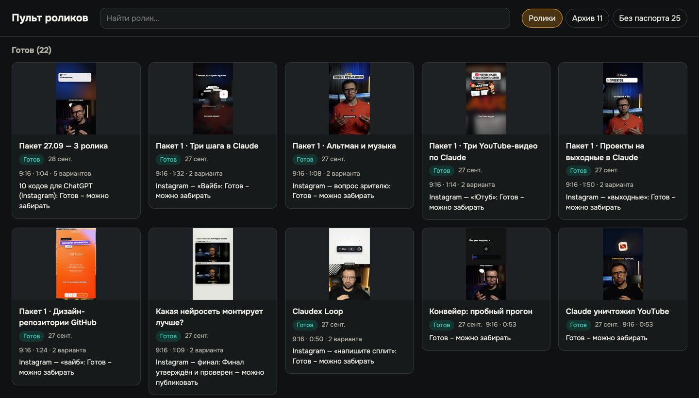
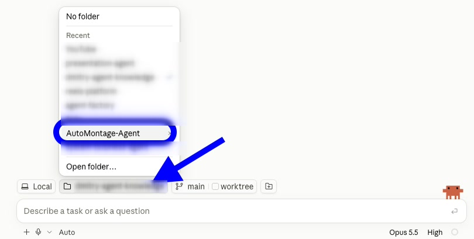
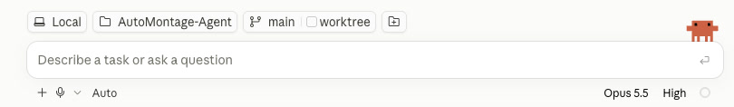
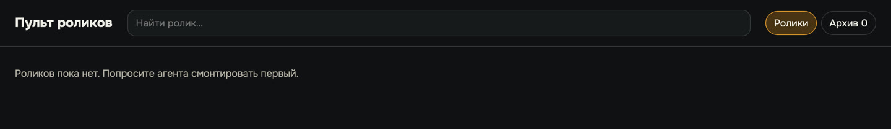

# Урок 1. Рабочее место за один вечер

Для многих «установка» - самое страшное слово. В голове сразу чёрное окно терминала, команды,
которые надо где-то найти, и красные ошибки, в которых ничего не понятно.

Хорошая новость: в этом курсе терминал не нужен вообще. Всё ставит агент, а вы разрешаете и
проверяете. Я всегда говорю: не надо понимать, как работает двигатель, - надо уметь водить машину.

**Результат урока:** пульт роликов открывается двойным щелчком, движок монтажа стоит и собрал
тестовый ролик, есть папка с музыкой. Для пути «аватар» ещё подключены HeyGen и ваш голос.

**В этом уроке мы:**

- разберём три правила работы с агентом;
- установим движок монтажа одной фразой;
- создадим значок «Пульта роликов»;
- соберём свою библиотеку музыки и подключим сток;
- подключим HeyGen и ваш голос - прям так, чтобы аватар говорил по тексту.

**Время:** один раз, 30-60 минут. Большую часть времени вы ждёте, пока агент ставит программы.

---

## Смотрите, как это выглядит

Одна фраза в чате - и через несколько минут на вашем компьютере стоит движок и собрано первое
тестовое видео. Вы не вводите ни одной команды руками: агент сам скачивает, ставит, проверяет и
пишет, чего не хватает.

А вот куда вы придёте через девять уроков - мой пульт после двух дней работы:



---

## Шаг 1. Три правила работы с агентом

**Зачем.** Агент - это монтажёр, который работает в своей студии. Студия - это папка на вашем
компьютере. Откроете агента не в той папке - он окажется в пустой комнате без инструментов.

**Сначала само приложение.** Скачайте с официального сайта приложение Claude (в нём есть Claude
Code) или Codex и войдите в свой аккаунт с подпиской. В приложении Claude слева вверху два значка -
«чат» и `</>`. Нажмите `</>`: это режим Claude Code, в котором агент работает с файлами на вашем
компьютере. Внизу окна - поле для сообщения: туда вы вставляете все фразы из курса и отправляете их
клавишей Enter, как в мессенджере.

**Правило первое: агент работает в той папке, где его открыли.**

Над полем для сообщения есть ряд кнопок, и на одной из них значок папки с её названием. Нажмите
её - откроется список: «No folder», недавние папки и внизу «Open folder…».



- В первый раз выберите «Open folder…» и найдите нужную папку на компьютере.
- Дальше папка появится в недавних, и её можно выбрать одним щелчком.
- Выбрали - на кнопке теперь её название. Всё, что вы пишете в этом чате, агент делает в этой папке:



В VS Code то же самое делается так: «Файл» → «Открыть папку», затем откройте панель Claude Code
или Codex. В приложении Codex папку тоже выбирают при открытии проекта.

Для начала создайте на компьютере пустую папку «Монтаж» и откройте агента в ней.

**Правило второе: разрешения читаем, а не прокликиваем.** Перед каждым действием агент
спрашивает разрешение - в чате появляется вопрос с вариантами ответа: «да», «да и больше не
спрашивать про такие команды», «нет». Установку и проверки разрешайте; при установке вопросов
будет много, и вариант «больше не спрашивать» для одной и той же команды сэкономит время. Если он хочет удалить файлы, отправить
что-то в интернет или потратить деньги, прочитайте, что именно, и смело отказывайте, если не
уверены.

**Правило третье: файлы передаём перетаскиванием.** Перетащите файл или папку из Finder или
Проводника прямо в окно чата - агент получит путь к нему. Удобно держать всё в одном месте:

```text
Монтаж/
  AutoMontage-Agent/        движок, появится на шаге 2
  Исходники/                ваши видео с телефона
  Музыка для роликов/       шаг 4
```

И ещё две вещи на будущее. Сборка роликов идёт от минут до пары часов, поэтому ноутбук держите на
зарядке и с открытой крышкой. Если агент остановился из-за лимита подписки, ничего не пропало:
всё лежит в файлах. Когда лимит обновится, напишите «продолжи».

---

## Шаг 2. Устанавливаем движок одной фразой

**Зачем.** Движок - это монтажная программа, которой пользуется агент. Бесплатная, работает на
вашем компьютере, ролики никуда не отправляет.

**Что сказать агенту** (он открыт в папке «Монтаж»):

> Установи движок автомонтажа из репозитория https://github.com/mcdenil-skills/AutoMontage-Agent.
> Склонируй его, поставь зависимости (npm ci и Python-пакеты из requirements.txt) и глобальную
> команду automontage (npm install -g .). Проверь окружение командой automontage doctor, собери
> демо командой npm run demo и проверь, что работает локальная расшифровка речи Whisper. Скажи,
> чего не хватает, и поставь это сам.

Технические слова в этой фразе - для агента. Вам их понимать не нужно, просто скопируйте.

**Что делает агент.** Скачивает движок, ставит программы для сборки видео и расшифровки речи,
собирает тестовый ролик. Если на компьютере чего-то не хватает, ставит сам. При первой расшифровке
скачивается модель распознавания речи, это разовая загрузка.

**Пока ждёте.** На Mac может появиться окно «Установить инструменты разработчика» - нажмите
«Установить». Если установке понадобится пароль от компьютера, появится системное окно - вводите
пароль только туда, в чат его не пишите.

**Единственное исключение из «без терминала».** На совсем новом Mac установка некоторых программ
просит пароль администратора там, где агент не может его ввести. Тогда агент пришлёт одну команду и
попросит выполнить её самим. Нажмите `Cmd + Пробел`, наберите «Терминал», нажмите Enter, вставьте
команду и снова Enter. Когда спросят пароль от Mac, наберите его - символы при вводе не видны, так и
задумано - и нажмите Enter. Дальше агент продолжит сам.

**Что вы увидите.** Агент ответит обычным текстом: какие программы проверены, чего не хватало и
что он доставил, и что тестовое видео собрано - файл `out/demo.mp4`. Красных слов «ошибка» или
«не найдено» в конце ответа быть не должно.
Попросите: «Открой мне тестовое видео». Играет - движок работает.

> **Важно.** Движок появился в папке `Монтаж/AutoMontage-Agent`. Начните новый чат и выберите
> **эту папку** кнопкой с папкой над полем для сообщения: «Open folder…» → `Монтаж` →
> `AutoMontage-Agent`. В VS Code - «Файл» → «Открыть папку». Дальше всегда работайте только здесь:
> в папке движка лежат правила агента - как монтировать, как работать с пультом и что нельзя делать без вашего согласия.

---

## Шаг 3. Значок «Пульта роликов»

**Зачем.** Пульт - ваш экран приёмки. В нём все ролики, правки и кнопка «Утверждаю». Значок
открывает его в один щелчок.

**Что сказать агенту:**

> Создай значок пульта роликов.

- **macOS:** значок «Пульт роликов» появится в папке «Программы» вашей домашней папки - не в
  общей. В Finder: меню «Переход» → «Домой» → папка «Программы». Перетащите значок в Dock.
- **Windows:** значок появится на рабочем столе.

Откройте пульт двойным щелчком. Пока роликов нет, он пустой, так и должно быть:



 Подробно про
каждую кнопку - в [инструкции к пульту](../PULT.md).

### Что мы уже сделали

Открыли агента в своей папке, установили движок, собрали тестовое видео и получили значок пульта.
Осталось дать агенту материалы: музыку, сток и, для пути «аватар», ваш голос.

---

## Шаг 4. Своя библиотека музыки и звуков

**Зачем.** Музыка с чужими правами - это блокировка звука или жалоба на ролик. Поэтому в движке
музыки нет, и библиотеку вы собираете один раз сами.

**StreamBeats** - бесплатная библиотека инструментальной музыки для авторов видео. Короче,
простым языком: больше 1 500 треков, которые по их лицензии можно ставить даже в монетизированные
ролики и не указывать автора. Музыку для наших роликов мы брали оттуда. Перед публикацией всё равно сверьтесь с
актуальными условиями на сайте.

**Что вы делаете.** Зайдите на [streambeats.com](https://www.streambeats.com/) и скачайте 15-20
треков без вокала в папку `Монтаж/Музыка для роликов`. Подойдёт и любая другая музыка, на которую у
вас есть права.

Почему так много: у каждого ролика своя музыка, даже у вариантов для Instagram (запрещённая в
России соцсеть) и YouTube одной темы. Одинаковый трек в ленте быстро надоедает.

**Звуки** - щелчки, вылеты карточек, набор текста - агент берёт в **Mixkit**, бесплатной библиотеке
звуковых эффектов. По её лицензии звуки можно ставить в коммерческие ролики и не указывать автора.
Все звуки наших роликов оттуда. Собирать их заранее не нужно: агент скачает сам (правило 7 в
уроке 4). Движок берёт звуки из локальной библиотеки на вашем компьютере, в интернет-репозиторий
они не попадают. Если агент предупредит «библиотеки звуков нет», попросите: «Собери библиотеку
звуков из Mixkit и пересобери слой анимаций со звуками».

---

## Шаг 5. Сток по желанию

**Зачем.** Когда вы говорите «мозговой штурм» или «офис в пятницу вечером», хорошо бы на 2-3
секунды показать это живым видео. Искать такие вставки руками долго.

**Pexels** - бесплатный фотобанк с видео. Короче, простым языком: бесплатный ключ даёт агенту самому
искать ролики по смыслу вашей фразы, а указывать автора по лицензии Pexels не нужно. Стоковые
вставки наших роликов - оттуда. Без ключа монтаж тоже работает, но вставки придётся приносить самим.

**Что вы делаете.** Получите ключ на странице [pexels.com/api](https://www.pexels.com/api/) и
скажите агенту:

> Создай файл .env для ключа PEXELS_API_KEY и открой его мне в текстовом редакторе.

В открывшемся файле должна быть строка - вставьте свой ключ после знака «равно», без кавычек и
пробелов:

```dotenv
PEXELS_API_KEY=ваш_ключ
```

Сохраните (`Cmd + S`) и закройте файл. Сам файл скрытый, в Finder его не видно - это нормально,
агент его найдёт. В чат ключ не присылайте: файл `.env` - это сейф с
ключами, и открывать его должны только вы.

---

## Шаг 6. Путь «аватар»: HeyGen и ваш голос

Пропустите этот шаг, если будете снимать себя на телефон. Навык аватара работает на macOS и Linux,
на Windows выбирайте путь «своя съёмка».

**Зачем.** Чтобы ролик выходил без камеры, света и дублей: вы даёте текст, а говорит его ваш
цифровой двойник вашим же голосом.

**HeyGen** - сервис, который делает видео с вашим цифровым двойником (Digital Twin): вы один раз
снимаете себя на видео, дальше двойник говорит любой текст. **ElevenLabs** - сервис озвучки,
который читает текст вашим клонированным голосом. Без ElevenLabs тоже можно: запишите голос на
диктофон, и двойник повторит его губами. Оба сервиса платные. На этой связке сделаны все 15
роликов курса.

**Если двойника и клона голоса ещё нет** - их создают один раз:

- **двойник** - на сайте HeyGen по их инструкции для Digital Twin: вы записываете короткое видео с
  собой, сервис обрабатывает его и сообщает, когда двойник готов. Можно и через агента, когда
  навык установлен (пункт 2 ниже): «Создай мой Digital Twin из этого видео» - видео до 32 МБ;
- **клон голоса** - на сайте ElevenLabs по их инструкции: нужен платный тариф и записи вашего
  голоса.

Сколько это занимает, зависит от сервиса, - ориентируйтесь на их подсказки на сайте.

**Что сказать агенту - по очереди:**

1. Программа HeyGen и вход в аккаунт:

   > Установи официальную программу HeyGen CLI и запусти вход в мой аккаунт HeyGen.

   Откроется браузер - войдите в свой аккаунт.

2. Навык аватара:

   > Установи навык https://github.com/mcdenil-skills/heygen-avatar-oauth для Claude Code (или
   > Codex) по его README и проверь его командой doctor.

3. Голос. Ключ ElevenLabs создаётся на сайте ElevenLabs в разделе API Keys, код голоса (Voice ID)
   - это строка из букв и цифр у вашего клона в разделе голосов.

   > Создай файл для ключей ElevenLabs и открой его мне в текстовом редакторе.

   Агент сам выберет правильный файл - тот, который читает навык аватара. Вставьте значения после
   знака «равно», без кавычек и пробелов, сохраните (`Cmd + S`) и закройте:

   ```dotenv
   ELEVENLABS_API=ваш_ключ
   ELEVENLABS_VOICE_ID=код_вашего_голоса
   ```

**Что вы увидите.** Агент покажет результат проверки навыка. В нём должно быть `ok: true` и
`billingType: subscription`. Это значит, что ролики оплачиваются кредитами вашей подписки HeyGen, а
не отдельным кошельком. Если вместо `subscription` написано другое, роликов не запускайте:
скорее всего, вход выполнен не в тот аккаунт.

---

## Итог урока

Короче, что мы сделали за вечер:

- разобрали три правила работы с агентом: своя папка, внимательные разрешения, файлы
  перетаскиванием;
- установили движок одной фразой и собрали тестовый ролик;
- создали значок «Пульта роликов»;
- собрали библиотеку музыки и подключили сток;
- подключили HeyGen и ваш голос.

## Грабли

| Что случилось | Как избежать |
|---|---|
| Агент «не знает» пульт и спрашивает, что за движок | Он открыт не в той папке. Откройте его в `Монтаж/AutoMontage-Agent` |
| Агент просит прислать ключ в чат | Не присылайте. Попросите открыть файл для ключей и вставьте ключ сами |
| Проверка предупреждает про WebP: видео работает, фото нет | Скажите агенту: «Поставь полную сборку ffmpeg с поддержкой WebP» |
| Значок пульта перестал запускаться после обновления | Скажите агенту: «Пересоздай значок пульта» |
| Windows: нарезка в пульте стоит ровно, а preview с телефона лёг набок | Скажите агенту: «Проверь версию FFmpeg. Если это 7.1.0 или 7.1.1 - поставь более новую и пересобери исходник» |

## Домашнее задание

**Сделайте:** пройдите шаги 1-5, а для аватара и шаг 6.

**Проверьте себя:**

- [ ] тестовое видео `out/demo.mp4` открывается и играет;
- [ ] пульт открывается двойным щелчком по значку;
- [ ] в папке «Музыка для роликов» лежат 15-20 треков, на которые у вас есть права;
- [ ] для аватара: проверка навыка показывает `ok: true` и `billingType: subscription`;
- [ ] агент открыт в папке `AutoMontage-Agent`.

---

**В следующем уроке** разберём, почему одни ролики пролистывают через две секунды, а другие
досматривают до кодового слова, и напишем текст, который досматривают:
[урок 2](02-idea-and-script.md).
