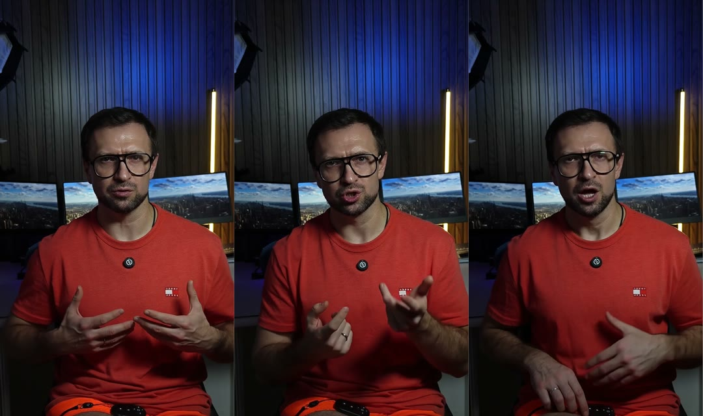

# Урок 3. Видео со спикером: аватар или телефон

«Я не люблю себя на камере», «нет света и студии», «на каждый ролик уходит по двадцать дублей» -
вот из-за чего большинство так и не начинает снимать.

Сегодня разберём два пути, и оба рабочие. Первый - цифровой двойник: вы даёте текст, а говорит
его ваша копия вашим голосом, без камеры вообще. Второй - обычный телефон, и тут разберём, как
снять так, чтобы агенту было из чего сделать живую камеру. Монтаж, пульт и финал у обоих путей
одинаковые (кроме черновой нарезки: она только у своей съёмки одной записью), отличается только
этот урок.

**Результат урока:** видео, где спикер говорит ваш утверждённый текст, - готовый материал для
монтажа.

**В этом уроке мы:**

- сравним два пути и выберем свой;
- посчитаем кредиты HeyGen так, чтобы не было сюрпризов;
- создадим видео с цифровым двойником одной фразой;
- сделаем концовку для YouTube, которая подходит ко всем роликам;
- снимем ролик на телефон с запасом для живой камеры.

**Время:** путь «аватар» - 5 минут ваших и около получаса ожидания. Путь «своя съёмка» - 15-30
минут на запись.

---

## Смотрите: эти кадры никто не снимал

Это не видеозапись. Я дал текст, клон моего голоса в ElevenLabs его прочитал, а цифровой двойник
в HeyGen повторил губами и жестами. Камера, свет и дубли не понадобились.

---

## Шаг 1. Выбираем путь

| | Аватар | Своя съёмка |
|---|---|---|
| Что нужно | HeyGen, по желанию ElevenLabs | телефон, свет, тишина |
| Деньги | около 32 кредитов HeyGen за минуту видео | бесплатно |
| Оговорки | нет, но бывают заикания синтеза | есть: агент вырезает их сам, а вы проверяете в черновой нарезке |
| Живость | зависит от качества двойника | максимальная |
| Запас на приближение | меньше: файл HeyGen 1080×1920, но по чёткости это 720p, поэтому приближаем не больше чем на 25 % | больше: снимайте в максимальном качестве телефона (4K) |
| Компьютер | macOS или Linux | любой |

---

## Путь А. Цифровой двойник

### Шаг А1. Выбираем образ и лимит кредитов ✋

Двойника ещё нет - сначала создайте его ([урок 1, шаг 6](01-setup.md#шаг-6-путь-аватар-heygen-и-ваш-голос)).

**Зачем.** Кредиты HeyGen - это деньги. Лимит - как бюджет на ремонт: называете потолок заранее,
и прораб не выходит за него без вашего согласия.

**Что сказать агенту:**

> Покажи мои личные аватары для вертикального видео.

Агент пришлёт список ваших образов с названиями, иногда с картинками-превью. Выберите одно
название и назовите лимит:

> Образ - <название>. Лимит - <N> кредитов. Создавай.

Первый ролик с этим образом? Сразу закажите и концовку для YouTube (шаг А3), она стоит ещё около
3 кредитов:

> Образ - <название>. Лимит - <N> кредитов. Ещё сделай отдельный короткий клип с призывом
> «<текст призыва для YouTube>» тем же образом и сохрани его для следующих роликов. Создавай.

**Как посчитать лимит.** Около 1 000 символов текста - это минута речи, а минута аватара стоит
около 32 кредитов. Добавьте 10-20 % запаса. Например, текст на 1 500 символов - это где-то 1,5
минуты и 48 кредитов, лимит ставим 55. Если что-то придётся переозвучивать, агент остановится и
спросит новый лимит.

### Шаг А2. Агент озвучивает и рендерит

**Что делает агент.**

1. Озвучивает текст вашим голосом в ElevenLabs. Клона голоса нет - запишите голосовое на телефон,
   перекиньте его на компьютер (AirDrop или облако), перетащите файл в чат и скажите: «Я прикрепил
   голосовое, сделай из него видео с моим аватаром».
2. Проверяет озвучку расшифровкой: ищет заикания и неправильно прочитанные слова. Заикание
   вырезает сам. Неправильное слово обсуждает с вами: чаще проще переписать фразу, чем спорить с
   синтезом.
3. Отправляет аудио в HeyGen и ждёт готовое видео. Если связь оборвалась, агент докачивает то же
   видео и второй раз не платит.
4. Проверяет результат: размер, частоту кадров, совпадение губ со звуком.

**Пока ждёте.** У нас рендер одного ролика занял 24 минуты, а пяти параллельно - меньше часа.
Самое время продумать, что получит зритель по кодовому слову: собирать лид-магнит будем в
[уроке 7](07-lead-magnet.md).

**Что вы увидите.** Отчёт: видео готово, сколько кредитов ушло и сколько осталось. Файл искать не
нужно, на монтаж агент возьмёт его сам.

### Шаг А3. Концовка для YouTube - один раз на все ролики

**Зачем.** Рендерить весь ролик дважды ради последних четырёх секунд - платить дважды за одно и то
же. Поэтому мы делали так:

1. Основное видео рендерится один раз, с концовкой для Instagram (запрещённая в России соцсеть).
2. Призыв «Подписывайтесь на канал…» рендерится отдельным клипом на 4 секунды тем же образом.
3. Вариант для YouTube агент собирает сам: основное видео до концовки Instagram плюс этот клип.
   Стык прячет сменой графики.

Клип заказывается один раз, вместе с первым видео (шаг А1). Дальше он подходит к любому ролику с
этим образом, и кредиты на него больше не нужны.

### Что мы уже сделали

Посчитали кредиты, получили видео с двойником и одну концовку для YouTube на все будущие ролики.
Если снимаете себя сами - вот ваш путь.

---

## Путь Б. Своя съёмка на телефон

### Шаг Б1. Ставим кадр с запасом

**Зачем.** Живая камера - это когда агент в монтаже приближает, отдаляет и сдвигает кадр. Для этого
ему нужен запас: снимете впритык - приближать будет некуда.

- **Вертикально**, 9:16. В настройках камеры - 4K или хотя бы 1080p, 25 или 30 кадров в секунду.
- **Телефон на штативе** на уровне глаз. Смотрите в камеру, а не на экран.
- **Свет спереди:** окно или лампа за телефоном. Свет из-за спины делает лицо тёмным.
- **Голова и плечи в кадре**, над головой немного места.
- **Звук:** петличный микрофон или хотя бы тихая комната без эха.

### Шаг Б2. Записываем без остановок

- Говорите по утверждённому тексту. Суфлёр можно, монотонное чтение - нет.
- **Не останавливайте запись.** Если оговорились – помолчите около 2 секунд и повторите фразу
  целиком, с начала. По паузе агент найдёт место разреза, а по одинаковому началу двух попыток -
  неудачную. Лишнее он вырежет сам, а вы проверите это в черновой нарезке в пульте
  ([урок 5](05-pult.md#шаг-2-черновая-нарезка)).
- **Лучше одной записью от начала до конца**, с оговорками и повторами внутри. Тогда агент
  покажет вам черновую нарезку, и вы сами проверите, что он вырезал. Если всё же снимаете
  блоками (хук, основная часть, концовка) или несколькими полными дублями разными файлами,
  агент соберёт ролик из лучших кусков сам, а свой выбор покажет таблицей «блок → дубль →
  причина» вместе с preview. Черновой нарезки в этом случае нет.
- **Обе концовки запишите подряд** в конце: сначала для Instagram, потом для YouTube.

### Шаг Б3. Кладём запись рядом с движком

Перекиньте файл с телефона в папку `Монтаж/Исходники` - AirDrop, кабель или облако. Агенту
пока ничего писать не нужно: запись вы отдадите вместе с заданием в уроке 4. Заранее исходник из
неё не собирают. Сначала агент вырежет паузы и повторы и покажет вам черновую нарезку в пульте
([урок 5](05-pult.md#шаг-2-черновая-нарезка)), у каждого из двух вариантов свою. Исходник он
соберёт только после вашего «Нарезка готова».

Сняли блоками или несколькими дублями разными файлами - в уроке 4 перетащите в чат все файлы
сразу и допишите в начало задания «Это дубли одного ролика» или «Хук - файл 1, основная часть -
файл 2, концовка - файл 3». Подробно - в [инструкции про дубли](../TAKES.md).

---

## Итог урока

Что мы сделали:

- сравнили два пути и выбрали свой;
- посчитали кредиты по правилу «1 000 символов - минута - 32 кредита»;
- получили видео со спикером - двойником одной фразой или на телефон с запасом для живой камеры;
- для двойника сделали одну концовку для YouTube на все ролики.

## Грабли

| Что случилось | Как избежать |
|---|---|
| В варианте для YouTube «подпишись» прозвучало дважды: неудачный первый заход остался в записи | Попросите агента проверить, что каждая концовка звучит ровно один раз |
| В озвучке лишний звук «жж» в начале слова | Агент вырезает такое точечно, без новой озвучки. Отметьте место правкой в пульте ([урок 5](05-pult.md)) |
| Голос двойника тихий, и музыка его перекрывала | Для HeyGen это нормально. Громкость музыки агент подбирает по замеру ([урок 4](04-montage.md)) |
| Кредиты кончились посреди пакета | Считайте лимит заранее: 32 кредита за минуту плюс запас |

## Домашнее задание

**Сделайте:** получите видео со спикером по тексту из урока 2 - двойником или на телефон. Для
двойника сразу закажите клип-концовку для YouTube.

**Проверьте себя:**

- [ ] видео вертикальное, лицо хорошо освещено, голос чистый;
- [ ] послушайте начало и конец: текст совпадает с утверждённым;
- [ ] для двойника: кредиты ушли в пределах лимита, заиканий нет;
- [ ] для своей съёмки: в записи есть обе концовки.

---

**В следующем уроке** - главный секрет курса. Мои первые ролики дошли до утверждения только с
третьей версии, хотя хватило бы первой. Разберём, какое одно сообщение агенту это меняет: [урок 4](04-montage.md).
