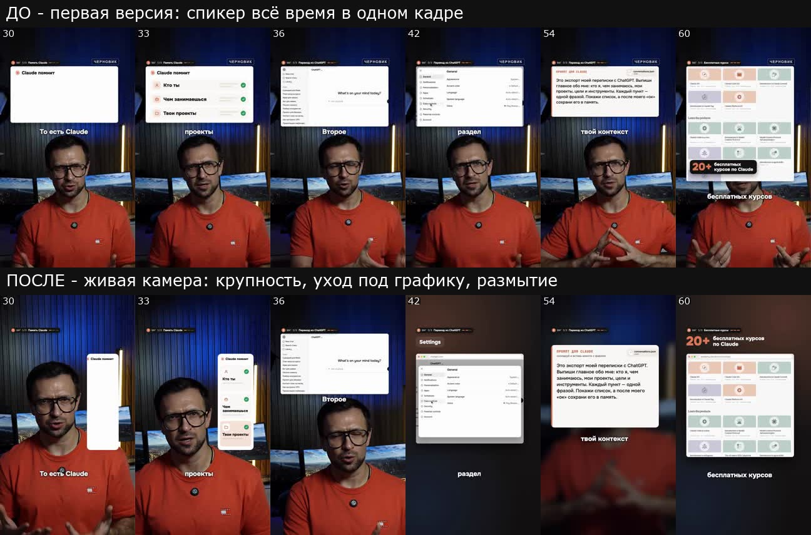

# Урок 4. Одно задание вместо лишних кругов правок

Страх здесь простой: «отдам агенту видео, а он сделает какую-то ерунду, и я неделю буду
объяснять, что имел в виду».

Так и бывает, если давать задание по кусочку. Это как ремонт, где вы каждый день звоните прорабу с
новым пожеланием: «а розетку перенесите», «а плитку другую». Каждое пожелание - это переделка. А
если отдать полное ТЗ до начала работ, прораб сразу делает как надо. С агентом ровно так же.

**Результат урока:** первый preview вашего ролика для Instagram (запрещённая в России соцсеть) и
YouTube в пульте - уже с живой камерой, скриншотами,
звуками и музыкой, - который остаётся только немного поправить.

**В этом уроке мы:**

- разберём, почему мои первые ролики дошли до утверждения только с третьей версии;
- соберём одно задание из 10 правил;
- выберем маршрут монтажа;
- посмотрим, что делает агент, пока вы ждёте, - прям по шагам;
- разберём, что движок проверяет сам и как читать его отчёт.

**Время:** 5 минут ваших и два коротких просмотра черновой нарезки, по одному на вариант (у
аватара их нет). Первый preview агент готовит где-то от получаса до пары часов - зависит от длины
ролика и очереди: анимации под ваш текст он пишет с нуля.

---

## Смотрите на разницу

Одна и та же минута ролика. Сверху первая версия: агент ещё не знал правил, и спикер всё время в
одном кадре. Снизу - после правил из этого урока: крупность меняется, спикер уходит под графику,
фон размывается под скриншотом.

---

## Шаг 1. Почему понадобились три версии

Первые наши ролики дошли до утверждения только с третьей версии - два лишних круга правок. Не потому, что агент плохо монтирует, а потому, что правила
приходили к нему по частям:

1. **Первая версия:** аватар стоял неподвижно, звуков не было, музыку не было слышно, вместо
   настоящих сайтов - нарисованные макеты.
2. **Вторая:** камера ожила, появились звуки и скриншоты, но эффекты оказались громче нужного, а
   музыка тише.
3. **Третья:** чужое видео висело в кадре 30 секунд вместо 2-3, а в одном ролике спикер стоял без
   смены плана по 7-10 секунд.

Всё это можно было сказать заранее. Поэтому дальше - одно задание, где все правила уже собраны.

---

## Шаг 2. Отдаём видео и задание

**Что сказать агенту** - скопируйте, подставьте свои данные и отправьте одним сообщением:

> Смонтируй ролик из <путь к видео>. Маршрут - Creative Motion. Тема - «<название>». Нужны два
> варианта в одной карточке пульта: Instagram (концовка с кодовым словом «<слово>») и YouTube
> (концовка с призывом подписаться). Вертикаль 9:16.
>
> Уровень - как в курсе «Ролики с нуля», правила сразу:
>
> 1. **Живая камера.** Спикер не стоит без изменений дольше 2-2,5 секунды: медленный наезд,
>    резкие смены крупности на акцентных словах (заметные, не меньше 15 %), размытие под крупной
>    графикой, уход спикера на 1,5-4 секунды под полноэкранные вставки.
> 2. **Хук.** В первые 3 секунды спикер виден. Если хук - перечисление вещей, пусть они вылетают
>    на экран со звуком.
> 3. **Настоящие вещи.** Где я называю сайты, посты, видео, книги, продукты - настоящие скриншоты,
>    по возможности на русском, а не нарисованные макеты. Логотипы - настоящие.
> 4. **Сток.** 3-4 коротких видео Pexels строго по смыслу фразы, с движением внутри, без чужих
>    логотипов. Если ключа Pexels нет - скажи, я пришлю свои видео, или обойдёмся анимацией.
> 5. **Чужое видео** в кадре - не дольше 2-3 секунд и с подписью автора, дальше свои анимации.
> 6. **Графика.** У каждой карточки есть появление, жизнь и уход. Текст не заходит под кнопки
>    Instagram.
> 7. **Звуковые эффекты** на появление графики: щелчки, вылеты, набор текста - из бесплатной
>    библиотеки Mixkit. Не больше одного заметного звука в 1-2 секунды, эффекты не спорят с голосом.
> 8. **Музыка.** Своя у каждого варианта, из папки <путь к музыке>, под речью приглушается. Для
>    цифрового двойника - баланс как в утверждённом эталоне (около 38 LU по G8); своя съёмка - по
>    умолчанию движка (12-18 дБ).
> 9. **Субтитры** по словам, названия в оригинальном написании.
> 10. **Проверь сам до показа:** собери слой анимаций из motion-kit и прогони все его проверки;
>     сам посмотри громкость голоса и музыки, синхрон, кадры по всему ролику. В отчёте назови
>     каждое ⚠️ и каждое исключение, если они есть. Потом покажи полный preview в пульте. Для
>     своей съёмки одной записью сначала покажи черновую нарезку в пульте и жди «Нарезка готова».

Как заполнить: вставьте задание в поле сообщения, затем замените каждое место в `<угловых
скобках>` своим - скобки удалите. Чтобы вставить путь к папке с музыкой, поставьте курсор на место
`<путь к музыке>` и перетащите туда папку из Finder. Для двойника вместо пути к видео напишите
«Смонтируй видео аватара, которое ты сделал». Для своей съёмки поставьте курсор на место
`<путь к видео>` и перетащите туда файл записи из папки `Монтаж/Исходники`. Несколько дублей или
блоков - перетащите все файлы и допишите в начало задания «Это дубли одного ролика».

Не хотите смотреть черновую нарезку (она бывает только у своей съёмки одной записью) - допишите в
конце задания: «Режь сам: черновую нарезку мне не показывай». Это отменяет остановку на нарезке
из правила 10: агент дойдёт до preview, не дожидаясь вас. Но оговорку, найденную потом в preview,
придётся вырезать полным кругом - 15-20 минут.

Задание можно не печатать, а надиктовать голосом, - для агента это обычная речь. Правила при этом
всё равно лучше вставить текстом целиком, чтобы ни одно не потерялось.

**Почему правила именно такие** - коротко, по каждому:

| Правило | Зачем |
|---|---|
| Живая камера | зритель листает, когда картинка стоит. Смена плана каждые 2 секунды держит глаз |
| Хук со спикером | в первые секунды зритель решает, смотреть ли, и ему нужно лицо |
| Настоящие вещи | нарисованный «сайт» выглядит как заглушка, настоящий скриншот - как доказательство |
| Чужое видео 2-3 с | дольше - это уже чужой ролик в вашем, и риск жалобы (урок 9) |
| Звуки | каждое появление графики «щёлкает» - ролик ощущается дорогим |
| Музыка по эталону | см. ниже |

**Про громкость музыки.** Музыку под голосом приглушают, как водитель убавляет радио, когда в
машине начинают разговаривать. Движок сам меряет, насколько музыка тише голоса под речью
(проверка G8, единицы LU). Для цифрового двойника эталон - ролик, который утвердили на слух: у
него около 38 LU. Число большое, потому что меряется готовый микс после выравнивания громкости
голоса, а на слух музыка при этом хорошо слышна. Хотите музыку слышнее - так и напишите: агент
сократит разницу на 6-8 LU, а проверка покажет предупреждение - так и задумано. Если же у двойника
музыка ушла совсем мимо эталона - почти не слышна или звучит вровень с голосом, - проверка
остановит preview, и агент поправит громкость до показа. Для своей съёмки действует обычное
правило движка: голос громче музыки на 12-18 дБ, 8-10 дБ, если попросили музыку слышнее. Точного
эталона для своей съёмки пока нет, поэтому проверка здесь только предупреждает, а останавливает
лишь музыку вровень с голосом или громче. Баланс сверяйте на слух.

---

## Шаг 3. Выбираем маршрут

Если маршрут не назван, агент сначала спросит **«Как монтируем?»** и покажет три варианта:

- **Creative Motion** - новый дизайн под тему. На нём сделаны все ролики курса, рекомендую.
- **Готовый стиль** - одна из готовых тем движка. Быстрее, но ролики похожи друг на друга.
- **По референсу** - механика и ритм чужого ролика без копирования его материалов. Подходит,
  если в уроке 2 вы работали от референса.

Выбирается один раз на ролик. Дальше агент решает сам: шрифты, цвета, переходы, тайминги.

### Что мы уже сделали

Поняли, откуда берутся лишние круги правок, отдали агенту одно задание со всеми правилами и
выбрали маршрут. Дальше работает агент.

---

## Шаг 4. Что делает агент, пока вы ждёте

Следить за каждым шагом не нужно, но полезно понимать, куда уходят эти полчаса-два часа.

1. **Заводит паспорт ролика** - папку в `projects/` и служебный файл, чтобы ролик появился в
   пульте. Два варианта ложатся в одну карточку.
2. **Расшифровывает речь по словам.** Отсюда тайминги всех анимаций и субтитры.
3. **Вырезает паузы и повторы и показывает вам черновую нарезку** - ролик ещё без графики, в
   пульте в разделе «Ждёт меня», у каждого из двух вариантов своя. Агент напишет в чат
   «✅ черновая нарезка: …»: сколько длится нарезка, сколько вырезано и в скольких местах. Ещё он
   назовёт сомнительные места с секундой. Их послушайте особенно внимательно: агент их оставил,
   чтобы решили вы. Здесь агент останавливается и ждёт вас: посмотрите нарезку, отметьте оговорки
   и нажмите «Нарезка готова» ([урок 5, шаг 2](05-pult.md#шаг-2-черновая-нарезка)). Пока вы
   смотрите, агент готовит дизайн, скриншоты и музыку - всё, что не зависит от секунд.
   Если у вас аватар, этого шага нет: в видео из текста нет оговорок, и агент собирает исходник по
   своему списку сам, не дожидаясь вас. А у дублей разными файлами нарезки тоже нет.
4. **Собирает исходник один раз** - из оригинала записи по подтверждённой нарезке. После этого
   тайминги уже не сдвинутся, и графика ляжет точно на слова.
5. **Собирает слой анимаций из готовых деталей движка** - это и есть motion-kit. Слой - отдельное
   видео с живой камерой, карточками, скриншотами, стоком, звуками и субтитрами. Камера, вставки,
   звуки и субтитры берутся готовыми, а режиссуру и дизайн карточек агент пишет под ваш текст.
   Каждое событие привязано к слову.
6. **Проверяет план слоя ещё до рендера** - за секунды, по правилам из [таблицы в шаге 5](#шаг-5-что-движок-проверяет-сам). Нашёл ошибку -
   исправляет и проверяет снова.
7. **Рендерит слой и проверяет готовое видео:** длина совпадает с исходником, в звуке слоя только
   эффекты, без голоса.
8. **Подбирает музыку** из вашей папки и настраивает приглушение под голос.
9. **Собирает preview.** Перед тем как положить его в пульт, движок меряет баланс голоса и музыки.
   Потом агент смотрит контакт-лист - кадры по всему ролику с рамкой безопасной зоны.
10. **Кладёт ролик в пульт** в раздел «Ждёт меня» и пишет в чат, что preview готов.

Команды для всего этого агент запускает сам, вам их знать не нужно. Кому интересно, как устроен
слой и все проверки, - [инструкция motion-kit](../MOTION-KIT.md).

**Пока ждёте:**

- **не открывайте второй чат на тот же ролик** - два агента в одной папке перетирают работу друг
  друга;
- **новые мысли записывайте**, а не отправляйте сразу - удобнее оставить их правками в пульте;
- **на вопросы агента отвечайте** - обычно это выбор, который нельзя сделать за вас, например трата
  кредитов;
- **держите компьютер на зарядке и с открытой крышкой.** Окно приложения можно свернуть, но
  чат не закрывайте.

Ролики на одном компьютере собираются по одному. Две сборки одновременно тормозят друг друга и
могут испортить файлы.

---

## Шаг 5. Что движок проверяет сам

**Зачем.** Раньше ошибки вроде «спикер стоит 7 секунд» или «текст ушёл под кнопки» находились
только глазами, уже в пульте. Теперь часть правил из задания проверяет сам движок, как ОТК на
заводе проверяет деталь, прежде чем она уйдёт на склад. Агент ловит такие ошибки до того, как их
увидите вы.

| Что проверяется | Правило из задания | Если не так |
|---|---|---|
| Спикер не стоит на одном плане дольше 2,5 секунды | 1 | стоп |
| Смена крупности заметна глазу | 1 | предупреждение |
| Спикера не приближают слишком сильно | 1 | предупреждение (стоп - только если план сам поднял предел) |
| Спикер виден все первые 2 секунды, лучше - все 3 (кроме хука-перечисления) | 2 | стоп |
| Текст и субтитры в безопасной зоне на каждом кадре | 6 | стоп |
| Стока хватает: 3 вставки, в ролике короче 45 секунд - 2 | 4 | предупреждение |
| Чужое видео подряд - не дольше 3 секунд | 5 | стоп |
| Звуки не теснятся и не бьют у самого края ролика | 7 | предупреждение |
| В звуке анимаций только эффекты, без голоса | 7 | стоп (мелкая утечка - предупреждение) |
| Длина слоя анимаций равна длине исходника | - | стоп |
| Музыка под речью тише голоса, как в эталоне | 8 | цифровой двойник: стоп, если совсем мимо эталона; своя съёмка: стоп, только если музыка вровень с голосом или громче |
| Нет пустых кадров, где выпала графика | 10 | предупреждение |

**Как читать отчёт агента.** У каждой проверки значок:

- ✅ - пройдено;
- ⚠️ - предупреждение: замечание на вкус, preview всё равно собирается. Агент исправит или
  объяснит, почему оставил;
- ❌ - стоп: объективная ошибка. Агент исправляет её сам и проверяет заново;
- ☑️ - стоп снят исключением, рядом написана причина (ниже);
- ⏭️ - не оценивалось, например в ролике нечего мерить.

**«Preview не опубликован».** Если агент пишет эту фразу, не пугайтесь: это не поломка, а
сработавшая защита. Проверка нашла объективную ошибку, и движок не пустил такую версию в пульт.
В пульте остаётся прошлая версия, агент исправляет ошибку и собирает preview заново. Нажимать
ничего не нужно.

**Исключение из проверки.** Иногда длинный план нужен по смыслу - например, вы показываете экран
без склеек. Тогда агент может снять стоп исключением: записывает в план ролика, какую проверку
снимает и почему. Исключение бывает только у трёх проверок: ритм спикера, спикер в первые секунды
и чужое видео. И действует оно на всю проверку целиком, а не на одно место: длинный план, который
добавится потом, проверка уже не остановит. В отчёте исключение видно значком ☑️ с причиной. Не
согласны с причиной - попросите убрать исключение.

**Чего проверки не ловят** - вкуса: удачный ли шрифт, тот ли скриншот, смешно ли. Это по-прежнему
ваш просмотр в пульте. Зелёный отчёт значит «ошибок не нашёл», а не «утверждено».

---

## Итог урока

Что мы сделали:

- разобрали, откуда взялись лишние круги правок;
- собрали одно задание из 10 правил;
- выбрали маршрут монтажа;
- посмотрели, что делает агент, пока вы ждёте;
- разобрали, что движок проверяет сам и что значат ✅, ⚠️ и ❌ в отчёте.

## Грабли

| Что случилось | Как избежать |
|---|---|
| Два лишних круга правок из-за правил, которые приходили по частям | Одно задание со всеми правилами (шаг 2) |
| Музыка звучала вровень с тихим голосом двойника | Правило 8: для двойника баланс как в утверждённом эталоне, движок проверяет его сам (G8) |
| Когда спикер уходил под графику, низ кадра оставался пустым | Под графику ставится размытый спикер на весь кадр. Увидели пустоту - правка в пульте |
| Смену крупности «на 6 %» зритель не заметил | Правило 1: смена крупности не меньше 15 % |
| Одинаковая музыка в двух вариантах одной темы | Правило 8: своя музыка у каждого варианта |
| Агент написал «preview не опубликован» | Это защита, а не поломка: проверка нашла ошибку. Ждите - агент исправит и соберёт заново |
| Ролик вышел без звуковых эффектов, агент предупредил «библиотеки звуков нет» | Звуки лежат в локальной библиотеке на вашем компьютере. Скажите агенту: «Собери библиотеку звуков из Mixkit и пересобери слой анимаций со звуками» |

## Домашнее задание

**Сделайте:** отдайте агенту видео из урока 3 с заданием из 10 правил и дождитесь preview. Для
своей съёмки одной записью агент по дороге остановится на черновой нарезке: посмотрите её, нажмите
«Нарезка готова» ([урок 5, шаг 2](05-pult.md#шаг-2-черновая-нарезка)) и передайте фразу из пульта
агенту. Без этого preview не появится.

**Проверьте себя:**

- [ ] задание ушло одним сообщением, в нём все 10 правил;
- [ ] названы тема, кодовое слово и папка с музыкой;
- [ ] ролик появился в пульте в разделе «Ждёт меня»;
- [ ] в отчёте агента о preview нет ❌, а про каждое ⚠️ и исключение есть объяснение;
- [ ] на этот ролик работает один чат.

---

**В следующем уроке** примем работу, как принимают ремонт: посмотрим ролик глазами зрителя,
поставим правки прямо на нужную секунду и подпишем «Утверждаю». Разберём правку, которую агент
выполнил с одного раза: [урок 5](05-pult.md).
