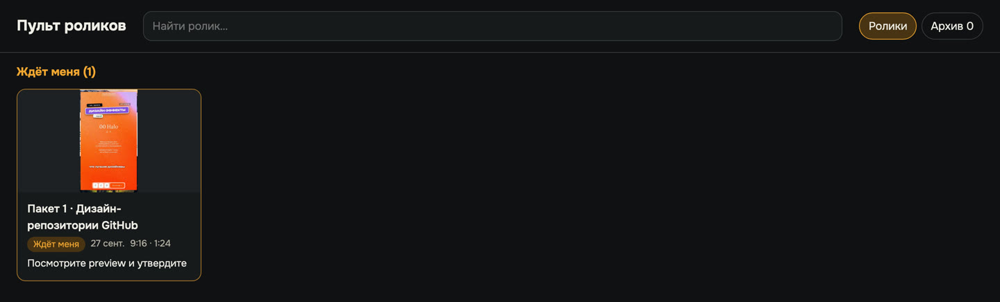
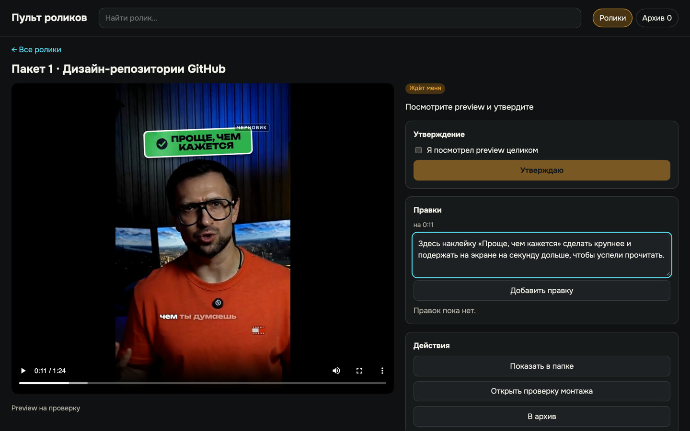
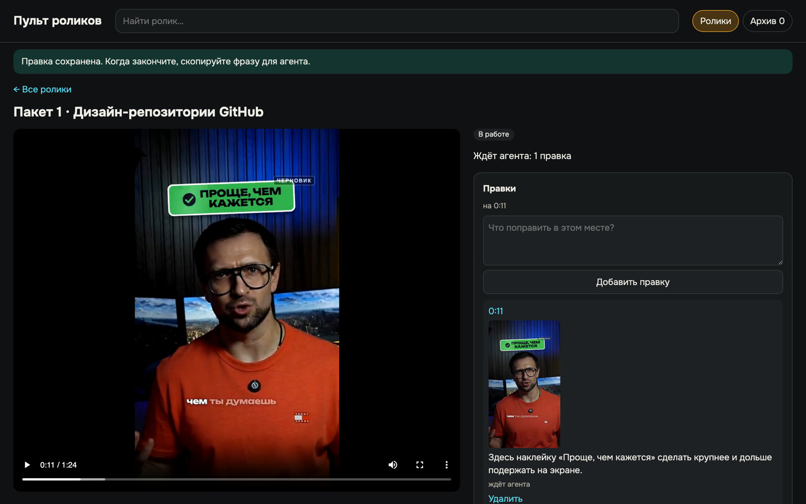
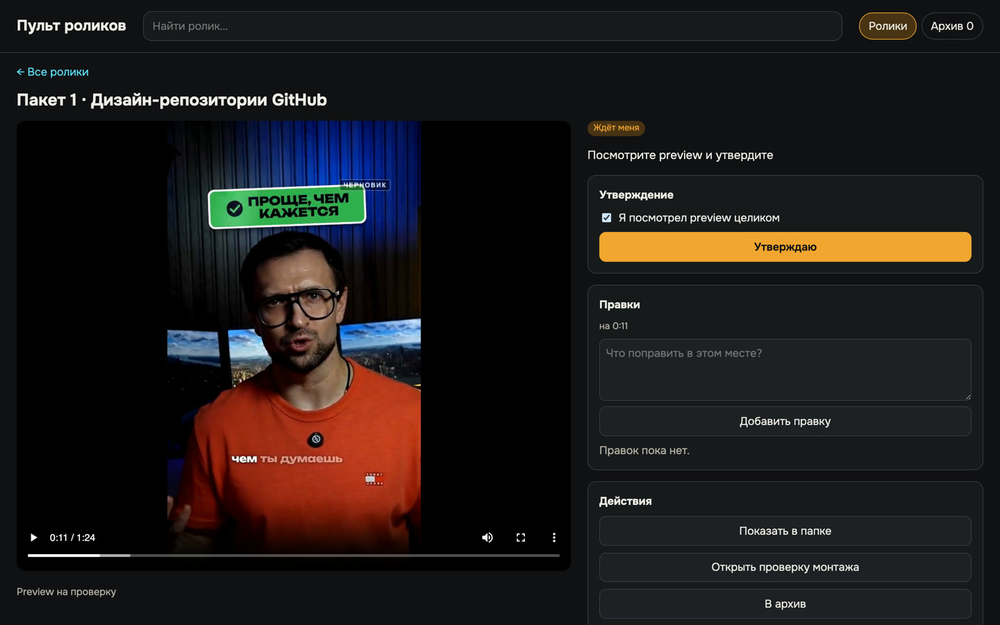

# Урок 5. Пульт: принимаем работу, как принимают ремонт

Самое неприятное в работе с любым подрядчиком - объяснять правки. «Вот тут что-то не то… ну,
сделай поживее». Он переделывает, опять не то, и так по кругу.

В пульте правку не надо описывать словами «где-то в середине». Вы ставите видео на паузу, пишете
одну фразу, и агент получает точную секунду и кадр, на который вы смотрели. Это как приёмка
ремонта: ходите по квартире и клеите стикер прямо на кривую плитку.

**Результат урока:** ваш ролик в пульте утверждён - вы подписали акт приёмки, и агент собирает
финал.

**В этом уроке мы:**

- откроем пульт и разберёмся, что где лежит;
- посмотрим черновую нарезку (для своей съёмки) и отметим оговорки до того, как агент сделает
  графику;
- посмотрим ролик глазами зрителя и проверим по таблице;
- поставим правки прямо на нужную секунду;
- передадим их агенту одной кнопкой;
- проверим новую версию и утвердим её.

**Время:** для своей съёмки сначала два коротких просмотра черновой нарезки, по одному на
вариант: каждый не дольше вашей записи, и пара минут на правки. Дальше 10-20 минут на ролик плюс
ожидание новой версии, 8-20 минут.

---

## Смотрите: правка, которую выполнили с одного раза

Слева - кадр, на котором я поставил правку: найти настоящие скриншоты сайтов, постов и рассылок.
Справа - тот же момент в финале: агент нашёл настоящие письма-рассылки и вставил их
поверх размытого кадра. Одна фраза - и всё сделано.

Работает это одним правилом: **после правок, после «Нарезка готова» и после «Утверждаю» передайте
агенту короткую фразу из пульта** (шаг 5). Всё, что вы сделали в пульте, агент получает в точности,
но сам в пульт не заглядывает.

---

## Шаг 1. Открываем пульт

**Что вы делаете.** Дважды щёлкните значок «Пульт роликов». Значка нет - скажите агенту «открой
пульт роликов».

**Что вы увидите.** Все ваши ролики в трёх разделах:

- **Ждёт меня** - ход за вами: посмотреть черновую нарезку и нажать «Нарезка готова» или
  посмотреть preview и утвердить, либо оставить правки;
- **В работе** - агент монтирует или выполняет ваши правки;
- **Готов** - финальный файл собран, можно забирать.

Так выглядит ролик, который ждёт вашего решения:

Оба варианта одной темы, Instagram (запрещённая в России соцсеть) и YouTube, лежат в одной
карточке. Поиск сверху находит ролик по названию.

Справа вверху ещё две вкладки. **«Архив»** - ролики, которые вы убрали с глаз кнопкой «В архив».
Папки при этом не удаляются, вернуть карточку можно в любой момент. **«Без паспорта»** - папки,
которые пульт не понял. Скажите агенту «заведи паспорт для папки …».

---

## Шаг 2. Черновая нарезка

Этот шаг - для своей съёмки. У аватара черновой нарезки нет: в видео из текста нет оговорок, агент
сразу собирает графику и кладёт в пульт готовый preview. С аватаром переходите к
[шагу 3](#шаг-3-смотрим-как-зритель).

**Зачем.** Сначала агент показывает, как он сократил вашу запись, - ещё без графики. Оговорку
дешевле вырезать сейчас: когда к ролику уже нарисована графика, каждый лишний кусок сдвигает
все тайминги, и слой приходится собирать заново.

**Что вы увидите.** Карточку в «Ждёт меня» с подписью «Черновая нарезка - посмотрите и отметьте
оговорки». Под плеером написано «Черновая нарезка без графики» - так и должно быть: здесь
проверяем только речь и склейки. Справа список **«Что вырезал агент»**: где вырез, сколько секунд
убрано и почему, например «0:02 - вырезано 1,0 с: вырезан повтор «Первое»».

У темы два варианта - нарезка придёт в каждом. Переключите вкладку над плеером и подтвердите обе.
Пока одна из них не подтверждена, карточка остаётся в «Ждёт меня», если к ней нет правок.

**Что вы делаете.**

1. Посмотрите нарезку целиком со звуком.
2. Нажмите на строку в списке вырезов - видео встанет за секунду до стыка. Запустите
   воспроизведение и послушайте, не режет ли склейка слово.
3. Нашли оговорку, повтор или, наоборот, пропал нужный кусок - поставьте правку на этой секунде,
   как в [шаге 4](#шаг-4-ставим-правку-на-секунду): «оговорка», «верни кусок», «повтор».
   Поставили правку - вариант, как и с preview, уйдёт в «В работе» с подписью «Ждёт агента:
   N правок». Это нормально: нарезка в нём осталась, и кнопка «Нарезка готова» тоже.
4. Выберите один из двух путей:
   - отметьте **«Я посмотрел нарезку целиком»** и нажмите **«Нарезка готова»**. Агент внесёт
     правки и пойдёт дальше без повторного показа: соберёт графику и покажет уже готовый preview.
     Пульт ответит: «Нарезка подтверждена. Скопируйте фразу для агента - он соберёт слой», а на
     месте кнопки останется отметка «✅ Нарезка подтверждена в 10:11» (с вашим временем), чтобы
     было видно, что вы уже нажали. Вариант перейдёт в «В работе» с подписью «Нарезка
     подтверждена - агент собирает слой» (если оставляли правки - «Ждёт агента: N правок»).
     Готовый preview с графикой вернётся в «Ждёт меня» обычно через полчаса-два часа
     ([урок 4](04-montage.md#шаг-4-что-делает-агент-пока-вы-ждёте));
   - хотите посмотреть нарезку ещё раз после правок - не нажимайте кнопку, только оставьте
     правки. Агент покажет новую черновую нарезку.
5. Передайте фразу агенту, как в [шаге 5](#шаг-5-передаём-правки-агенту).

**Что важно знать:**

- кнопки «Утверждаю» у нарезки нет: нарезку подтверждают, а утверждают потом готовый ролик;
- агент сам «Нарезка готова» не нажимает. Подтвердить можно и в чате словами «нарезка готова»
  или «режь сам», и кнопка в пульте сменится той же отметкой ✅;
- не хотите смотреть нарезку вообще - скажите «режь сам» ещё до неё, лучше прямо в задании из
  [урока 4](04-montage.md#шаг-2-отдаём-видео-и-задание). Тогда агент вырежет всё сам и пойдёт
  дальше без вас. Но оговорку, которую вы найдёте уже в preview, придётся вырезать полным кругом:
  новый исходник и новый слой, 15-20 минут вместо одной правки на нарезке;
- совет на будущее: оговорились при записи - помолчите около 2 секунд и повторите фразу целиком,
  с начала. Так агенту проще найти и вырезать неудачную попытку.

---

## Шаг 3. Смотрим как зритель

**Зачем.** Первый просмотр отвечает на один вопрос: досмотрел бы я это до конца? Ошибки ищем
вторым проходом.

**Что вы делаете.**

1. Нажмите на карточку. Откроется версия, которая ждёт вашего решения. Вкладки над плеером
   переключают варианты: Instagram и YouTube.
2. Включите звук и посмотрите ролик от начала до конца без остановок.
3. Второй раз пройдите медленно, сверяясь с таблицей.

| Что | Как должно быть |
|---|---|
| Первые 3 секунды | сразу понятно, о чём ролик, и хочется смотреть дальше |
| Спикер | не стоит без изменений дольше 2-2,5 секунды |
| Графика | настоящие скриншоты того, о чём говорится, а не нарисованные заглушки |
| Чужие видео | не дольше 2-3 секунд и с подписью автора |
| Текст на экране | читается и не уходит под кнопки и подписи Instagram сверху, справа и снизу |
| Субтитры | без ошибок в словах и названиях |
| Голос | чистый, без заиканий, лишних звуков и странных ударений |
| Музыка | слышна, но тише голоса, не «гуляет» по громкости |
| Звуковые эффекты | подчёркивают появление графики, но не перекрывают речь |
| Концовка | в Instagram кодовое слово, в YouTube призыв подписаться |

---

## Шаг 4. Ставим правку на секунду

**Что вы делаете.**

1. Поставьте видео на паузу там, где нужно исправить. Клик в поле правки тоже ставит паузу.
2. Напишите, что сделать, и нажмите **«Добавить правку»**.

Пульт запомнит секунду и сохранит кадр. Вариант сразу уйдёт в «В работе» с подписью «Ждёт агента:
N правок», а блок утверждения спрячется, пока агент не выполнит правки. Так и должно быть. Сверху
пульт напомнит: «Правка сохранена. Когда закончите, скопируйте фразу для агента». Пока агент правку
не взял, её можно удалить ссылкой «Удалить» под ней.

**Как написать правку, чтобы хватило одного раза.** Формула: **где → что не так → что сделать →
зачем**. Вежливость и технические слова агенту не нужны, нужны место и смысл.

Вот настоящие правки из наших роликов, почти дословно, как я их надиктовал голосом - так тоже можно. После каждой хватило
одного круга:

> Здесь нужно видео с сатирой сверху показать только первые 2-3 секунды. А дальше добавить
> анимацию по смыслу.

> Логотипы почты, календаря, браузера лучше взять настоящие, от Google.

> Всё отлично, только каждый код лучше сделать как в оригинале, на английском языке, а все
> пояснения на русском, потому что команды вводятся на английском.

> Ошибка в слове «разговаривать прям как с Джарвисом из жж, из Железного человека» - как будто
> лишняя буква «ж».

**Правка на весь ролик** - поставьте её на любую секунду и начните со слов «по всему видео»:

> Нужно прибавить музыку по всему видео. Сделать, чтобы смена кадра у спикера была каждые
> 2 секунды: где-то размыть кадр, где-то подобрать B-roll по смыслу, чтобы монтаж был динамичный.

**Громкость говорите цифрами.** «Эффекты убавить на 5 дБ, музыку прибавить на 3 дБ» агент выполнит
точно, а «сделай потише» - на глаз.

**Правка на все ролики сразу** - одна и та же для всего пакета, например громкость, - пишется один
раз в чат агенту со словами «для всех роликов пакета». Ставить её в каждую карточку не нужно.

---

## Шаг 5. Передаём правки агенту

**Что вы делаете.** Внизу карточки, в блоке «Передать агенту», нажмите **«Скопировать для
агента»** и вставьте фразу в чат. Она выглядит так:

> Продолжи ролик «Пакет 1 · Проекты на выходные в Claude» в projects/…: выполни automontage inbox
> и обработай входящие.

Фразу собирает сам пульт, вы её только вставляете.

Правки по нескольким роликам можно накопить и отправить разом - вставьте фразы подряд одним
сообщением.

**Что делает агент.**

1. Читает все ваши правки с секундами и кадрами.
2. Делает полоску из пяти кадров вокруг каждой правки: за секунду до, за полсекунды, саму секунду,
   через полсекунды и через секунду. Так он видит не один кадр, а момент целиком - ровно то, на
   что смотрели вы.
3. Делает новую версию. Прошлая сохраняется в папке ролика.
4. Прогоняет проверки движка ([урок 4, шаг 5](04-montage.md#шаг-5-что-движок-проверяет-сам)) и
   собирает новый полный preview: громкость, синхрон голоса и губ, длину. Потом смотрит
   контакт-лист - кадры по всему ролику с рамкой безопасной зоны.
5. Отмечает каждую правку как выполненную - под ней появится «принята агентом».

Ролики собираются строго по одному, поэтому пять правок в пяти роликах - это очередь.

**Что вы увидите.** Пока агент работает, под названием варианта подпись «Ждёт агента: N правок»,
потом «Агент готовит preview». Когда новая версия готова, карточка возвращается в «Ждёт меня».

Подпись «Preview устарел - агент готовит новый» под плеером значит: новая версия ещё не готова, а
в плеере прошлая. Агент собирает новую. Если карточка стоит так дольше обычного, возможно, проверка
движка нашла ошибку и не пустила новую версию в пульт. Агент исправит ошибку и соберёт preview
заново сам, ничего нажимать не нужно.

**Пока ждёте** эти 8-20 минут, посмотрите следующий ролик пакета или попросите агента в соседнем
сообщении набросать подпись к публикации.

### Что мы уже сделали

Открыли пульт, посмотрели черновую нарезку (если снимали сами) и подтвердили её кнопкой «Нарезка
готова», посмотрели ролик как зритель, поставили правки на секунду и передали их агенту одной
кнопкой. Осталось принять новую версию.

---

## Шаг 6. Проверяем новую версию

**Что вы делаете.** Откройте карточку и найдите места своих правок: у каждой в списке остались
секунда и кадр «до». Если правка сдвинула время - например, агент вырезал фразу, - ищите по смыслу,
а не по секундам.

Прошлые preview пульт не показывает, поэтому сверяйтесь с кадром «до» в строке правки. Кнопка
**«История»** появляется, когда у ролика уже есть собранные финалы.

Если что-то всё ещё не так, повторите шаги 4-5. Обычно хватает одного-двух кругов.

---

## Шаг 7. Утверждаем ✋

**Зачем.** «Утверждаю» - это подпись под актом приёмки. Только после неё агент собирает финал.

**Что вы делаете.** Когда невыполненных правок не осталось, справа над списком правок появится
блок утверждения. Отметьте **«Я посмотрел preview целиком»** и нажмите **«Утверждаю»**. Пульт
ответит: «Утверждено. Скопируйте фразу для агента - он соберёт финал и проверит его». Нажмите
**«Скопировать для агента»** и вставьте фразу в чат.

**Что важно знать:**

- вы утверждаете ровно ту версию, которую смотрели. Если агент тем временем выпустил новую, пульт
  покажет её и попросит посмотреть снова;
- пока агент собирает финал, карточка стоит в «В работе» с подписью «Утверждено - агент собирает
  финал»;
- утверждаете только вы. Агент никогда не нажимает «Утверждаю» за вас;
- зелёные проверки движка - не утверждение. Они значат «ошибок не нашёл», а решение за вами.

---

## Итог урока

Что мы сделали:

- открыли пульт и разобрались, что где лежит;
- посмотрели черновую нарезку (если снимали сами) и подтвердили её кнопкой «Нарезка готова»;
- посмотрели ролик глазами зрителя и проверили по таблице;
- поставили правки прямо на нужную секунду;
- передали их агенту одной кнопкой;
- проверили новую версию и утвердили её.

## Грабли, на которые мы наступили

| Что случилось | Как избежать |
|---|---|
| Агенту написали «кайф» - финал не собрался | «Кайф» и «круто» - не утверждение. Нажмите «Утверждаю» в пульте или напишите слово «утверждаю» |
| Утвердили, потом попросили музыку громче - пришлось утверждать ещё раз | Любое изменение после утверждения, даже громкость, - новая версия и новое утверждение. Допишите все правки до «Утверждаю» |
| Лишний звук в слове нашли только на третьем круге | Второй проход смотрите внимательно, по таблице из шага 3 |
| Правка «сделай динамичнее» - агент угадывает, что именно | Назовите место и способ: «смена кадра каждые 2 секунды, размыть, добавить B-roll» |
| Агент пишет «preview не опубликован», в пульте старая версия | Это сработала проверка движка, а не поломка. Правки не пропали: агент исправит ошибку и покажет новую версию |
| Оговорку заметили только в preview - пересборка слоя заняла 15-20 минут | Смотрите черновую нарезку целиком со звуком; сомнительные места агент называет в чате |
| Один ролик одновременно правили два чата | Один ролик - один чат. Передавайте фразу туда, где этот ролик уже делали: прошлые чаты лежат в списке разговоров приложения. Не нашли - откройте новый в папке движка |

Подробно про каждую кнопку, архив и сообщения об ошибках - в [инструкции к пульту](../PULT.md).

## Домашнее задание

**Сделайте:** примите свой ролик из урока 4. Поставьте хотя бы одну правку по формуле, передайте
её агенту, проверьте новую версию и утвердите.

**Проверьте себя:**

- [ ] ролик просмотрен целиком со звуком, а не кусками;
- [ ] каждая правка стоит на своей секунде и отвечает на «где → что не так → что сделать → зачем»;
- [ ] под каждой правкой стоит «принята агентом»;
- [ ] «Утверждаю» нажато после полного просмотра последней версии, фраза передана агенту.

---

**В следующем уроке** заберём финал и разберёмся, как агент доказывает, что файл совпадает с
утверждённым до кадра, а не «вроде тот же»: [урок 6](06-final.md).
