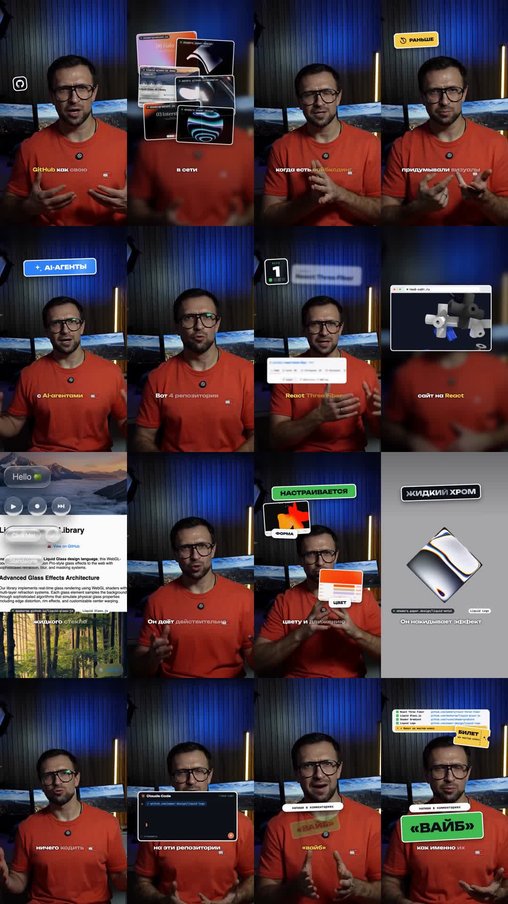
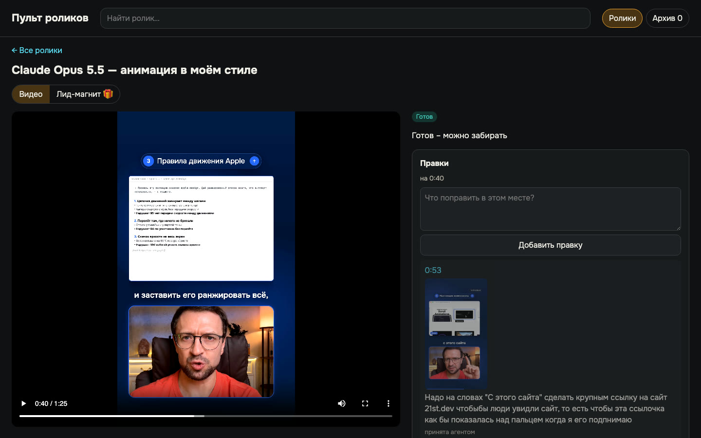
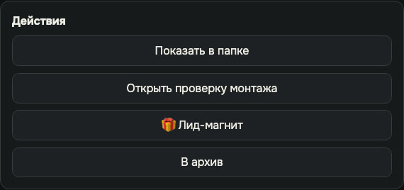

# Урок 6. Финал, который совпадает с утверждённым

Знакомая история: утвердили одну версию, а выложили другую. Где-то проскочил старый файл, где-то
при экспорте поплыл звук, и заметили это уже по комментариям.

Здесь так не будет. Агент собирает финал ровно из утверждённой версии и сам доказывает цифрами,
что это тот же ролик: та же картинка, та же длина, голос не сдвинулся ни на миллисекунду.

**Результат урока:** проверенный финальный файл у вас на телефоне, готовый к выкладке.

**В этом уроке мы:**

- передадим утверждение агенту;
- разберём отчёт проверки простыми словами;
- заберём файл так, чтобы он не потерял качество;
- поймём, что делать, если в финале всё-таки нашлась ошибка.

**Время:** 5 минут ваших. Агент собирает и проверяет финал за несколько минут: у нас семь финалов
собрались и проверились за 22 минуты.

---

## Смотрите: вот так агент отчитывается

Это настоящий отчёт по ролику «Дизайн-репозитории GitHub». Агент собрал финал и проверил его сам,
без моей просьбы:

| Проверка | Результат |
|---|---|
| Формат | 1080×1920, 25 кадров в секунду |
| Длительность | 84,36 с - ровно как у утверждённой версии |
| Файл | проигрывается целиком, без битых кадров |
| Громкость | −14,7 LUFS, пики −1,2 дБ |
| Картинка против утверждённой | совпадает |
| Голос против исходного видео | сдвиг 0 мс в начале, середине и конце |

А это контакт-лист: кадры по всему ролику на одной картинке. Одного взгляда хватает, чтобы
увидеть весь ролик и убедиться, что нигде нет пустого или битого кадра.

---

## Шаг 1. Передаём утверждение агенту

**Зачем.** Утверждение лежит в пульте, а агент в пульт сам не заглядывает. Фраза из пульта - это
команда «собирай».

**Что вы делаете.** Нажмите «Скопировать для агента» в пульте и вставьте фразу в чат - тот же,
где делали ролик, или новый, открытый в папке движка. Если вы уже отправили фразу сразу после
«Утверждаю» в уроке 5, повторять не нужно - просто ждите.

Финал собирается только после вашего «Утверждаю» - даже если все проверки движка на preview были
зелёными. Проверки ищут ошибки, а решение, что ролик готов, принимаете вы.

**Что делает агент.**

1. Собирает финальный файл **ровно из утверждённой версии**. Ничего нового не добавляет.
2. Проверяет финал.
3. Пишет отчёт в чат и кладёт его рядом с файлом.

**Пока ждёте** - закажите лид-магнит, если пульт уже спросил «🎁 Лид-магнит?»
([урок 7](07-lead-magnet.md)).

**Что вы увидите.** Карточка переедет в раздел **«Готов»** с подписью «Готов - можно забирать».

---

## Шаг 2. Читаем отчёт простыми словами

**Зачем.** Разбираться в цифрах не обязательно: достаточно, чтобы агент написал «все проверки
пройдены». Но полезно понимать, за что он ручается.

| Проверка | Что это значит | Какой результат нормальный |
|---|---|---|
| Формат | размер и частота кадров | вертикаль 1080×1920, 25 или 30 кадров |
| Файл | открывается ли целиком | без битых кадров |
| Громкость (LUFS) | средняя громкость ролика | около −14…−15 - обычный уровень соцсетей, ролик не будет тише или громче соседних |
| Совпадение с preview | та же ли картинка, что вы утвердили | совпадает |
| Синхрон | не сдвинулся ли голос относительно исходного видео | 0 мс в начале, середине и конце |
| Контакт-лист | кадры по всему ролику | без обрывов и пустых кадров |
| SHA-256 | «номер кузова» файла, как VIN у машины | по нему можно убедиться, что выкладываете именно проверенный файл |

---

## Шаг 3. Забираем файл

**Что вы делаете.** В пульте откройте карточку и нажмите **«Показать в папке»**. Финал лежит в
папке ролика: `projects/<папка ролика>/final/<название>.mp4`. У двух вариантов темы две папки и
два финала: перед «Показать в папке» переключите вкладку варианта над плеером.

Кнопка «Показать в папке» - в блоке «Действия» ниже правок:

**Как перенести на телефон без потери качества:** AirDrop, кабель или облако. Через Telegram -
только **как файл**, а не как видео, иначе мессенджер пережмёт ролик.

### Что мы уже сделали

Передали утверждение, прочитали отчёт и забрали файл на телефон. Осталось знать, что делать, если
ошибка нашлась уже в финале.

---

## Шаг 4. Если в финале что-то не так

Финал собран из утверждённой версии и проверен. Заметили ошибку - это новая правка, по тому же
кругу, что в уроке 5:

1. Оставьте правку в пульте на нужной секунде.
2. Нажмите «Скопировать для агента» и вставьте фразу в чат.
3. Посмотрите новую версию и утвердите заново.
4. Агент соберёт новый финал. Файл в папке `final/` заменится новым, а прежняя сборка останется в
   «Истории» пульта.

Нашли в финале оговорку, которую надо вырезать из речи, - это полный круг: новый исходник, новый
слой анимаций и новое утверждение. Поэтому такие места лучше ловить ещё на черновой нарезке
([урок 5](05-pult.md#шаг-2-черновая-нарезка)).

---

## Итог урока

Что мы сделали:

- передали утверждение агенту;
- разобрали отчёт проверки простыми словами;
- забрали файл на телефон без потери качества;
- поняли, как исправить ошибку в финале.

## Грабли

| Что случилось | Как избежать |
|---|---|
| Финал выглядел не так, как утверждённый preview | Агент собрал его с другими настройками оформления. Это ловит проверка «совпадение с preview». Если агент о ней не написал - спросите |
| Карточка утверждена, а финала нет | Фразу из пульта не передали агенту. Скопируйте и отправьте |
| После утверждения попросили музыку громче | Это новая версия и новое утверждение ([урок 5](05-pult.md#шаг-7-утверждаем-)) |

## Домашнее задание

**Сделайте:** заберите финал своего ролика и перенесите его на телефон.

**Проверьте себя:**

- [ ] карточка в разделе «Готов»;
- [ ] в отчёте агента все проверки пройдены;
- [ ] вы посмотрели финал на телефоне, в том размере, в каком его увидит зритель, и со звуком.

---

**В следующем уроке** выполним обещание из концовки: соберём страницу, которую зритель получит по
кодовому слову, - в вашем стиле и проверенную, как финал: [урок 7](07-lead-magnet.md).
