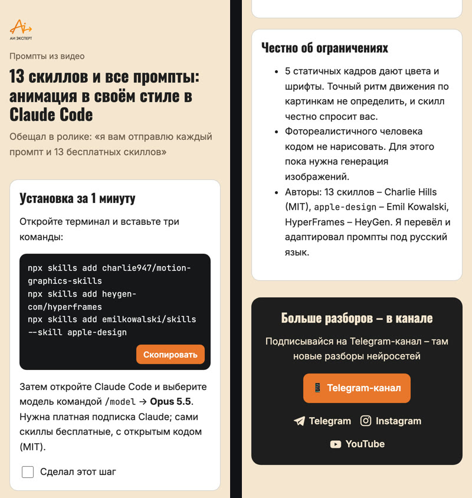
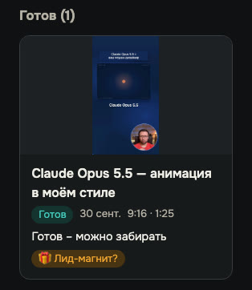
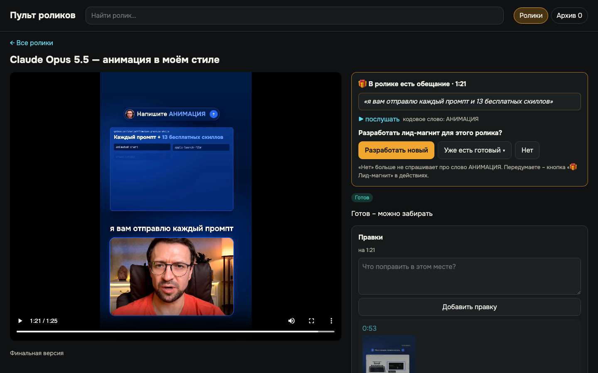
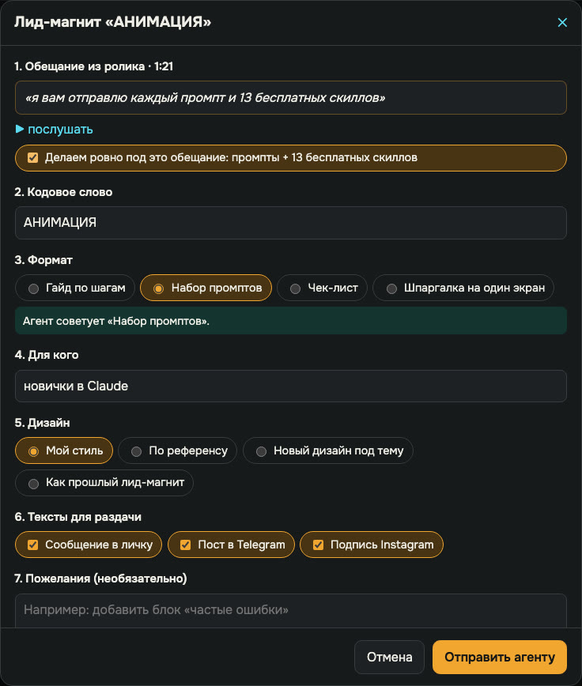
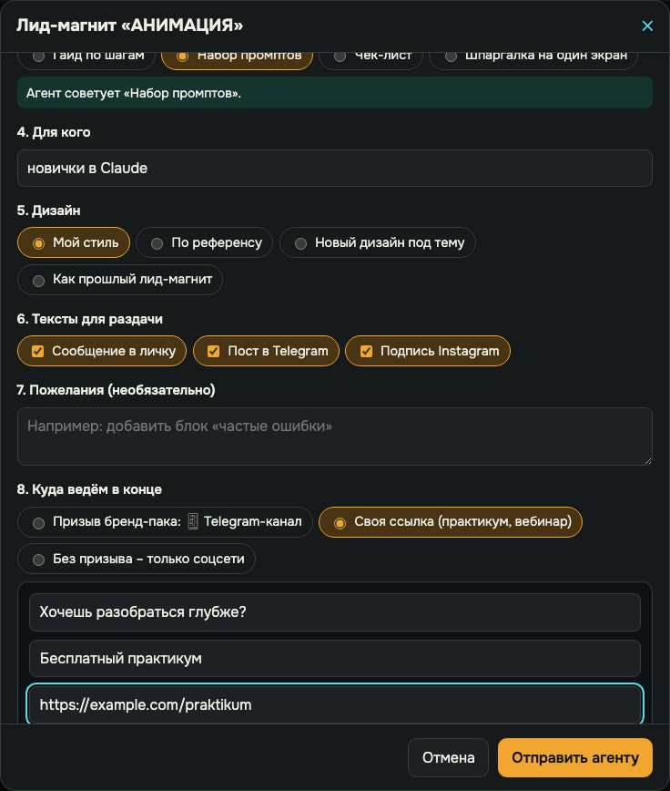
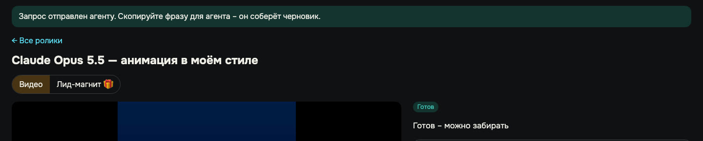
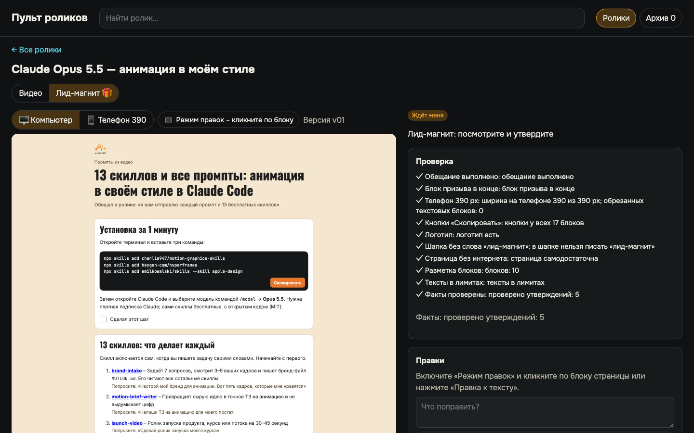
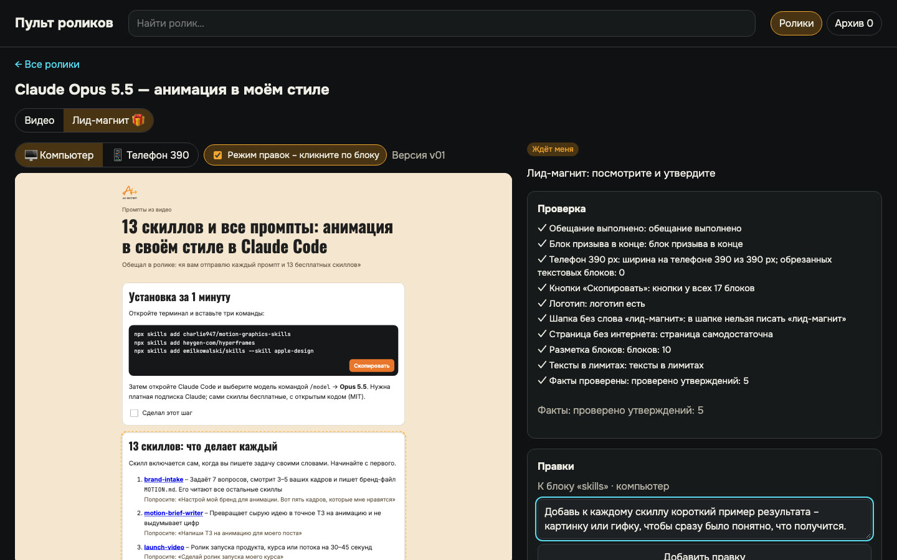
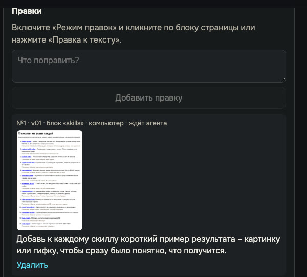
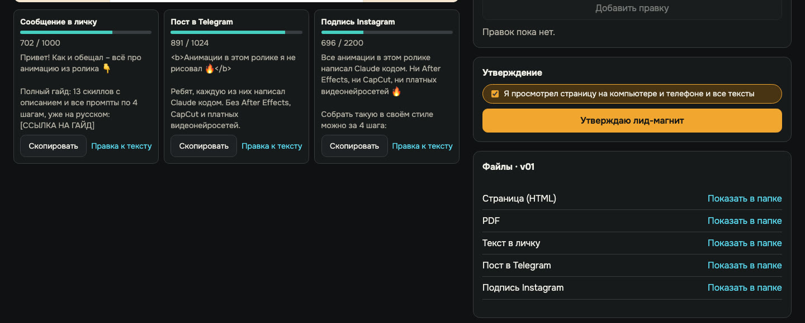

# Урок 7. Лид-магнит: выполняем обещание из концовки

В конце ролика вы сказали: «Напишите АНИМАЦИЯ в комментариях - я пришлю промпты». Ролик выстрелил,
слово пишут сотни людей, а обещанного ещё нет. Садитесь собирать гайд по памяти, вечером, на
скорую руку - и помните «13 промптов», хотя в ролике говорили «каждый промпт и 13 скиллов».
Зритель замечает разницу первым.

В пульте обещание не теряется. Агент сам находит его в речи и записывает дословно, с секундой. Вы
отвечаете на один вопрос, агент собирает страницу в вашем стиле и проверяет её, как финал ролика:
ширина телефона, кнопки «Скопировать», ссылки и цифры. Это как фирменная упаковка подарка в
магазине: вы выбираете подарок, а упаковка всегда одинаково аккуратная и с вашим логотипом.

**Результат урока:** утверждённый лид-магнит к вашему ролику - страница одним файлом, PDF и три
готовых текста для раздачи: в личку, в Telegram и подпись для Instagram.

**В этом уроке мы:**

- один раз подключим ваш стиль - логотип, цвета, соцсети;
- ответим на вопрос пульта «Разработать лид-магнит?»;
- заполним окно заказа и выберем, куда вести читателя в конце;
- проверим страницу на компьютере и телефоне и поставим правку кликом;
- утвердим лид-магнит и заберём файлы.

**Время:** несколько минут ваших плюс ожидание, пока агент собирает черновик.

Instagram в курсе - запрещённая в России соцсеть.

---

## Смотрите: обещание из ролика - уже страница

Слева - верх страницы, справа - её конец. Обещание из ролика стоит дословно под заголовком, все
промпты с кнопкой «Скопировать», в конце главная кнопка и соцсети со значками. Так страница
выглядит на телефоне зрителя:

Это настоящий ролик «Claude Opus 5.5 - анимация в моём стиле» и настоящий гайд к нему: 13
бесплатных скиллов и все промпты по шагам. Первый раз 30 сентября я делал его вручную, в чате с
агентом, и наступил почти на все грабли из конца урока. Теперь тот же путь проходит через пульт.

---

## Шаг 1. Один раз: подключаем свой стиль

**Зачем.** Без вашего стиля агент соберёт страницу в спокойном нейтральном оформлении без
логотипа. Работать будет, но подписчик не узнает в ней вас. Стиль задаётся один раз - дальше
каждый лид-магнит выходит в нём сам.

**Что вы делаете.** Подготовьте логотип (файл SVG или PNG) и скажите агенту:

> Заведи бренд-пак лид-магнитов: логотип <путь к файлу>, цвета <фон, текст, акцент>, шрифты
> <названия>. Призыв по умолчанию - <куда вести читателя: канал, сайт>. Соцсети внизу каждой
> страницы: <ссылки на Telegram, Instagram, YouTube>. Подключи его к пульту и пересоздай значок.

**Что делает агент.** Складывает логотип, шрифты и правила в отдельную папку на вашем компьютере.
Она не попадает в публичный репозиторий движка - это ваш личный «фирменный пакет».

**Что вы увидите.** Агент подтвердит, что бренд-пак подключён. Попросите его собрать тестовую
страницу и показать её на компьютере и телефоне - цвета, шрифты и логотип должны быть ваши.

Соцсети из бренд-пака стоят внизу **каждого** лид-магнита. Главную кнопку над ними вы выбираете
под каждый материал отдельно - об этом в шаге 3.

---

## Шаг 2. Отвечаем на вопрос пульта

**Зачем.** Агент записывает обещание сам, когда расшифровывает речь. Вам остаётся решить, нужен ли
к этому ролику новый материал.

**Что вы видите.** У ролика с обещанием в пульте появляется метка **«🎁 Лид-магнит?»**:

Откройте карточку. Справа - обещание дословно, с секундой и кнопкой «▶ послушать»: она включит
ролик ровно на этой фразе. Ниже - кодовое слово и вопрос «Разработать лид-магнит для этого
ролика?».

**Что вы делаете.** Выберите одну из трёх кнопок:

| Кнопка | Когда нажимать | Что будет |
|---|---|---|
| **Разработать новый** | обещан новый материал | откроется окно заказа, шаг 3 |
| **Уже есть готовый ▾** | ролик ведёт на лид-магнит, который вы уже делали | выберите его из списка утверждённых - ролик привяжется сразу, агенту ничего делать не нужно |
| **Нет** | лид-магнит не нужен | пульт больше не спрашивает про это слово. Передумаете - кнопка «🎁 Лид-магнит» в действиях карточки |

Сначала нажмите «▶ послушать». Пульт показывает то, что вы **сказали**, а не то, что вы помните.

---

## Шаг 3. Заказываем лид-магнит

**Зачем.** Окно заказа - это короткое ТЗ. Агент не угадывает формат и стиль, а делает то, что вы
отметили.

**Что вы делаете.** Нажмите «Разработать новый» и пройдите восемь пунктов:

| Пункт | Что выбрать |
|---|---|
| 1. Обещание из ролика | проверьте цитату и поставьте галочку «Делаем ровно под это обещание». Без неё окно не отправится |
| 2. Кодовое слово | агент подставил его из ролика, обычно менять не нужно |
| 3. Формат | гайд по шагам, набор промптов, чек-лист или шпаргалка на один экран. Под пунктом совет агента |
| 4. Для кого | одной фразой: «новички в Claude», «владельцы салонов» |
| 5. Дизайн | «Мой стиль» - ваш бренд-пак; «По референсу» - перетащите картинку, PDF или HTML-файл либо вставьте ссылку и отметьте, что взять: композицию, цвета, шрифты; «Новый дизайн под тему»; «Как прошлый лид-магнит» |
| 6. Тексты для раздачи | сообщение в личку, пост в Telegram, подпись Instagram - отметьте нужные |
| 7. Пожелания | необязательно: «добавь блок про частые ошибки» |
| 8. Куда ведём в конце | см. ниже |

**Пункт 8 - главная кнопка в конце страницы.** Три варианта:

- **Призыв бренд-пака** - то, что вы задали в шаге 1, например подписка на канал;
- **Своя ссылка (практикум, вебинар)** - заголовок, надпись на кнопке и адрес. Подходит, когда
  ссылка часто меняется: пульт сам подставит последнюю, которую вы вводили, и добавит к ней
  UTM-метки, чтобы вы видели, сколько людей пришло с этого лид-магнита;
- **Без призыва - только соцсети**.

Под вариантами пульт напоминает: «Внизу всегда: Telegram · Instagram · YouTube». Соцсети стоят на
странице при любом выборе. Адрес своей ссылки должен начинаться с `https://`, иначе кнопка
«Отправить агенту» не нажмётся.

Нажмите **«Отправить агенту»**. Пульт ответит: «Запрос отправлен агенту. Скопируйте фразу для
агента - он соберёт черновик». У карточки появится вкладка **«Лид-магнит 🎁»**.

**Передайте агенту.** Внизу карточки, в блоке «Передать агенту», нажмите «Скопировать для агента»
и вставьте фразу в чат - так же, как правки к ролику в [уроке 5](05-pult.md).

### Что мы уже сделали

Подключили свой стиль, решили, что лид-магнит нужен, и заказали его восемью пунктами. Дальше
работает агент.

---

## Шаг 4. Что делает агент, пока вы ждёте

1. Берёт ваш бренд-пак: логотип, цвета, шрифты, соцсети, правила голоса.
2. Если вы дали референс - делает его снимок и берёт оттуда только то, что вы отметили. Чужие
   тексты и логотипы на страницу не попадают.
3. Собирает страницу из заготовки движка: шапка, обещание дословно, блоки с кнопками
   «Скопировать», в конце главная кнопка и соцсети.
4. Наполняет её содержанием из ролика и проверяет каждую ссылку, команду, лицензию и цифру по
   первоисточнику. Всё проверенное записывает в список фактов.
5. Пишет выбранные тексты для раздачи, печатает PDF.
6. Прогоняет проверку движка из 10 пунктов, исправляет красные пункты и только потом показывает
   вам черновик.

| Пункт проверки | Что он ловит |
|---|---|
| Обещание выполнено | на странице есть дословная цитата и всё обещанное в нужном количестве: например, ровно 13 скиллов |
| Блок призыва в конце | страница не обрывается без «куда дальше» |
| Телефон 390 px | ничего не вылезает за экран телефона и не обрезается |
| Кнопки «Скопировать» | у каждого промпта и команды есть кнопка |
| Логотип | логотип на месте, если он нужен бренд-паку |
| Шапка без слова «лид-магнит» | это слово для вас, а не для зрителя |
| Страница без интернета | шрифты и картинки внутри файла, страница открывается даже без сети |
| Разметка блоков | у каждого блока свой адрес - на нём держатся правки кликом |
| Тексты в лимитах | личка до 1000 знаков, Telegram до 1024, Instagram до 2200 |
| Факты проверены | ни одной непроверенной ссылки или цифры |

**Пока ждёте** - подготовьте место, где страница будет жить: свой сайт или облако с доступом по
ссылке. PDF можно отправлять в личку файлом.

---

## Шаг 5. Проверяем страницу и ставим правки кликом

**Что вы делаете.** Откройте вкладку **«Лид-магнит 🎁»**. Слева - страница, справа - итог проверки:

1. Прочитайте страницу целиком в режиме **«Компьютер»**.
2. Переключите **«Телефон 390»** и пролистайте её ещё раз: так её увидит большинство зрителей.
3. Нажмите пару кнопок «Скопировать» - они работают прямо в пульте.
4. Ниже страницы прочитайте тексты для раздачи. У каждого счётчик знаков и кнопка «Скопировать».

**Правка к блоку страницы.** Включите **«Режим правок - кликните по блоку»** и щёлкните по
блоку, который нужно изменить. Пульт подсветит его пунктиром и подпишет над полем правки: «К блоку
«skills» · компьютер». Напишите, что сделать, и нажмите «Добавить правку».

Пульт ответит: «Правка сохранена. Когда закончите, скопируйте фразу для агента». Правка
сохранится вместе со снимком блока, а лид-магнит уйдёт в «В работе» с подписью «Лид-магнит: ждёт
агента, правок: 1». Пока агент правку не взял, её можно удалить ссылкой «Удалить».

**Правка к тексту для раздачи** - кнопка «Правка к тексту» под нужным текстом.

Формула правки та же, что для ролика: **где → что не так → что сделать → зачем**. «Сделай
красивее» агент угадает, а «добавь к каждому скиллу пример результата, чтобы было понятно, что
получится» - выполнит.

**Передайте правки агенту** фразой из блока «Передать агенту». Агент соберёт новую версию - над
страницей появится «Версия v02», - заново прогонит проверку и вернёт лид-магнит в «Ждёт меня».

---

## Шаг 6. Утверждаем ✋

**Зачем.** Как и с роликом, утверждаете только вы. Агент не может нажать эту кнопку за вас: у него
просто нет такой команды.

**Что вы делаете.** Когда проверка зелёная и правок, которые ждут агента, нет, справа появится
блок «Утверждение». Отметьте **«Я просмотрел страницу на компьютере и телефоне и все тексты»** и
нажмите **«Утверждаю лид-магнит»**.

**Что вы увидите.** Пульт ответит: «Лид-магнит утверждён. Файлы и тексты - в блоке «Файлы»».

**Что важно знать:**

- вы утверждаете ровно ту версию, которую смотрели. Если агент тем временем выпустил новую,
  пульт покажет «Появилась новая версия лид-магнита - посмотрите её перед утверждением»;
- утверждённый лид-магнит попадает в вашу библиотеку. В следующем ролике с тем же подарком
  нажмите «Уже есть готовый ▾» и выберите его - заново собирать не нужно;
- если вы перемонтировали ролик и обещание изменилось, вкладка покажет прежнюю и новую цитаты и
  предложит «Обновить под новое» или «Оставить как есть».

---

## Шаг 7. Забираем файлы и раздаём

**Что вы делаете.** В блоке **«Файлы»** у каждого файла есть «Показать в папке»:

| Файл | Что с ним делать |
|---|---|
| Страница (HTML) | выложите на свой сайт или в облако с доступом по ссылке. Это один файл: шрифты и картинки внутри |
| PDF | отправляйте в личку тем, кому удобнее скачать |
| Текст в личку | вставьте ссылку на страницу вместо `[ССЫЛКА НА ГАЙД]` и отправляйте на кодовое слово |
| Пост в Telegram | для анонса в канале |
| Подпись Instagram | подпись к ролику, с кодовым словом в конце ([урок 9](09-publish.md)) |

**Автоответ на кодовое слово.** Если вы отправляете материалы через Chatplace и подключили его к
агенту, скажите:

> Проверь в Chatplace, есть ли автоответ на слово «<слово>», и запиши результат в лид-магнит.

Агент только читает настройки Chatplace и показывает итог в блоке «Воронка автоответа». Создавать
или менять автоответ он не будет - это вы делаете сами в Chatplace.

---

## Итог урока

Что мы сделали:

- один раз подключили свой стиль - логотип, цвета и соцсети;
- ответили на вопрос пульта и заказали лид-магнит восемью пунктами;
- выбрали, куда вести читателя в конце;
- проверили страницу на компьютере и телефоне и поставили правку кликом;
- утвердили лид-магнит и забрали файлы для раздачи.

## Грабли, на которые мы наступили

Все - из первого лид-магнита 30 сентября, собранного вручную, до пульта:

| Что случилось | Как теперь не наступить |
|---|---|
| Я помнил «13 промптов», а в ролике сказал «каждый промпт и 13 бесплатных скиллов» | Пульт показывает обещание дословно, с кнопкой «▶ послушать», а проверка считает обещанное |
| Агент собрал гайд и забыл блок призыва в конце | Заготовка движка всегда ставит его в конец, а проверка не пропустит страницу без него |
| Ссылка на YouTube вела не на тот канал | Соцсети задаются один раз в бренд-паке и проверяются на каждой странице |
| Страница была шире экрана телефона и загружала шрифты из интернета | Проверки «Телефон 390 px» и «Страница без интернета» |
| Ссылка на практикум сменилась, а в старом тексте осталась прежняя | Пункт 8 «Своя ссылка» задаётся под каждый лид-магнит, пульт подставляет последнюю |

Подробно про файлы, бренд-пак и проверки - в [описании лид-магнитов](../LEAD-MAGNET.md).

## Домашнее задание

**Сделайте:** соберите лид-магнит к своему ролику из уроков 4-6. Если в ролике нет обещания -
допишите концовку с кодовым словом в следующем ролике и вернитесь к этому уроку.

**Проверьте себя:**

- [ ] обещание в пульте совпадает с тем, что вы слышите по кнопке «▶ послушать»;
- [ ] в пункте 8 выбрано, куда ведёт главная кнопка, а соцсети внизу ваши;
- [ ] страница просмотрена на компьютере и в режиме «Телефон 390», кнопки «Скопировать» работают;
- [ ] все 10 пунктов проверки зелёные;
- [ ] «Утверждаю лид-магнит» нажато вами после просмотра последней версии;
- [ ] в тексте для лички вместо `[ССЫЛКА НА ГАЙД]` стоит настоящая ссылка.

---

**В следующем уроке** сделаем всё то же сразу для 5-10 роликов. Разберём, как у меня за один день
вышло 10 финалов: [урок 8](08-batch.md).
