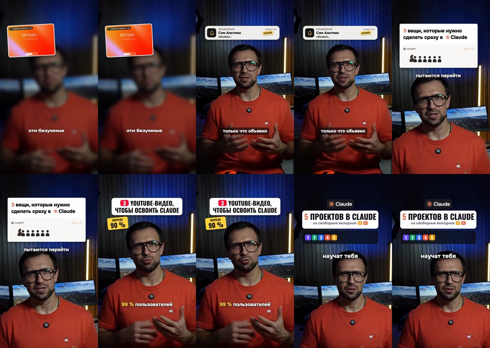
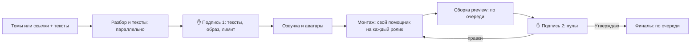

# Урок 8. Пакет: 10 роликов за день

Хочется выпускать по ролику каждый день, но каждый ролик съедает вечер. Так серии и
заканчиваются на третьем выпуске.

Пакет решает это так же, как оптовая закупка: вы один раз даёте все темы, один раз подписываете
тексты и один раз принимаете работу. Всё, что посередине, агент делает сам: почти всё параллельно,
а сборку видео по очереди.

**Результат урока:** серия из 5-10 готовых роликов, у каждой темы два варианта, все проверены и
лежат в пульте в разделе «Готов».

**В этом уроке мы:**

- разберём, как устроен пакет и что в нём идёт параллельно;
- дадим агенту все темы одним сообщением;
- утвердим все тексты разом - одна подпись на весь пакет;
- примем ролики в пульте с общими правками одной фразой;
- получим таблицу всех финалов.

**Время:** один день. Наш пакет из 10 роликов (5 тем × 2 варианта) прошёл путь от готовых текстов
до 10 финалов за один день вместе с двумя кругами правок.

---

## Смотрите: 10 роликов за один день

Пять тем, у каждой два варианта - для Instagram и YouTube. Все десять собраны, проверены и готовы к
выкладке за один день.

---

## Шаг 1. Как устроен пакет

Всё, что можно делать параллельно, агент делает параллельно: разбирает референсы, пишет тексты,
расшифровывает речь, пишет анимации. А собирает видео строго по одному - как на одной кухне одна
плита: две кастрюли на одной конфорке не сварятся быстрее.

---

## Шаг 2. Даём материал одним сообщением

**Что сказать агенту:**

> Сделай пакет роликов. Темы и ссылки на референсы:
> 1. <тема или ссылка>
> 2. <тема или ссылка>
> …
> Тексты - мои, вот они: <тексты> (или: напиши тексты по референсам моим голосом).
> У каждой темы два варианта: Instagram с кодовым словом и YouTube с призывом подписаться.
> Названия карточек начинай с «Пакет <N> · ». Путь - аватар, образ <название>.
> Маршрут монтажа - Creative Motion. Музыка - из папки <путь>,
> у каждого ролика своя. Правила монтажа для каждого ролика:
> <вставьте сюда целиком 10 правил из урока 4 или из шпаргалки>

Instagram здесь и дальше - запрещённая в России соцсеть.

**Что делает агент.** Разбирает референсы и готовит тексты, вычитывает их для озвучки, считает
символы и кредиты. Потом присылает всё одной таблицей.

---

## Шаг 3. Подпись 1: утверждаем всё разом ✋

**Что вы делаете.** Прочитайте тексты, проверьте расчёт кредитов и ответьте одним сообщением:

> Утверждаю тексты 1-5. Образ - <название>. Лимит - 260 кредитов. Создавай.

Лимит считаем как в уроке 3: у нас пять тем и общая концовка для YouTube дали чуть больше 7 минут
аватара, ушёл 231 кредит, лимит стоял 260. Если нужно больше, агент остановится и спросит.

**Что делает агент.** Озвучивает, рендерит аватары, заводит проекты и сразу монтирует каждый ролик
отдельным помощником: черновой нарезки у аватара нет, в видео из текста нет оговорок. Потом
собирает preview по очереди и кладёт их в пульт. Весь пакет находится поиском по «Пакет N».

Если часть роликов пакета - своя съёмка, для них агент сначала положит в пульт черновые нарезки.
Посмотрите их подряд, отметьте оговорки и нажмите «Нарезка готова» у каждого, как в
[уроке 5](05-pult.md#шаг-2-черновая-нарезка); ночью агент на этом остановится и подождёт вас.

### Что мы уже сделали

Дали все темы одним сообщением и одной подписью запустили весь пакет. Дальше - приёмка.

---

## Шаг 4. Подпись 2: принимаем в пульте ✋

Работайте как в [уроке 5](05-pult.md), с двумя отличиями:

- **общие правки - один раз в чат:** «Для всех роликов пакета: эффекты на 5 дБ тише, музыку на
  3 дБ громче». Агент применит правку ко всем роликам;
- **правки по конкретному ролику** - в пульте, на секунде, как обычно.

Закончили с правками - скопируйте фразы «Передать агенту» из нужных карточек и отправьте их одним
сообщением. Агент выполнит их по очереди и вернёт карточки в «Ждёт меня».

Утверждайте ролики по одному, по мере готовности, и каждый раз передавайте фразу агенту. Финалы он
собирает и проверяет по очереди ([урок 6](06-final.md)).

**Пока ждёте** - закажите лид-магниты для всех тем пакета: метка «🎁 Лид-магнит?» появится у
каждой карточки, где в концовке есть обещание ([урок 7](07-lead-magnet.md)).

**Что вы увидите в конце.** Отчёт агента - таблицу всех роликов: папка и финальный файл,
длительность и громкость, результат проверки, SHA-256. В пульте все карточки пакета стоят в «Готов».

---

## Итог урока

Что мы сделали:

- разобрали, что в пакете идёт параллельно, а что по очереди;
- дали агенту все темы одним сообщением;
- утвердили все тексты одной подписью;
- приняли ролики в пульте с общими правками одной фразой;
- получили таблицу всех финалов.

## Грабли

| Что случилось | Как избежать |
|---|---|
| Два лишних круга правок на весь пакет | Все 10 правил из урока 4 - в первом же сообщении |
| Одна и та же правка громкости в десяти карточках | Общие правки - одним сообщением в чат «для всех роликов пакета» |
| Сборки стояли часами: две очереди ждали друг друга | Один пакет - один чат. Карточки долго стоят «В работе» и непонятно почему - спросите агента: «Что сейчас собирается и что в очереди?» |
| Два чата взялись за один и тот же ролик | Каждый ролик ведёт тот чат, который его начал. Тот чат закрыт - откройте новый в папке движка и вставьте фразу из пульта |
| Кредиты кончились раньше, чем ролики | Лимит на весь пакет - в первой подписи, с запасом |

## Домашнее задание

**Сделайте:** запустите пакет из трёх тем - шесть роликов - одним сообщением и доведите до
финалов.

**Проверьте себя:**

- [ ] тексты, образ и лимит утверждены одним сообщением;
- [ ] правила монтажа вставлены в задание целиком;
- [ ] общие правки написаны один раз в чат, частные - в пульте;
- [ ] у каждого варианта своя музыка;
- [ ] пакет вёл один чат, все карточки в «Готов».

---

**В последнем уроке** выложим ролики и разберёмся, где тонко с правами: музыка, чужие видео,
сатира и отметка «сделано с ИИ» - [урок 9](09-publish.md).
