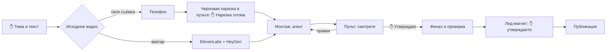

# Ролики с нуля: вертикальные видео уровня монтажёра без монтажёра

Когда человек слышит «сделай ролик с анимацией, звуками и живой камерой», в голове сразу
Premiere, After Effects, таймлайн на десятки дорожек и монтажёр на зарплате. Кажется, что без
этого никак.

В этом курсе мы с вами делаем такие ролики без единой строчки кода и без монтажной программы.
Монтирует агент - Claude Code или Codex. Вы ставите задачу, смотрите результат и нажимаете
«Утверждаю».

Курс собран по реальной работе 27-28 сентября 2026 года. За два дня так сделано 15 вертикальных
роликов с цифровым двойником. Все цифры, правки и ошибки ниже - оттуда, ничего не придумано.

## Результат курса

У вас на руках готовый вертикальный ролик на 1-2 минуты в двух вариантах: для Instagram
(запрещённая в России соцсеть) с кодовым словом в конце и для YouTube с призывом подписаться.
В ролике:

- **живая камера** - спикер не стоит на месте: наезды, смены крупности, размытие под графикой;
- **смена картинки каждые 2-2,5 секунды**, поэтому зрителю некогда скучать;
- **настоящие скриншоты** сайтов, постов и видео, о которых вы говорите;
- **короткие вставки готового видео** (сток) по смыслу фразы;
- **звуковые эффекты** на каждое появление графики;
- **музыка**, которая слышна, но не спорит с голосом.

И к ролику - **лид-магнит**: страница с тем, что вы обещали по кодовому слову, в вашем стиле,
с PDF и готовыми текстами для раздачи.

## Что мы пройдём

За девять уроков мы с вами:

1. **подготовим** рабочее место один раз и навсегда;
2. **напишем** текст, который удобно слушать, - свой или по схеме чужого удачного ролика;
3. **получим** видео со спикером: цифровой двойник в HeyGen или своя съёмка на телефон;
4. **поставим** агенту задачу так, чтобы хватило одного круга правок;
5. **примем** ролик в «Пульте роликов» и прям на нужной секунде скажем, что поправить;
6. **заберём** готовый проверенный файл;
7. **выполним** обещание из концовки - соберём лид-магнит в своём стиле;
8. **запустим** пакет из 5-10 роликов за раз;
9. **выложим** ролик, не нарушив ничьих прав.

## Смотрите, что получается

Сверху - первая версия, которую агент собрал, пока правил ещё не знал: спикер всё время в одном
кадре. Снизу - та же минута после правил из урока 4. Разница видна без звука.

А так выглядит мой «Пульт роликов» после этих двух дней: все ролики в одном окне, у каждой
темы по два варианта, всё готово к выкладке.

## Кто что делает

Агента удобно представлять как нанятого монтажёра. Вы - продюсер: даёте задание, принимаете
работу и подписываете акт. Монтажёр делает всё остальное - расшифровку речи, дизайн, анимации,
поиск скриншотов и стока, звук, сборку и проверку файла.

Ваших действий девять. Четыре из них ✋ - подписи, без которых агент дальше не пойдёт:

| Ваше действие | Где | Урок |
|---|---|---|
| Дать тему или ссылку на чужой удачный ролик и текст | чат с агентом | [2](02-idea-and-script.md) |
| ✋ Утвердить текст, для аватара - выбрать образ и лимит расходов | чат с агентом | [2](02-idea-and-script.md), [3](03-source-video.md) |
| Один раз выбрать способ монтажа | чат с агентом | [4](04-montage.md) |
| ✋ Посмотреть черновую нарезку без графики, отметить оговорки и нажать «Нарезка готова» (только для своей съёмки) | пульт | [5](05-pult.md) |
| Посмотреть сборку ролика с графикой (preview) целиком | пульт | [5](05-pult.md) |
| Оставить правки на нужной секунде | пульт | [5](05-pult.md) |
| ✋ Нажать «Утверждаю» | пульт | [5](05-pult.md) |
| Заказать лид-магнит к ролику | пульт | [7](07-lead-magnet.md) |
| ✋ Нажать «Утверждаю лид-магнит» | пульт | [7](07-lead-magnet.md) |

У аватара черновой нарезки нет: в видео из текста нет оговорок, агент сразу собирает графику. Нет её
и у своей съёмки несколькими дублями или блоками разными файлами (выбор дублей агент покажет вместе
с preview), и если вы заранее сказали агенту «режь сам». Тогда действий восемь, из них три ✋.

## Уроки

| # | Урок | Что будет на руках | Время |
|---|---|---|---|
| 1 | [Рабочее место за один вечер](01-setup.md) | агент, движок, пульт, музыка, для аватара - HeyGen и голос | один раз, 30-60 мин |
| 2 | [Текст, который досматривают](02-idea-and-script.md) | утверждённый текст с двумя концовками | 15-30 мин |
| 3 | [Видео со спикером: аватар или телефон](03-source-video.md) | видео, где спикер говорит ваш текст | около получаса ожидания |
| 4 | [Одно задание вместо лишних кругов правок](04-montage.md) | первый preview в пульте | 5 мин ваших (для своей съёмки плюс просмотр черновой нарезки), ожидание 30 мин - 2 ч |
| 5 | [Пульт: принимаем работу как ремонт](05-pult.md) | подтверждённая черновая нарезка (для своей съёмки) и утверждённая версия | 10-20 мин на ролик плюс просмотр нарезки |
| 6 | [Финал, который совпадает с утверждённым](06-final.md) | проверенный файл на телефоне | 5 мин |
| 7 | [Лид-магнит: выполняем обещание из концовки](07-lead-magnet.md) | утверждённая страница, PDF и тексты для раздачи | несколько минут ваших плюс ожидание |
| 8 | [Пакет: 10 роликов за день](08-batch.md) | целая серия роликов | один день |
| 9 | [Выкладываем и не нарушаем права](09-publish.md) | опубликованный ролик | 10 мин |

Instagram в курсе - запрещённая в России соцсеть.

Приложения: [готовые фразы для агента](PROMPTS.md) и [словарь](GLOSSARY.md).

Первый раз проходите уроки по порядку. Со второго ролика понадобятся только уроки 2-7.

## Что понадобится

- Компьютер на macOS или Windows и подписка Claude Code или Codex. Работаем в обычном
  приложении Claude Code или Codex либо в редакторе VS Code, терминал не нужен.
- **Путь «аватар»:** HeyGen с кредитами и, если хотите свой голос, ElevenLabs с клоном голоса.
  Оба сервиса платные, тарифы смотрите на их сайтах. Навык аватара работает на macOS и Linux,
  на Windows выбирайте путь «своя съёмка».
- **Путь «своя съёмка»:** телефон, который снимает вертикальное видео, тихая комната и свет на лицо.
- По желанию - бесплатный ключ Pexels, чтобы агент сам искал стоковые видео.

## Честные цифры

| Что | Сколько |
|---|---|
| Текст | около 1 000 символов на минуту речи |
| Аватар HeyGen | около 32 кредитов за минуту видео |
| Рендер аватара | у нас 24 минуты на один ролик, пять роликов параллельно - меньше часа |
| Черновая нарезка | машине меньше минуты после расшифровки, ваш просмотр - длина записи |
| Первый preview с анимациями | где-то от получаса до пары часов - зависит от длины ролика и очереди |
| Оговорка, найденная уже в preview | полный круг 15-20 минут: новый исходник и новый слой |
| Новая версия после правок | 8-20 минут на ролик: 3-5 минут слой анимаций, остальное сборка и проверка |
| Финал с проверкой | несколько минут: у нас семь финалов собрались и проверились за 22 минуты |
| Пакет из 10 роликов (5 тем × 2 варианта) | от готовых текстов до 10 финалов - один день и два круга правок |
| Ваше время на один ролик | где-то 20-40 минут: текст, просмотр нарезки (для своей съёмки) и ролика, правки, утверждение |

## Чего курс не делает

- Не выкладывает ролики за вас: готовый файл вы загружаете сами (урок 9).
- Не настраивает автоответ на кодовое слово: агент только проверяет его в Chatplace (урок 7).
- Не заменяет ваш вкус. Дизайн агент придумывает сам, но что хорошо, а что нет, решаете вы.
- Не тратит ваши деньги без спроса. Каждый платный вызов HeyGen или ElevenLabs агент сначала
  согласует с вами.

**Начинаем:** [урок 1. Рабочее место за один вечер](01-setup.md).
